

### 1. Years to Double Population #031001 极高频 普通

<b>1.</b> The following graph shows information about years to double population, from 1715 to 1999.  <b>2.</b> According to the graph, we can see that 1715 has the largest number, which is around 544 years.  <b>3.</b> Following that, 1804 has the second largest number, which is around 304 years.  <b>4.</b> Based on the information we can get from the graph 1999 has the smallest number, which is around 39 years.  <b>5.</b> It's clear that 1715 has always been higher than 1999.  <b>6.</b> In general, this graph is very informative about years to double population.

### 2. Dubai Gold Sales in 2002 #031002 极高频 简单

<b>1.</b> The following graph shows information about Dubai gold sales in 2002, from January to December.  <b>2.</b> According to the graph, we can see that March has the largest number, which is around 350 million Dirhams.  <b>3.</b> Following that, August has the second largest number, which is around 210 million Dirhams.  <b>4.</b> Based on the information we can get from the graph July and September has the smallest number, which is around 130 million Dirhams.  <b>5.</b> It's clear that March has always been higher than July.  <b>6.</b> In general, this graph is very informative about Dubai gold sales in 2002.

### 3. Number of Arrests per Year for Using Illegal Drugs

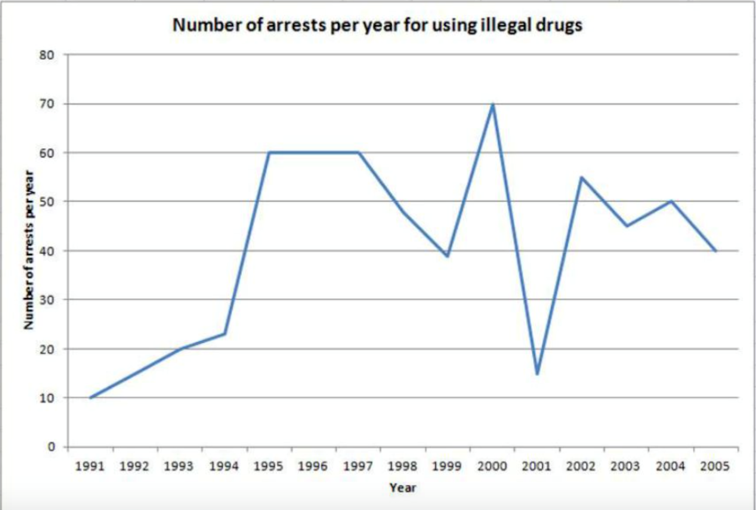

<b>1.</b> The following graph shows information about the number of arrests per year for using illegal drugs, from 1991 to 2005.  <b>2.</b> According to the graph, we can see that the year 2000 has the largest number, which is around 70.  <b>3.</b> Following that, 1995 and 1997 have the second largest number, which is around 60.  <b>4.</b> Based on the information we can get from the graph 1991 has the smallest number, which is around 10.  <b>5.</b> It's clear that the number of arrests fluctuated significantly over the years, with a sharp drop in 2001 to around 15.  <b>6.</b> In general, this graph is very informative about the number of arrests per year for using illegal drugs.

### 4. Number of Laws in Brazil 1953-1993

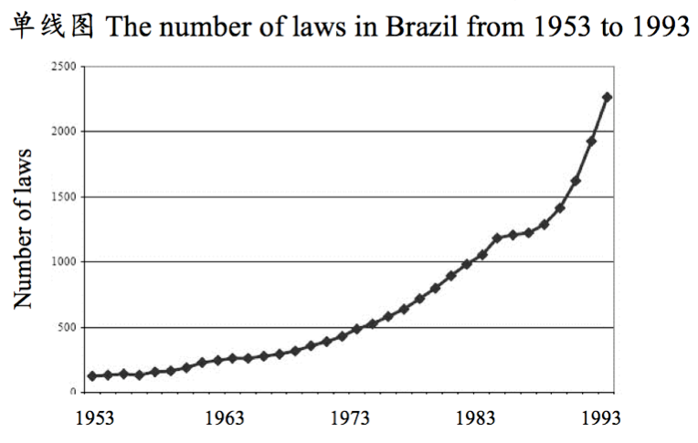

<b>1.</b> The following graph shows information about the number of laws in Brazil, from 1953 to 1993.  <b>2.</b> According to the graph, we can see that 1993 has the largest number, which is around 2,250.  <b>3.</b> Following that, 1990 has the second largest number, which is around 1,950.  <b>4.</b> Based on the information we can get from the graph 1953 has the smallest number, which is around 100.  <b>5.</b> It's clear that the number of laws increased exponentially, especially after 1983.  <b>6.</b> In general, this graph is very informative about the number of laws in Brazil from 1953 to 1993.

### 5. S&P/ASX 200

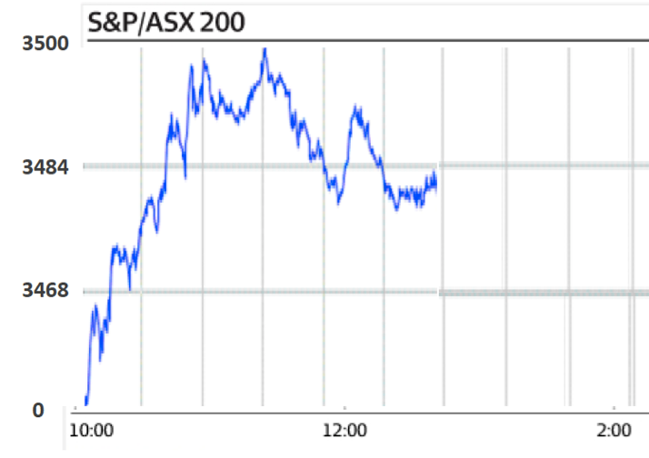

<b>1.</b> The following graph shows information about the S&P/ASX 200 index, from 10:00 to 2:00.  <b>2.</b> According to the graph, we can see that around 10:30 has the largest number, which is around 3,500.  <b>3.</b> Following that, around 11:30 has the second largest number, which is around 3,490.  <b>4.</b> Based on the information we can get from the graph the opening at 10:00 has the smallest number, which is around 3,460.  <b>5.</b> It's clear that the index rose sharply after 10:00, peaked near 3,500, and then declined steadily toward 3,468 by 2:00.  <b>6.</b> In general, this graph is very informative about the S&P/ASX 200 index performance during the trading day.

### 6. US Fruit and Vegetable Consumption Trends

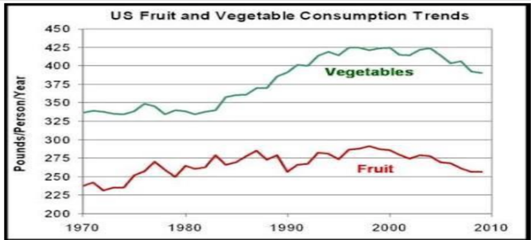

<b>1.</b> The following graph shows information about US fruit and vegetable consumption trends, from 1970 to 2010.  <b>2.</b> According to the graph, we can see that vegetables around 1995 has the largest number, which is around 425 pounds per person per year.  <b>3.</b> Following that, vegetables in 2010 has the second largest number, which is around 395 pounds per person per year.  <b>4.</b> Based on the information we can get from the graph fruit in 1970 has the smallest number, which is around 235 pounds per person per year.  <b>5.</b> It's clear that vegetables consumption has always been higher than fruit consumption.  <b>6.</b> In general, this graph is very informative about US fruit and vegetable consumption trends.

### 7. Life Expectancy (Years) at Birth by Sex

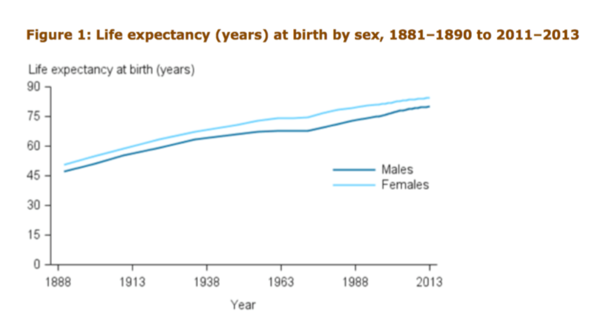

<b>1.</b> The following graph shows information about life expectancy at birth by sex, from 1888 to 2013.  <b>2.</b> According to the graph, we can see that females in 2013 has the largest number, which is around 84 years.  <b>3.</b> Following that, males in 2013 has the second largest number, which is around 80 years.  <b>4.</b> Based on the information we can get from the graph males in 1888 has the smallest number, which is around 45 years.  <b>5.</b> It's clear that females has always been higher than males.  <b>6.</b> In general, this graph is very informative about life expectancy at birth by sex from 1888 to 2013.

### 8. Articles Published per Year by Male and Female University Professors

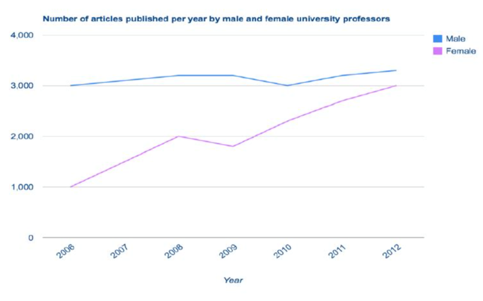

<b>1.</b> The following graph shows information about articles published per year by male and female university professors, from 2006 to 2012.  <b>2.</b> According to the graph, we can see that male professors in 2012 has the largest number, which is around 3,300.  <b>3.</b> Following that, male professors in 2008 has the second largest number, which is around 3,200.  <b>4.</b> Based on the information we can get from the graph female professors in 2006 has the smallest number, which is around 1,000.  <b>5.</b> It's clear that male professors has always been higher than female professors.  <b>6.</b> In general, this graph is very informative about articles published per year by male and female university professors.

### 9. Daily temperature in Beijing China #031024 极高频 简单

<b>1.</b> The following graph shows information about daily temperature in Beijing China, including daily high and daily low from January to December.  <b>2.</b> According to the graph, we can see that daily high in July has the largest number, which is around 30 degrees Centigrade.  <b>3.</b> Following that, daily low in July has the second largest number, which is around 21 degrees Centigrade.  <b>4.</b> Based on the information we can get from the graph daily low in January has the smallest number, which is around minus 10 degrees Centigrade.  <b>5.</b> It's clear that daily high has always been higher than daily low.  <b>6.</b> In general, this graph is very informative about daily temperature in Beijing China.

### 10. Population Growth and Growth in Rating Base

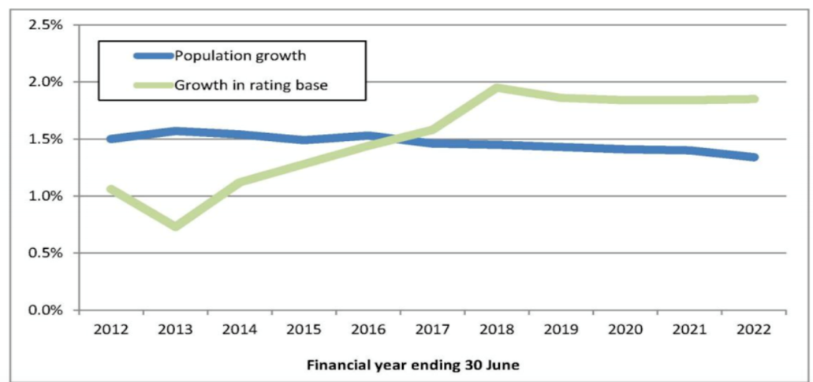

<b>1.</b> The following graph shows information about population growth and growth in rating base, from 2012 to 2022.  <b>2.</b> According to the graph, we can see that growth in rating base in 2018 has the largest number, which is around 2.0%.  <b>3.</b> Following that, growth in rating base in 2022 has the second largest number, which is around 1.85%.  <b>4.</b> Based on the information we can get from the graph growth in rating base in 2013 has the smallest number, which is around 0.75%.  <b>5.</b> It's clear that population growth was higher before 2016 but growth in rating base surpassed it after 2017.  <b>6.</b> In general, this graph is very informative about population growth and growth in rating base.

### 11. Electricity Generation in China by Type 1994-2004

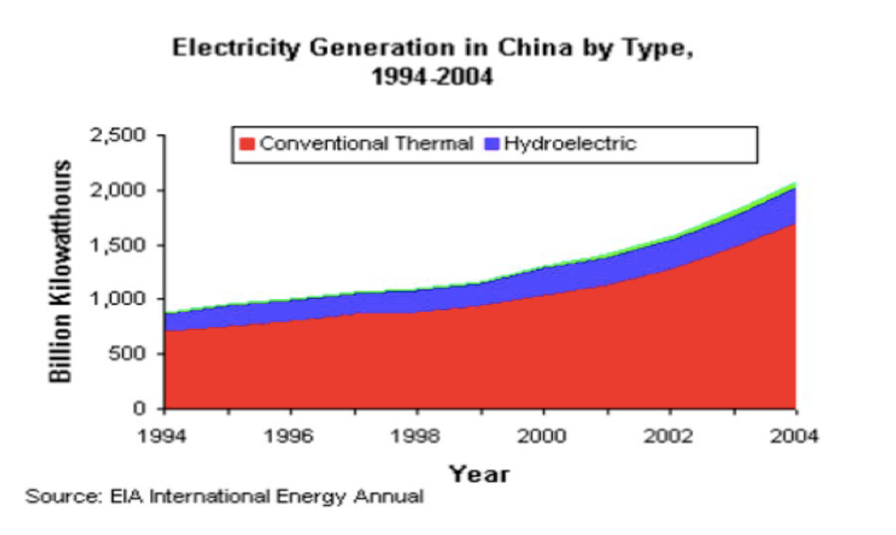

<b>1.</b> The following graph shows information about electricity generation in China by type, from 1994 to 2004.  <b>2.</b> According to the graph, we can see that conventional thermal in 2004 has the largest number, which is around 1,700 billion kilowatt-hours.  <b>3.</b> Following that, hydroelectric in 2004 has the second largest number, which is around 300 billion kilowatt-hours.  <b>4.</b> Based on the information we can get from the graph total generation in 1994 has the smallest number, which is around 900 billion kilowatt-hours.  <b>5.</b> It's clear that conventional thermal has always been higher than hydroelectric.  <b>6.</b> In general, this graph is very informative about electricity generation in China by type from 1994 to 2004.

### 12. University and College Students Who Did Educational Activities

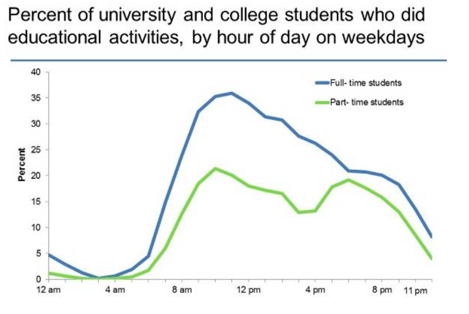

<b>1.</b> The following graph shows information about percent of university and college students who did educational activities by hour of day on weekdays, from 12 am to 11 pm.  <b>2.</b> According to the graph, we can see that full-time students around 11 am has the largest number, which is around 36%.  <b>3.</b> Following that, part-time students around 10 am has the second largest number, which is around 21%.  <b>4.</b> Based on the information we can get from the graph both groups around 4 am has the smallest number, which is around 0%.  <b>5.</b> It's clear that full-time students has always been higher than part-time students.  <b>6.</b> In general, this graph is very informative about university and college students who did educational activities by hour of day.

### 13. Temperature and CO2 for the Last 400,000 Years

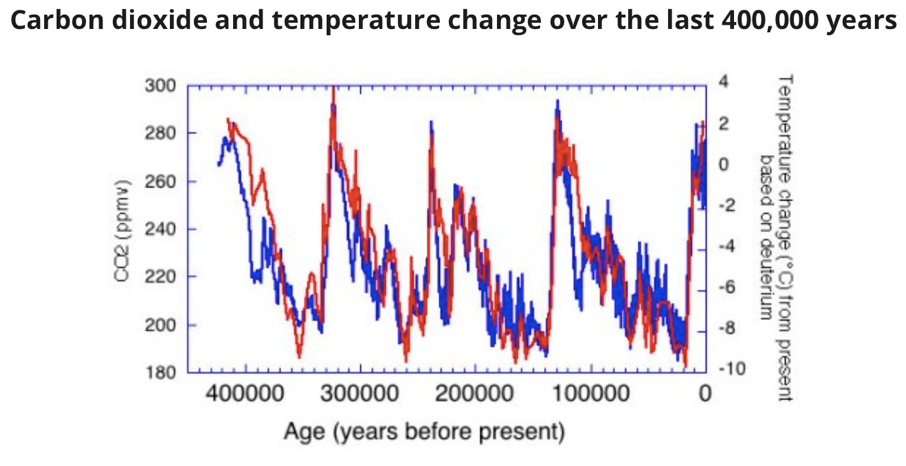

<b>1.</b> The following graph shows information about carbon dioxide and temperature change over the last 400,000 years, from 400,000 years ago to the present.  <b>2.</b> According to the graph, we can see that CO2 at around 300,000 years ago and at present has the largest number, which is around 280-300 ppmv.  <b>3.</b> Following that, temperature at the peaks has the second largest number, which is around +2 to +4 degrees Celsius.  <b>4.</b> Based on the information we can get from the graph CO2 at the lowest points has the smallest number, which is around 180 ppmv with temperature around -8 to -10 degrees.  <b>5.</b> It's clear that CO2 levels and temperature changes has always been higher than their respective baselines, showing a strong correlation between the two.  <b>6.</b> In general, this graph is very informative about temperature and CO2 for the last 400,000 years.

### 14. Food Price vs Oil Price

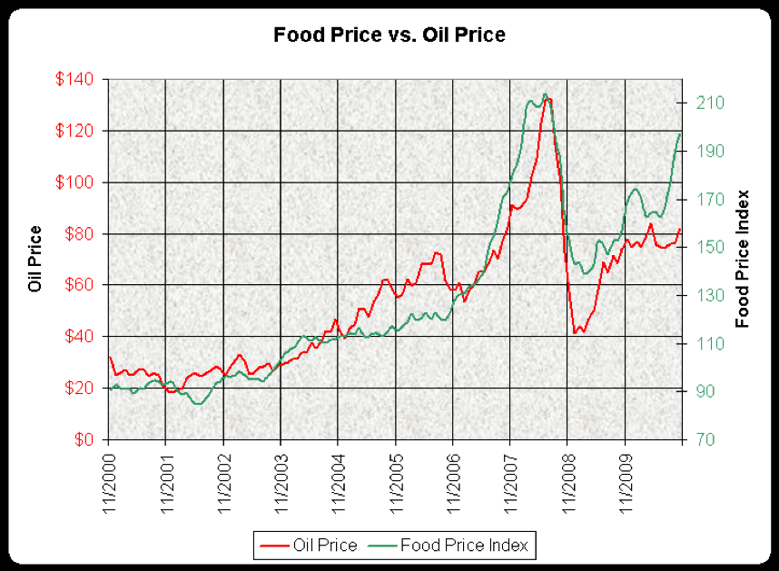

<b>1.</b> The following graph shows information about food price vs oil price, from November 2000 to November 2009.  <b>2.</b> According to the graph, we can see that oil price in mid-2008 has the largest number, which is around $130.  <b>3.</b> Following that, food price index in mid-2008 has the second largest number, which is around 210.  <b>4.</b> Based on the information we can get from the graph oil price in 2001 has the smallest number, which is around $20.  <b>5.</b> It's clear that oil price and food price index are strongly correlated, both peaking in 2008 and then declining.  <b>6.</b> In general, this graph is very informative about food price vs oil price.

### 15. Projected Population in Australia

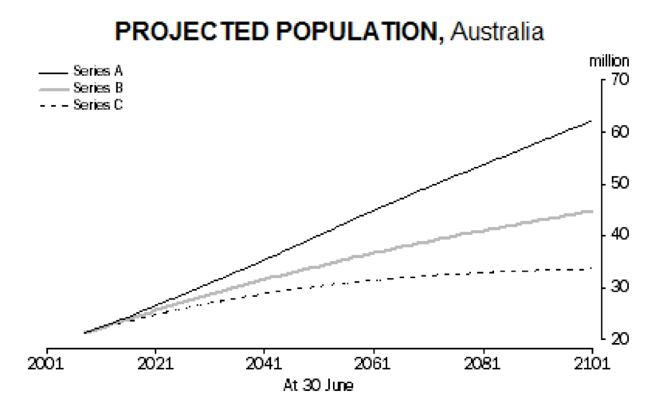

<b>1.</b> The following graph shows information about projected population in Australia, from 2001 to 2101.  <b>2.</b> According to the graph, we can see that Series A in 2101 has the largest number, which is around 63 million.  <b>3.</b> Following that, Series B in 2101 has the second largest number, which is around 45 million.  <b>4.</b> Based on the information we can get from the graph all three series in 2001 has the smallest number, which is around 20 million.  <b>5.</b> It's clear that Series A has always been higher than Series B and Series C.  <b>6.</b> In general, this graph is very informative about projected population in Australia.

### 16. Annual per Capita Meat Consumption (kg)

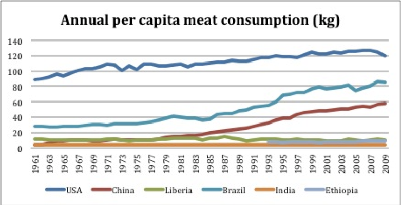

<b>1.</b> The following graph shows information about annual per capita meat consumption in kilograms, from 1961 to 2009.  <b>2.</b> According to the graph, we can see that USA in 2007 has the largest number, which is around 125 kg.  <b>3.</b> Following that, Brazil in 2009 has the second largest number, which is around 85 kg.  <b>4.</b> Based on the information we can get from the graph India and Ethiopia has the smallest number, which is around 5 kg throughout the period.  <b>5.</b> It's clear that USA has always been higher than all other countries.  <b>6.</b> In general, this graph is very informative about annual per capita meat consumption across six countries.

### 17. Australian Age Group #031053 极高频 简单

<b>1.</b> The following graph shows information about Australian age group, including males and females.  <b>2.</b> According to the graph, we can see that females in 25-34 has the largest number, which is around 16.5%.  <b>3.</b> Following that, males in 25-34 has the second largest number, which is around 16.2%.  <b>4.</b> Based on the information we can get from the graph males in 85+ has the smallest number, which is around 0.7%.  <b>5.</b> It's clear that females in 5-14 has always been higher than males in 5-14.  <b>6.</b> In general, this graph is very informative about Australian age group.

### 18. Internet Population in Millions of Users #031058 极高频 简单

<b>1.</b> The following graph shows information about internet population in millions of users, including China, US, Japan, Germany, UK and other countries.  <b>2.</b> According to the graph, we can see that China has the largest number, which is around 180 million users.  <b>3.</b> Following that, US has the second largest number, which is around 165 million users.  <b>4.</b> Based on the information we can get from the graph Netherlands has the smallest number, which is around 15 million users.  <b>5.</b> It's clear that China has always been higher than US.  <b>6.</b> In general, this graph is very informative about internet population in millions of users.

### 19. The Taxation by Countries - Payroll and Superannuation

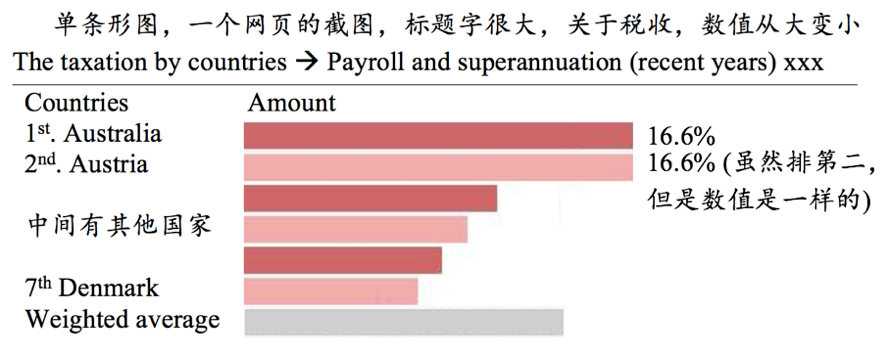

<b>1.</b> The following graph shows information about taxation by countries for payroll and superannuation, from various countries.  <b>2.</b> According to the graph, we can see that Australia has the largest number, which is around 16.6%.  <b>3.</b> Following that, Austria has the second largest number, which is around 16.6%.  <b>4.</b> Based on the information we can get from the graph Denmark has the smallest number, which is the lowest among the listed countries.  <b>5.</b> It's clear that Australia and Austria has always been higher than other countries including Denmark and the weighted average.  <b>6.</b> In general, this graph is very informative about the taxation by countries for payroll and superannuation.

### 20. Unemployment Rates by Ethnic Group and Sex in UK 2001

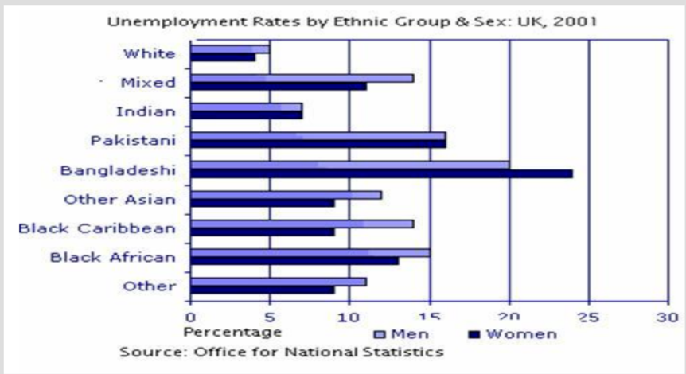

<b>1.</b> The following graph shows information about unemployment rates by ethnic group and sex in UK in 2001, from nine ethnic groups including White, Mixed, Indian, Pakistani, Bangladeshi, Other Asian, Black Caribbean, Black African, and Other.  <b>2.</b> According to the graph, we can see that Bangladeshi women has the largest number, which is around 24%.  <b>3.</b> Following that, Pakistani women has the second largest number, which is around 16%.  <b>4.</b> Based on the information we can get from the graph White men and women has the smallest number, which is around 4-5%.  <b>5.</b> It's clear that Bangladeshi women's unemployment rate has always been higher than all other ethnic groups and sexes.  <b>6.</b> In general, this graph is very informative about unemployment rates by ethnic group and sex in UK 2001.

### 21. Earnings and Unemployment Rates by Educational Attainment #031071 极高频 普通

<b>1.</b> The following graph shows information about earnings and unemployment rates by educational attainment, including unemployment rate and median weekly earnings in 2012.  <b>2.</b> According to the graph, we can see that less than a high school diploma has the largest unemployment rate, which is around 12.4%.  <b>3.</b> Following that, high school diploma has the second largest number, which is around 8.3%.  <b>4.</b> Based on the information we can get from the graph professional degree has the smallest unemployment rate, which is around 2.1%.  <b>5.</b> It's clear that median weekly earnings for professional degree at $1,735 has always been higher than less than a high school diploma at $471.  <b>6.</b> In general, this graph is very informative about earnings and unemployment rates by educational attainment.

### 22. Population of Major European Countries in 1996 and 2007

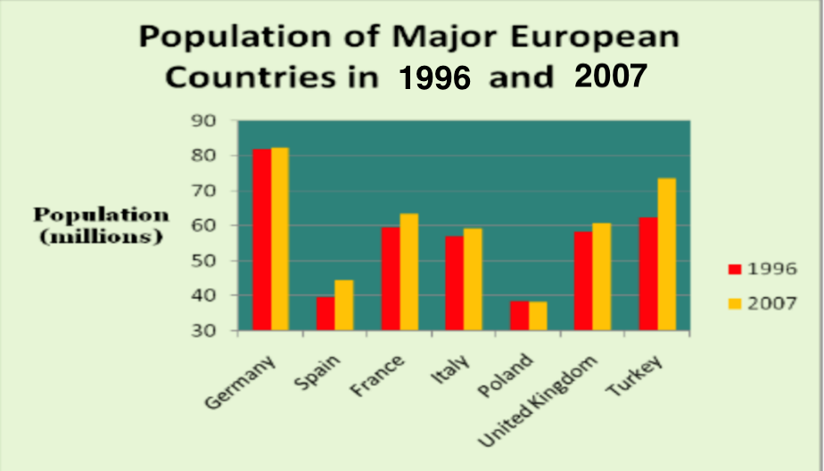

<b>1.</b> The following graph shows information about population of major European countries in 1996 and 2007, from Germany, Spain, France, Italy, Poland, United Kingdom and Turkey.  <b>2.</b> According to the graph, we can see that Germany has the largest number, which is around 83 million.  <b>3.</b> Following that, Turkey in 2007 has the second largest number, which is around 75 million.  <b>4.</b> Based on the information we can get from the graph Poland has the smallest number, which is around 38 million.  <b>5.</b> It's clear that Germany has always been higher than all other countries.  <b>6.</b> In general, this graph is very informative about population of major European countries in 1996 and 2007.

### 23. Transport Modes in a European City 1960-2000 #031078 极高频 简单

<b>1.</b> The following graph shows information about transport modes in a European city, from 1960 to 2000.  <b>2.</b> According to the graph, we can see that car in 2000 has the largest number, which is around 38% of total travellers.  <b>3.</b> Following that, foot in 1960 has the second largest number, which is around 35% of total travellers.  <b>4.</b> Based on the information we can get from the graph bike in 2000 has the smallest number, which is around 7% of total travellers.  <b>5.</b> It's clear that car in 2000 has always been higher than car in 1960.  <b>6.</b> In general, this graph is very informative about transport modes in a European city 1960-2000.

### 24. Age Percentage in UK #031082 极高频 普通

<b>1.</b> The following graph shows information about age percentage in UK, from UK 1911, UK 2001 and UK 2011.  <b>2.</b> According to the graph, we can see that 15-64 age group has the largest number, which is around 65%.  <b>3.</b> Following that, 0-14 in UK 1911 has the second largest number, which is around 30%.  <b>4.</b> Based on the information we can get from the graph 65+ in UK 1911 has the smallest number, which is around 5%.  <b>5.</b> It's clear that 15-64 has always been higher than 0-14 and 65+.  <b>6.</b> In general, this graph is very informative about age percentage in UK.

### 25. Beginning of flow chart for quiz #031086 极高频 简单

<b>1.</b> The following graph shows information about beginning of flow chart for quiz, including Slide 1 to Slide 5.  <b>2.</b> According to the graph, we can see that the first step is Slide 1, click to start quiz.  <b>3.</b> Following that, the second step is Slide 2, Question 1.  <b>4.</b> Based on the information we can get from the graph, the third step is click true or click false.  <b>5.</b> It's clear that the last steps are Slide 3 correct or Slide 4 wrong, then click to go to Slide 5, Question 2.  <b>6.</b> We can see that there is a decision process in the picture, which is interactive and structured.  <b>7.</b> In general, this graph is very informative about beginning of flow chart for quiz.

### 26. Age Percentage by Gender

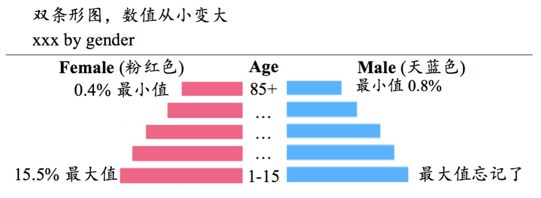

<b>1.</b> The following graph shows information about age percentage by gender, including females and males from age 1-15 to 85+.  <b>2.</b> According to the graph, we can see that females in age 1-15 has the largest number, which is around 15.5%.  <b>3.</b> Following that, males in age 1-15 has the second largest number, which is around a similar percentage.  <b>4.</b> Based on the information we can get from the graph females in age 85+ has the smallest number, which is around 0.4%.  <b>5.</b> It's clear that younger age groups has always been higher than older age groups.  <b>6.</b> In general, this graph is very informative about age percentage by gender.

### 27. Languages Have Influenced English

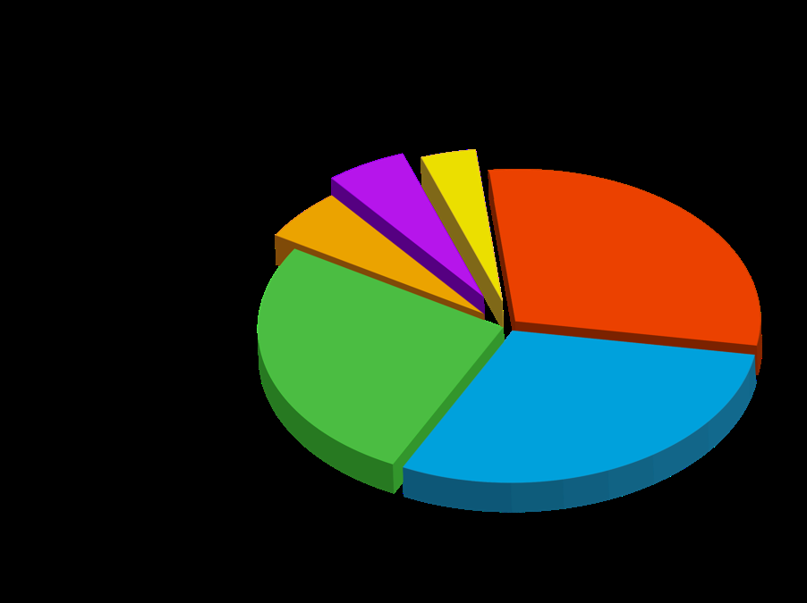

<b>1.</b> The following graph shows information about languages that have influenced English, including several languages shown in different colors.  <b>2.</b> According to the graph, we can see that the red section has the largest portion, which is around the biggest slice of the pie chart.  <b>3.</b> Following that, the blue section has the second largest portion, which is around the second biggest slice.  <b>4.</b> Based on the information we can get from the graph the yellow section has the smallest portion, which is around the tiniest slice of the pie chart.  <b>5.</b> It's clear that the red section has always been larger than all other sections.  <b>6.</b> In general, this graph is very informative about languages that have influenced English.

### 28. Approximate Composition of the Air

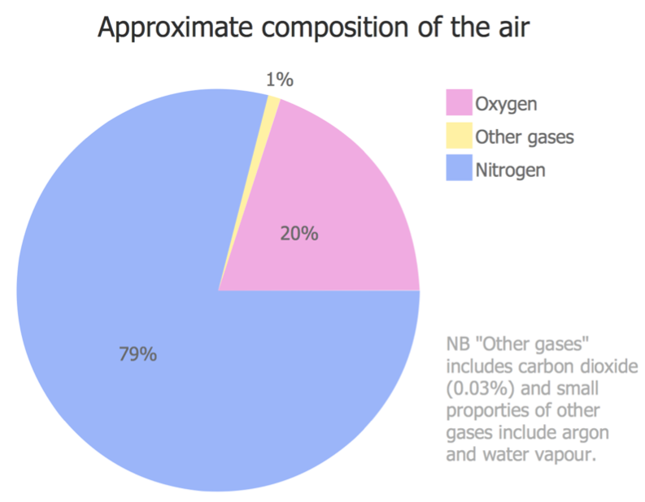

<b>1.</b> The following graph shows information about approximate composition of the air, including nitrogen, oxygen and other gases.  <b>2.</b> According to the graph, we can see that nitrogen has the largest portion, which is around 79%.  <b>3.</b> Following that, oxygen has the second largest portion, which is around 20%.  <b>4.</b> Based on the information we can get from the graph other gases has the smallest portion, which is around 1%, including carbon dioxide at 0.03%, argon and water vapour.  <b>5.</b> It's clear that nitrogen has always been higher than oxygen and other gases.  <b>6.</b> In general, this graph is very informative about approximate composition of the air.

### 29. Pet Expenditure in US #031133 极高频 简单

<b>1.</b> The following graph shows information about pet expenditure in US, including food and litter, vet care and wellbeing, services grooming and boarding, and pet purchase.  <b>2.</b> According to the graph, we can see that vet care and wellbeing has the largest number, which is around 47%.  <b>3.</b> Following that, food and litter has the second largest number, which is around 41%.  <b>4.</b> Based on the information we can get from the graph pet purchase has the smallest number, which is around 2%.  <b>5.</b> It's clear that vet care and wellbeing has always been higher than food and litter.  <b>6.</b> In general, this graph is very informative about pet expenditure in US.

### 30. Enrollments on Six Courses

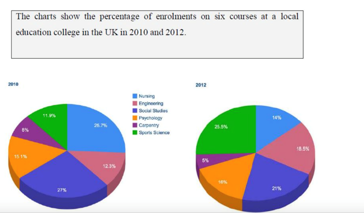

<b>1.</b> The following graph shows information about enrollments on six courses at a local education college in the UK, from 2010 and 2012.  <b>2.</b> According to the graph, we can see that Social Studies in 2010 has the largest number, which is around 27%.  <b>3.</b> Following that, Nursing in 2010 has the second largest number, which is around 26.7%.  <b>4.</b> Based on the information we can get from the graph Carpentry in 2012 has the smallest number, which is around 5%.  <b>5.</b> It's clear that Nursing and Social Studies has always been higher than Carpentry and Sports Science.  <b>6.</b> In general, this graph is very informative about enrollments on six courses.

### 31. Populations of Countries of the European Union in 1998 and 2007

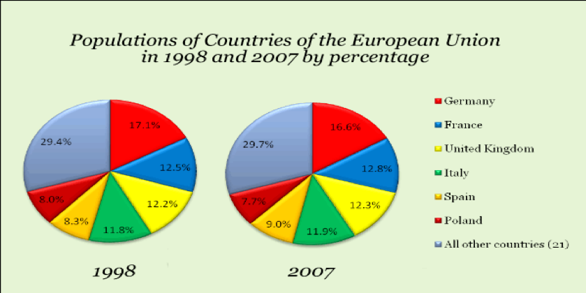

<b>1.</b> The following graph shows information about populations of countries of the European Union in 1998 and 2007 by percentage, including Germany, France, United Kingdom, Italy, Spain, Poland and all other countries.  <b>2.</b> According to the graph, we can see that all other countries (21) has the largest number, which is around 29.4% in 1998 and 29.7% in 2007.  <b>3.</b> Following that, Germany has the second largest number, which is around 17.1% in 1998 and 16.6% in 2007.  <b>4.</b> Based on the information we can get from the graph Poland has the smallest number, which is around 8.0% in 1998 and 7.7% in 2007.  <b>5.</b> It's clear that Germany has always been higher than France and United Kingdom.  <b>6.</b> In general, this graph is very informative about populations of countries of the European Union in 1998 and 2007.

### 32. Size of Nine Planets #031141 极高频 极限预测 困难

<b>1.</b> The following graph shows information about size of nine planets, including Jupiter, Saturn, Uranus, Neptune, Earth and Pluto.  <b>2.</b> According to the graph, we can see that Jupiter has the largest size, which is the biggest planet.  <b>3.</b> Following that, Saturn has the second largest size, which is slightly smaller than Jupiter.  <b>4.</b> Based on the information we can get from the graph Pluto has the smallest size, which is the tiniest object in the picture.  <b>5.</b> It's clear that Jupiter has always been bigger than all other planets.  <b>6.</b> In general, this graph is very informative about size of nine planets.

### 33. Typing Postures #031142 极高频 困难

<b>1.</b> The following graph shows information about typing postures, including right and wrong postures.  
<b>2.</b> According to the graph we can see that on the left side of the picture, the top left picture shows the correct typing posture in the top view., which is straight and aligned with the keyboard.  
<b>3.</b> Following that, in the middle of the picture, the bottom left picture shows the correct typing posture in the side view., which is clearly illustrated.  
<b>4.</b> Based on the information we can get from the graph on the right side of the picture, The top right picture shows the wrong typing posture in the top view., which is bent and angled incorrectly.  
<b>5.</b> It's clear that at the bottom of the picture, the bottom right picture shows the wrong typing posture in the side view., which is also showing right and wrong positions.  
<b>6.</b> In general, this graph is very informative about typing postures.

### 34. Adults Healthy BMI Chart #031143 极高频 普通

<b>1.</b> The following graph shows information about adults healthy BMI chart, including height from 1.36 to 2.00 metres and weight from 45 to 110 kilos.  <b>2.</b> According to the graph, we can see that extreme obese has the largest area, which is around the top left corner in red.  <b>3.</b> Following that, obese has the second largest area, which is around the upper middle section in pink.  <b>4.</b> Based on the information we can get from the graph under weight has the smallest area, which is around the bottom right corner in green.  <b>5.</b> It's clear that healthy weight has always been between under weight and over weight.  <b>6.</b> In general, this graph is very informative about adults healthy BMI chart.

### 35. How Solar Yard Lights Work #031145 极高频 困难

<b>1.</b> The following graph shows information about how solar yard lights work, including several components.  <b>2.</b> According to the graph we can see that on the left side of the picture, there is labels for each component, which is clearly marked.  <b>3.</b> Following that, in the middle of the picture, there is glass cover, solar cells and photoresistor, which is located at the top part of the light.  <b>4.</b> Based on the information we can get from the graph on the right side of the picture, there is battery, controller board and LED, which is the internal components in the middle part.  <b>5.</b> It's clear that at the bottom of the picture, there is lamp cover, which is the base of the solar yard light.  <b>6.</b> In general, this graph is very informative about how solar yard lights work.

### 36. Student Accommodation of Southampton University #031146 极高频 极限预测 困难

<b>1.</b> The following graph shows information about student accommodation of Southampton University, including a floor plan of 5.40m by 6.80m.  <b>2.</b> According to the graph we can see that on the left side of the picture, there is a kitchen area and a single bed, which is located next to each other.  <b>3.</b> Following that, in the middle of the picture, there is a desk and a bathroom, which is in the central area of the room.  <b>4.</b> Based on the information we can get from the graph on the right side of the picture, there is a sofa and a wardrobe, which is placed along the right wall.  <b>5.</b> It's clear that at the bottom of the picture, there is another bed and a washing machine, which is in the lower section of the accommodation.  <b>6.</b> In general, this graph is very informative about student accommodation of Southampton University.

### 37. Food Pyramid #031148 极高频 极限预测 困难

<b>1.</b> The following graph shows information about food pyramid, including different food groups from top to bottom.  <b>2.</b> According to the graph we can see that on the left side of the picture, there is milk, cheese and eggs, and bread and cereals, which is in the middle and lower layers of the pyramid.  <b>3.</b> Following that, in the middle of the picture, there is junk food, sweets and sugar drinks at the top, which is the smallest portion we should eat the least.  <b>4.</b> Based on the information we can get from the graph on the right side of the picture, there is meat, poultry, sausage and fish, and fruits and vegetables, which is in the middle and lower layers.  <b>5.</b> It's clear that at the bottom of the picture, there is water, which is the most essential and largest portion at the base.  <b>6.</b> In general, this graph is very informative about food pyramid.

### 38. The Graduation Laboratory

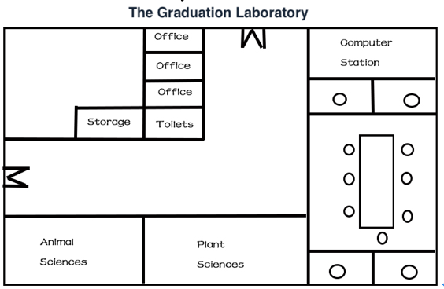

<b>1.</b> The following graph shows information about the graduation laboratory, including offices, storage, toilets, animal sciences, plant sciences and computer station.  <b>2.</b> According to the graph we can see that on the left side of the picture, there is three offices, a storage room and toilets, which is located in the upper left area.  <b>3.</b> Following that, in the middle of the picture, there is a staircase and a corridor, which is connecting different sections of the laboratory.  <b>4.</b> Based on the information we can get from the graph on the right side of the picture, there is a computer station with multiple workstations, which is arranged around a central table. It's clear that at the bottom of the picture, there is animal sciences and plant sciences, which is two large rooms at the lower level.  <b>5.</b> In general, this picture is very informative about the graduation laboratory.

### 39. Library Plan #031151 极高频 困难

<b>1.</b> The following graph shows information about library plan, including 5 functional areas.  <b>2.</b> According to the graph we can see that on the left side of the picture, there is area 1 in pink and area 4 in yellow, which is on the upper and lower left.  <b>3.</b> Following that, in the middle of the picture, there is area 2 in blue and area 5 in brown with an entrance between them, which is in the central part of the library.  <b>4.</b> Based on the information we can get from the graph on the right side of the picture, there is area 3 in purple, which is the largest area on the upper right.  <b>5.</b> It's clear that at the bottom of the picture, there is toilet F, toilet M and an elevator, which is located near the walkthrough area.  <b>6.</b> In general, this graph is very informative about library plan.

### 40. Oxbow Lake Formation #031152 极高频 极限预测 困难

<b>1.</b> The following graph shows information about oxbow lake formation, including two stages A and B.  <b>2.</b> According to the graph we can see that on the left side of the picture, there is a meander in stage A, which is a curved river bend.  <b>3.</b> Following that, in the middle of the picture, there is a narrow neck between the meander, which is where the river is about to cut through.  <b>4.</b> Based on the information we can get from the graph on the right side of the picture, there is sand and silt deposited, which is along the river bank.  <b>5.</b> It's clear that at the bottom of the picture, there is stage B showing an oxbow lake and a new channel, which is formed after the river cuts through the neck.  <b>6.</b> In general, this graph is very informative about oxbow lake formation.

### 41. The Eatwell Plate #031156 极高频 普通

<b>1.</b> The following graph shows information about the eatwell plate, including fruit and vegetables, bread rice potatoes pasta, meat fish eggs beans, milk and dairy foods, and foods high in fat and sugar.  <b>2.</b> According to the graph, we can see that fruit and vegetables has the largest portion, which is around the biggest green section of the plate.  <b>3.</b> Following that, bread, rice, potatoes, pasta and other starchy foods has the second largest portion, which is around the orange section.  <b>4.</b> Based on the information we can get from the graph foods and drinks high in fat and/or sugar has the smallest portion, which is around the tiniest yellow section.  <b>5.</b> It's clear that fruit and vegetables has always been larger than milk and dairy foods.  <b>6.</b> In general, this graph is very informative about the eatwell plate.

### 42. Student Accommodation Floor Plan

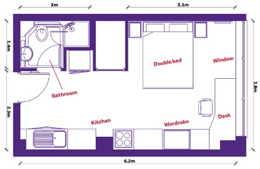

<b>1.</b> The following graph shows information about student accommodation floor plan, including bathroom, kitchen, double bed, desk, wardrobe and window.  <b>2.</b> According to the graph we can see that on the left side of the picture, there is a bathroom, which is approximately 2 metres wide.  <b>3.</b> Following that, in the middle of the picture, there is a kitchen area and a double bed, which is the main living and sleeping space.  <b>4.</b> Based on the information we can get from the graph on the right side of the picture, there is a window and a desk, which is located along the right wall. It's clear that at the bottom of the picture, there is a wardrobe, which is next to the desk area, and the total floor space is 6.2 metres by 3.9 metres.  <b>5.</b> In general, this picture is very informative about student accommodation floor plan.

### 43. The World's Water

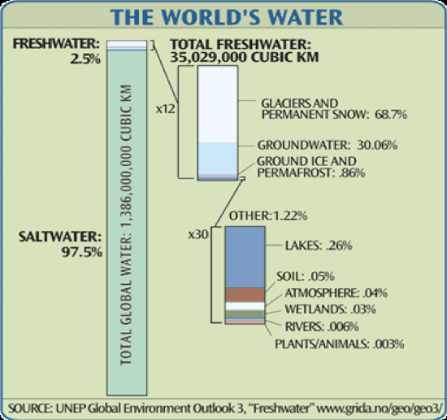

<b>1.</b> The following graph shows information about the world's water, including saltwater, freshwater, glaciers, groundwater and other sources.  <b>2.</b> According to the graph, we can see that saltwater has the largest number, which is around 97.5% of total global water at 1,386,000,000 cubic km.  <b>3.</b> Following that, freshwater has the second largest number, which is around 2.5%, totalling 35,029,000 cubic km.  <b>4.</b> Based on the information we can get from the graph glaciers and permanent snow has the largest portion of freshwater, which is around 68.7%, followed by groundwater at 30.06%.  <b>5.</b> It's clear that saltwater has always been higher than freshwater.  <b>6.</b> In general, this graph is very informative about the world's water.

### 44. Fish Count in Daytime and Nighttime

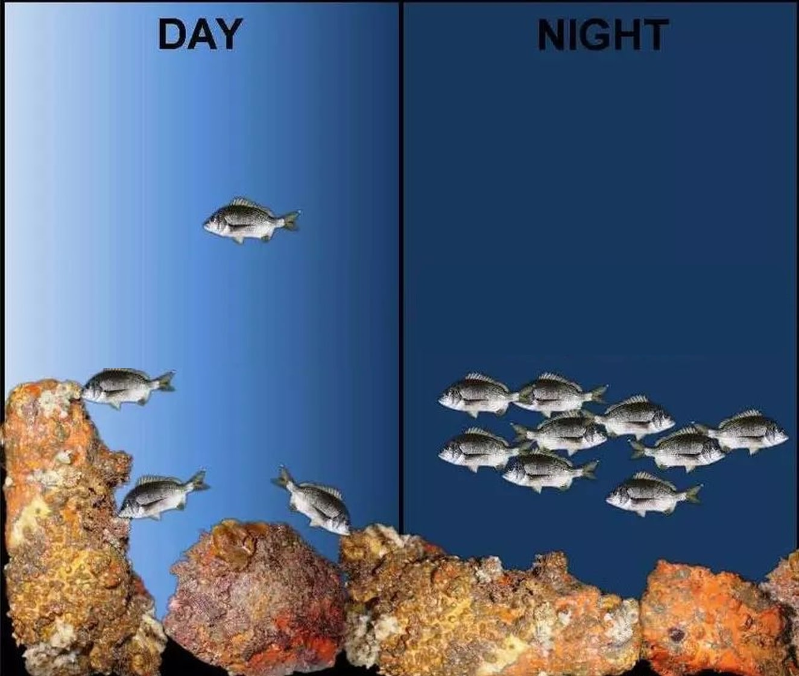

<b>1.</b> The following graph shows information about fish count in daytime and nighttime, including day and night comparison.  <b>2.</b> According to the graph we can see that on the left side of the picture, there is the daytime scene with approximately 4 fish scattered around the coral reef, which is showing fewer fish during the day.  <b>3.</b> Following that, in the middle of the picture, there is coral reef rocks, which is the natural habitat at the bottom of both scenes.  <b>4.</b> Based on the information we can get from the graph on the right side of the picture, there is the nighttime scene with approximately 10 fish gathered in a school, which is showing significantly more fish at night. It's clear that at the bottom of the picture, there is orange and brown coral formations, which is the shared ocean floor environment.  <b>5.</b> In general, this picture is very informative about fish count in daytime and nighttime.

### 45. Lunar Cycle affects Fish Catch Rates #031167 极高频 极限预测 困难

<b>1.</b> The following graph shows information about lunar cycle affects fish catch rates, including four moon phases.  <b>2.</b> According to the graph we can see that on the left side of the picture, there is a crescent moon with fish staying at the bottom, which is indicating low catch rates.  <b>3.</b> Following that, in the middle of the picture, there is a half moon and a full moon with fish moving to the surface, which is indicating increasing catch rates.  <b>4.</b> Based on the information we can get from the graph on the right side of the picture, there is a waning moon with fish near the surface, which is indicating high catch rates.  <b>5.</b> It's clear that at the bottom of the picture, there is fewer fish during the crescent moon, which is compared to more fish near the surface during the full moon.  <b>6.</b> In general, this graph is very informative about lunar cycle affects fish catch rates.

### 46. Computers Then and Now

<b>1.</b> The following graph shows information about computers then and now, including an old computer and a modern computer.  <b>2.</b> According to the graph we can see that on the left side of the picture, there is an old mainframe computer, which is very large, tall and bulky with tape reels and a small screen.  <b>3.</b> Following that, in the middle of the picture, there is a clear contrast between the two computers, which is showing the evolution of technology.  <b>4.</b> Based on the information we can get from the graph on the right side of the picture, there is a modern Dell desktop computer with a flat screen monitor, keyboard and mouse, which is compact and sleek. It's clear that at the bottom of the picture, there is a keyboard and mouse, which is part of the modern computer setup.  <b>5.</b> In general, this picture is very informative about computers then and now.

### 47. Different Heights of Four Trees

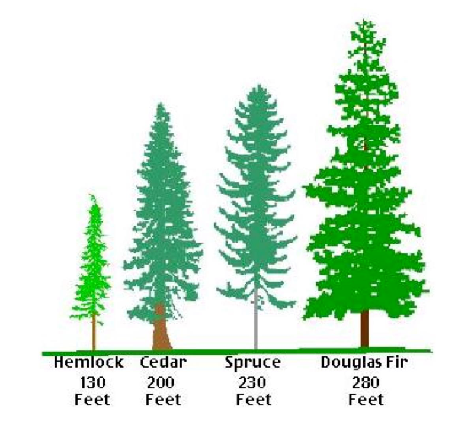

<b>1.</b> The following graph shows information about different heights of four trees, including Hemlock, Cedar, Spruce and Douglas Fir.  <b>2.</b> According to the graph, we can see that Douglas Fir has the largest number, which is around 280 feet.  <b>3.</b> Following that, Spruce has the second largest number, which is around 230 feet.  <b>4.</b> Based on the information we can get from the graph Hemlock has the smallest number, which is around 130 feet.  <b>5.</b> It's clear that Douglas Fir has always been higher than all other trees.  <b>6.</b> In general, this graph is very informative about different heights of four trees.

### 48. Human Arms and Wings #031170 极高频 困难

<b>1.</b> The following graph shows information about human arms and wings, including human arm, seal limb, bird wing and bat wing.  <b>2.</b> According to the graph we can see that on the left side of the picture, there is the labels for each limb type, which is clearly written.  <b>3.</b> Following that, in the middle of the picture, there is colored bone structures including humerus, radius, ulna and hand, which is highlighted in green, blue and red.  <b>4.</b> Based on the information we can get from the graph on the right side of the picture, there is the hand, wrist and fingers of each limb, which is shown in different shapes for each species.  <b>5.</b> It's clear that at the bottom of the picture, there is bat wing, which is the largest and most spread out limb.  <b>6.</b> In general, this graph is very informative about human arms and wings.

### 49. Overshot Waterwheel and Breast Shot Waterwheel

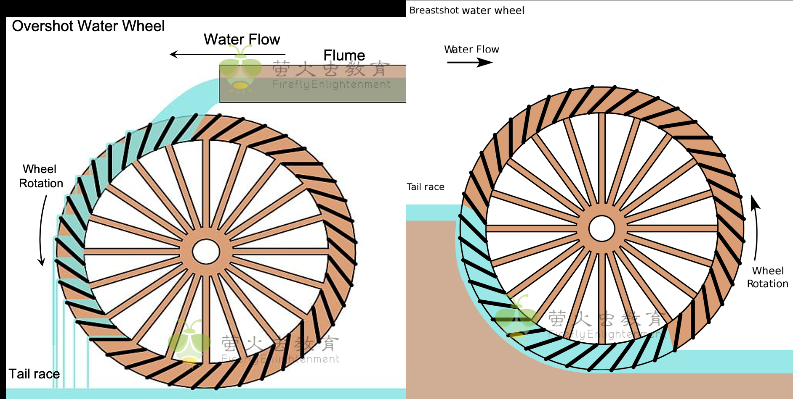

<b>1.</b> The following graph shows information about overshot waterwheel and breast shot waterwheel, including water flow, flume, wheel rotation and tail race.  <b>2.</b> According to the graph we can see that on the left side of the picture, there is an overshot water wheel, which is powered by water flowing from a flume at the top of the wheel.  <b>3.</b> Following that, in the middle of the picture, there is labels showing the water flow direction and wheel rotation, which is clearly indicated by arrows.  <b>4.</b> Based on the information we can get from the graph on the right side of the picture, there is a breast shot water wheel, which is powered by water hitting the wheel at the middle height. It's clear that at the bottom of the picture, there is the tail race, which is where the water exits after turning the wheel.  <b>5.</b> In general, this picture is very informative about overshot waterwheel and breast shot waterwheel.

### 50. Wind Power to Electricity

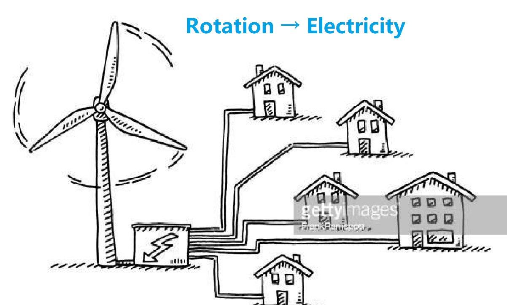

<b>1.</b> The following graph shows information about wind power to electricity, including wind turbine, generator and houses.  <b>2.</b> According to the graph, we can see that the first step is wind rotates the blades of the wind turbine.  <b>3.</b> Following that, the second step is the rotation is converted to electricity by a generator at the base of the turbine.  <b>4.</b> Based on the information we can get from the graph, the third step is the electricity is transmitted through cables to nearby houses and buildings.  <b>5.</b> It's clear that the last steps are the electricity powers multiple houses and an apartment building in the community.  <b>6.</b> We can see that there is a wind turbine connected to several houses in the picture, which is illustrating renewable energy distribution.  <b>7.</b> In general, this graph is very informative about wind power to electricity.

### 51. Layers of the Earth and the Distance

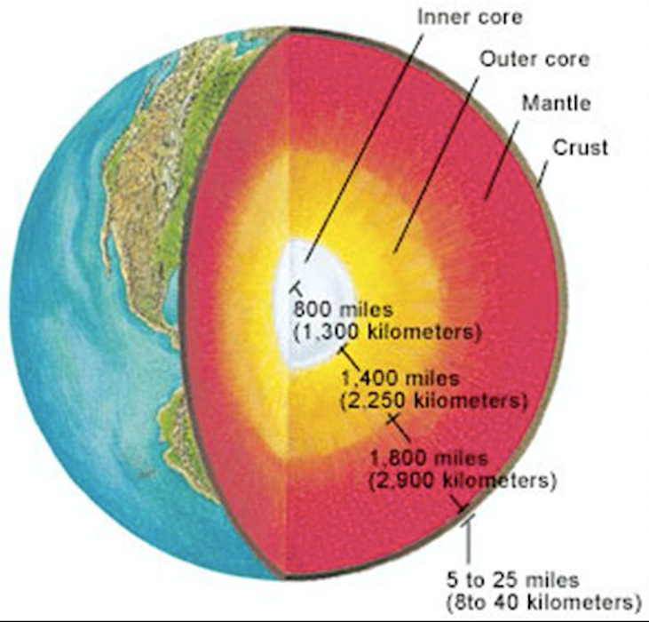

<b>1.</b> The following graph shows information about the layers of the Earth and the distance, including inner core, outer core, mantle, and crust.  <b>2.</b> According to the graph we can see that on the left side of the picture, there is the crust, which is 5 to 25 miles or 8 to 40 kilometers thick.  <b>3.</b> Following that, in the middle of the picture, there is the mantle, which is 1,800 miles or 2,900 kilometers deep.  <b>4.</b> Based on the information we can get from the graph on the right side of the picture, there is the outer core, which is 1,400 miles or 2,250 kilometers deep. It's clear that at the bottom of the picture, there is the inner core, which is 800 miles or 1,300 kilometers in radius.  <b>5.</b> In general, this picture is very informative about the layers of the Earth and the distance.

### 52. Bird Feeder

<b>1.</b> The following graph shows information about bird feeders made from plastic bottles, including two examples of homemade bird feeders.  <b>2.</b> According to the graph we can see that on the left side of the picture, there is a plastic bottle bird feeder, which is filled with seeds and has wooden sticks as perches.  <b>3.</b> Following that, in the middle of the picture, there is a pine cone, which is used to hang the feeder from a tree.  <b>4.</b> Based on the information we can get from the graph on the right side of the picture, there is another plastic bottle bird feeder, which is also filled with seeds and has a small bird perching on it. It's clear that at the bottom of the picture, there is a green garden background, which is natural and outdoor.  <b>5.</b> In general, this picture is very informative about bird feeders made from recycled plastic bottles.

### 53. Parts of a Tree

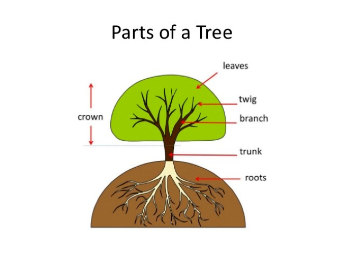

<b>1.</b> The following graph shows information about the parts of a tree, including crown, leaves, twig, branch, trunk, and roots.  <b>2.</b> According to the graph we can see that on the left side of the picture, there is the crown, which is the entire top section of the tree.  <b>3.</b> Following that, in the middle of the picture, there is the trunk, which is the main stem connecting the crown to the roots.  <b>4.</b> Based on the information we can get from the graph on the right side of the picture, there is the leaves, twig, and branch, which is labeled with arrows pointing to each part. It's clear that at the bottom of the picture, there is the roots, which is underground and spread out beneath the soil.  <b>5.</b> In general, this picture is very informative about the parts of a tree.

### 54. Land Use Map of India

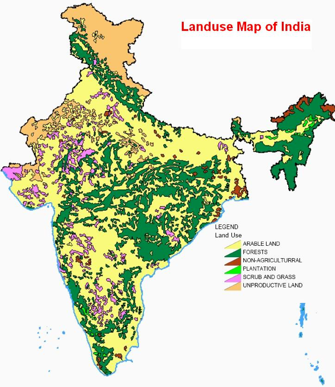

<b>1.</b> The following graph shows information about the land use map of India, including arable land, forests, non-agricultural, plantation, scrub and grass, and unproductive land.  <b>2.</b> According to the graph, we can see that on the left side of the picture, there is a yellow area, which is arable land covering most of the western and central regions.  <b>3.</b> Following that, in the middle of the picture, there is a green area, which is forests scattered across central India.  <b>4.</b> Based on the information we can get from the graph on the right side of the picture, there is a dark green area, which is dense forests in the northeastern region. It's clear that at the bottom of the picture, there is a purple area, which is scrub and grass in parts of western India.  <b>5.</b> In general, the graph is very informative about the land use map of India.

### 55. Distribution of Tropical Rain Forests #031181 极高频 困难

<b>1.</b> The following graph shows information about distribution of tropical rain forests, including all continents.  <b>2.</b> According to the graph, we can see that on the left side of the picture, there is a green area, which is South America with the largest tropical rain forest.  <b>3.</b> Following that, in the middle of the picture, there is a green area, which is Africa with a significant portion of rain forest.  <b>4.</b> Based on the information we can get from the graph on the right side of the picture, there is a green area, which is Southeast Asia and Australia with scattered rain forests.  <b>5.</b> It's clear that at the bottom of the picture, there is a blue area, which is oceans surrounding all the continents.  <b>6.</b> In general, the graph is very informative about distribution of tropical rain forests.

### 56. Climate Zones for Temperature and Humidity #031182 极高频 困难

<b>1.</b> The following graph shows information about climate zones for temperature and humidity in Australia, including hot humid, warm humid, hot dry summer warm winter, hot dry summer cold winter, temperate and cool temperate.  <b>2.</b> According to the graph, we can see that on the left side of the picture, there is a yellow area, which is hot dry summer cold winter in western Australia.  <b>3.</b> Following that, in the middle of the picture, there is a orange area, which is hot dry summer warm winter in central Australia.  <b>4.</b> Based on the information we can get from the graph on the right side of the picture, there is a red area, which is hot humid in the northeast of Australia.  <b>5.</b> It's clear that at the bottom of the picture, there is a green and blue area, which is temperate and cool temperate in the south and Tasmania.  <b>6.</b> In general, the graph is very informative about climate zones for temperature and humidity in Australia.

### 57. Population Density in Australia 2011 #031192 极高频 困难

<b>1.</b> The following graph shows information about Australian population density 2011, including people per square kilometer.  <b>2.</b> According to the graph, we can see that on the left side of the picture, there is a light yellow area, which is less than 0.1 people per square kilometer in western Australia.  <b>3.</b> Following that, in the middle of the picture, there is a light beige area, which is 0.1 to 1.0 people per square kilometer in central Australia.  <b>4.</b> Based on the information we can get from the graph on the right side of the picture, there is a dark brown area, which is 100.0 or more people per square kilometer along the east coast.  <b>5.</b> It's clear that at the bottom of the picture, there is a orange area, which is 10.0 to 100.0 people per square kilometer in the southeast.  <b>6.</b> In general, the graph is very informative about Australian population density 2011.

### 58. Annual Sunshine Hours for France #031196 极高频 极限预测 普通

<b>1.</b> The following graph shows information about annual sunshine hours for France, including less than 1750 to more than 2750 hours.  <b>2.</b> According to the graph, we can see that on the left side of the picture, there is a yellow area, which is 1750 to 2000 hours in western France near Charante-Maritime.  <b>3.</b> Following that, in the middle of the picture, there is a light yellow area, which is less than 1750 hours in northern France.  <b>4.</b> Based on the information we can get from the graph on the right side of the picture, there is a orange area, which is 2000 to 2500 hours in eastern and central France.  <b>5.</b> It's clear that at the bottom of the picture, there is a red area, which is more than 2750 hours in southern France and Corsica.  <b>6.</b> In general, the graph is very informative about annual sunshine hours for France.

### 59. Global Warming Predictions by Temperature Increase #031197 极高频 极限预测 普通

<b>1.</b> The following graph shows information about global warming predictions by temperature increase, including 2070-2100 prediction versus 1960-1990 average.  <b>2.</b> According to the graph, we can see that on the left side of the picture, there is a orange area, which is 3 to 4 degrees Celsius increase in South America.  <b>3.</b> Following that, in the middle of the picture, there is a dark red area, which is 5 to 7 degrees Celsius increase in Africa and Central Asia.  <b>4.</b> Based on the information we can get from the graph on the right side of the picture, there is a orange area, which is 3 to 5 degrees Celsius increase in Australia and East Asia.  <b>5.</b> It's clear that at the bottom of the picture, there is a light yellow area, which is 0 to 2 degrees Celsius increase in the oceans.  <b>6.</b> In general, the graph is very informative about global warming predictions by temperature increase.

### 60. Germination of Bean Plants

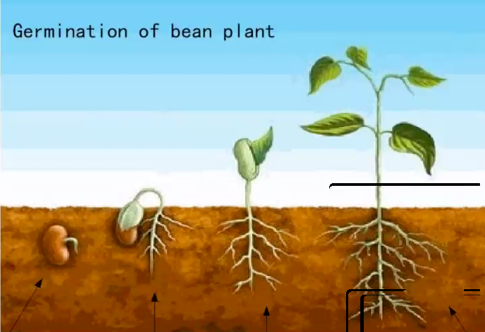

<b>1.</b> The following graph shows information about the germination of bean plants, including the seed, sprouting, seedling, and mature plant stages.  <b>2.</b> According to the graph, we can see that the first step is a bean seed lying in the soil.  <b>3.</b> Following that, the second step is the seed cracking open and a small shoot emerging from the soil.  <b>4.</b> Based on the information we can get from the graph, the third step is the seedling growing taller with initial leaves appearing above the ground.  <b>5.</b> It's clear that the last steps are the plant developing a strong root system underground and growing into a mature bean plant with multiple leaves.  <b>6.</b> We can see that there is a progression from left to right in the picture, which is illustrative of the complete growth cycle.  <b>7.</b> In general, this graph is very informative about the germination of bean plants.

### 61. Water Cycle (color) #031202 极高频 普通

<b>1.</b> The following graph shows information about water cycle, including evaporation, transportation, precipitation and surface run-off.  <b>2.</b> According to the graph, we can see that the first step is evaporation, where water from the ocean rises into the atmosphere.  <b>3.</b> Following that, the second step is transportation, where water vapor moves through the air towards the mountains.  <b>4.</b> Based on the information we can get from the graph, the third step is precipitation, where water falls as rain onto the mountains and land.  <b>5.</b> It's clear that the last steps are surface run-off, where water flows back to the ocean through rivers.  <b>6.</b> We can see that there is mountains, rivers and ocean in the picture, which is colorful and vivid.  <b>7.</b> In general, this graph is very informative about water cycle.

### 62. Life Cycle of an Apple Tree #031209 极高频 普通

<b>1.</b> The following graph shows information about life cycle of an apple tree, including seeds, sprout, tree, flower and fruit.  <b>2.</b> According to the graph, we can see that the first step is seeds, which come from inside the apple fruit.  <b>3.</b> Following that, the second step is sprout, where the seeds grow into a small plant with roots.  <b>4.</b> Based on the information we can get from the graph, the third step is tree, where the sprout grows into a full-sized apple tree.  <b>5.</b> It's clear that the last steps are flower and fruit, where the tree blossoms and then produces apples.  <b>6.</b> We can see that there is a circular arrow pattern in the picture, which is continuous and cyclical.  <b>7.</b> In general, this graph is very informative about life cycle of an apple tree.

### 63. Tesco Extra Music Download #031214 极高频 普通

<b>1.</b> The following graph shows information about Tesco Extra music download, including search, purchase, download and play.  <b>2.</b> According to the graph, we can see that the first step is search, where users look for the music they want.  <b>3.</b> Following that, the second step is purchase, where users buy the music through a shopping cart.  <b>4.</b> Based on the information we can get from the graph, the third step is download, where users save the purchased music to their device.  <b>5.</b> It's clear that the last steps are play, where users listen to the music with headphones.  <b>6.</b> We can see that there is a circular flow with arrows in the picture, which is simple and clear.  <b>7.</b> In general, this graph is very informative about Tesco Extra music download.

### 64. Fungus Gnat Lifecycle in 28 Days #031224 极高频 极限预测 困难

<b>1.</b> The following graph shows information about fungus gnat lifecycle in 28 days, including eggs, larva, pupa and adult.  <b>2.</b> According to the graph, we can see that the first step is eggs, which takes about 4 to 6 days.  <b>3.</b> Following that, the second step is larva, which takes about 12 to 14 days.  <b>4.</b> Based on the information we can get from the graph, the third step is pupa, which takes about 3 to 6 days.  <b>5.</b> It's clear that the last steps are adult, which lives for about 7 to 10 days before laying eggs again.  <b>6.</b> We can see that there is a circular diagram in the picture, which is about 28 days in total.  <b>7.</b> In general, this graph is very informative about fungus gnat lifecycle in 28 days.

### 65. Adding an Article to Wikipedia #031225 极高频 普通

<b>1.</b> The following graph shows information about adding an article to Wikipedia, including search, decision and creation.  <b>2.</b> According to the graph, we can see that the first step is search Wikipedia for the topic.  <b>3.</b> Following that, the second step is check if it is found, if yes, think of another term.  <b>4.</b> Based on the information we can get from the graph, the third step is if not found, check if there is a related term.  <b>5.</b> It's clear that the last steps are if there is a related term, create a redirect; if not, create a new article.  <b>6.</b> We can see that there is a decision flow with yes and no branches in the picture, which is logical and structured.  <b>7.</b> In general, this graph is very informative about adding an article to Wikipedia.

### 66. Where the Air Pollution Comes From

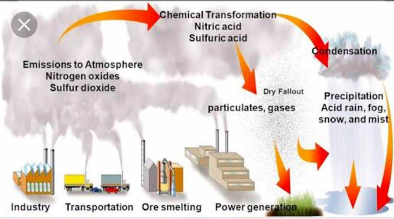

<b>1.</b> The following graph shows information about where the air pollution comes from, including industry, transportation, ore smelting, and power generation.  <b>2.</b> According to the graph, we can see that the first step is emissions to the atmosphere of nitrogen oxides and sulfur dioxide from industry, transportation, ore smelting, and power generation.  <b>3.</b> Following that, the second step is chemical transformation into nitric acid and sulfuric acid.  <b>4.</b> Based on the information we can get from the graph, the third step is condensation occurring in the atmosphere.  <b>5.</b> It's clear that the last steps are dry fallout of particulates and gases, and precipitation in the form of acid rain, fog, snow, and mist.  <b>6.</b> We can see that there is a cyclical process of pollution in the picture, which is harmful to the environment.  <b>7.</b> In general, this graph is very informative about where the air pollution comes from.

### 67. Commuting Time in Different Regions, Britain, 2014

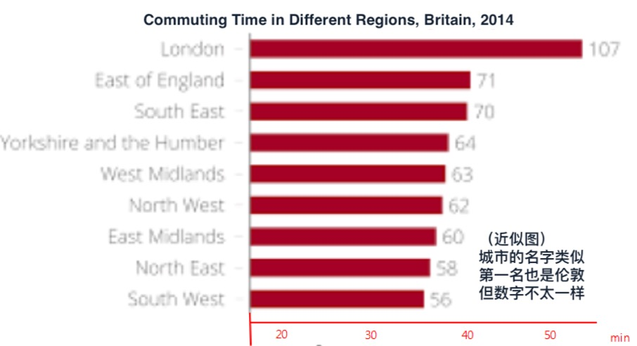

<b>1.</b> The following graph shows information about commuting time in different regions of Britain in 2014, from London, East of England, South East, Yorkshire and the Humber, West Midlands, North West, East Midlands, North East, and South West.  <b>2.</b> According to the graph, we can see that London has the largest number, which is around 107 minutes.  <b>3.</b> Following that, East of England has the second largest number, which is around 71 minutes.  <b>4.</b> Based on the information we can get from the graph South West has the smallest number, which is around 56 minutes.  <b>5.</b> It's clear that London has always been higher than all other regions.  <b>6.</b> In general, this graph is very informative about commuting time in different regions of Britain in 2014.

### 68. Vehicle Ownership, New Zealand in 2001 and 2013

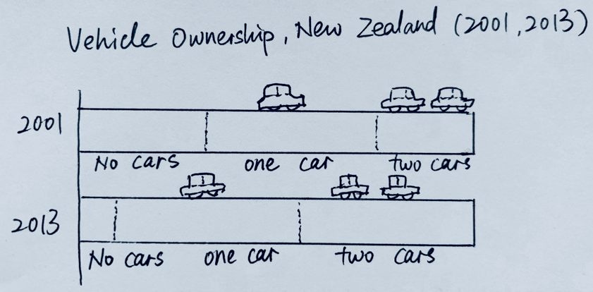

<b>1.</b> The following graph shows information about vehicle ownership in New Zealand, from 2001 and 2013.  <b>2.</b> According to the graph, we can see that two cars ownership in 2013 has the largest number, which is around the highest proportion compared to other categories.  <b>3.</b> Following that, one car ownership has the second largest number, which is around a moderate proportion in both years.  <b>4.</b> Based on the information we can get from the graph no cars has the smallest number, which is around the lowest proportion in both years.  <b>5.</b> It's clear that two cars ownership has always been higher than no cars ownership.  <b>6.</b> In general, this graph is very informative about vehicle ownership in New Zealand in 2001 and 2013.

### 69. Eclipse

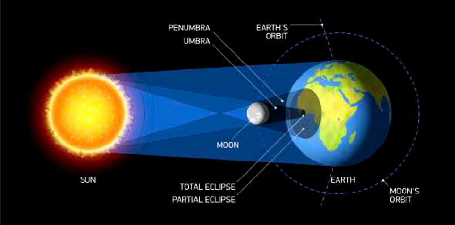

<b>1.</b> The following graph shows information about a solar eclipse, including the Sun, Moon, Earth, umbra, penumbra, and the orbits.  <b>2.</b> According to the graph we can see that on the left side of the picture, there is the Sun, which is large and bright.  <b>3.</b> Following that, in the middle of the picture, there is the Moon, which is positioned between the Sun and Earth casting shadows.  <b>4.</b> Based on the information we can get from the graph on the right side of the picture, there is the Earth, which is receiving the umbra and penumbra shadows. It's clear that at the bottom of the picture, there is labels for total eclipse and partial eclipse, which is indicating the two types of shadow zones.  <b>5.</b> In general, this picture is very informative about how a solar eclipse occurs.

### 70. Annual Change in Forest Area by Region, 1990-2010

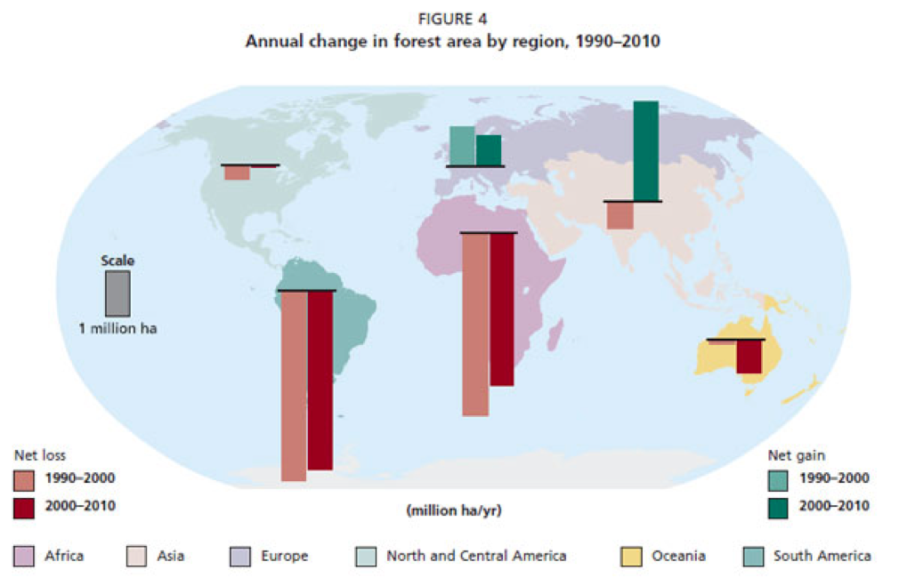

<b>1.</b> The following graph shows information about annual change in forest area by region from 1990 to 2010, from Africa, Asia, Europe, North and Central America, Oceania, and South America.  <b>2.</b> According to the graph, we can see that South America has the largest number, which is around the greatest net loss of over 4 million hectares per year.  <b>3.</b> Following that, Africa has the second largest number, which is around a significant net loss of approximately 3 to 4 million hectares per year.  <b>4.</b> Based on the information we can get from the graph North and Central America has the smallest number, which is around a minimal net loss.  <b>5.</b> It's clear that Asia has always been higher than Europe in terms of net gain from 1990 to 2010.  <b>6.</b> In general, this graph is very informative about annual change in forest area by region from 1990 to 2010.

### 71. Weekly Household Spending, Ireland

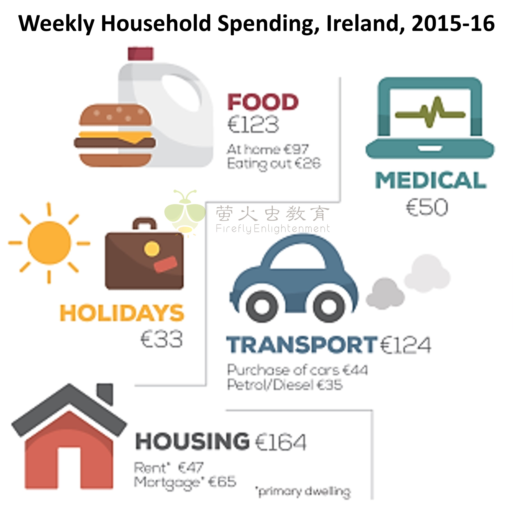

<b>1.</b> The following graph shows information about weekly household spending in Ireland in 2015-16, from housing, transport, food, medical, and holidays.  <b>2.</b> According to the graph, we can see that housing has the largest number, which is around 164 euros per week.  <b>3.</b> Following that, transport has the second largest number, which is around 124 euros per week.  <b>4.</b> Based on the information we can get from the graph holidays has the smallest number, which is around 33 euros per week.  <b>5.</b> It's clear that housing has always been higher than all other categories.  <b>6.</b> In general, this graph is very informative about weekly household spending in Ireland.

### 72. Input Output Process

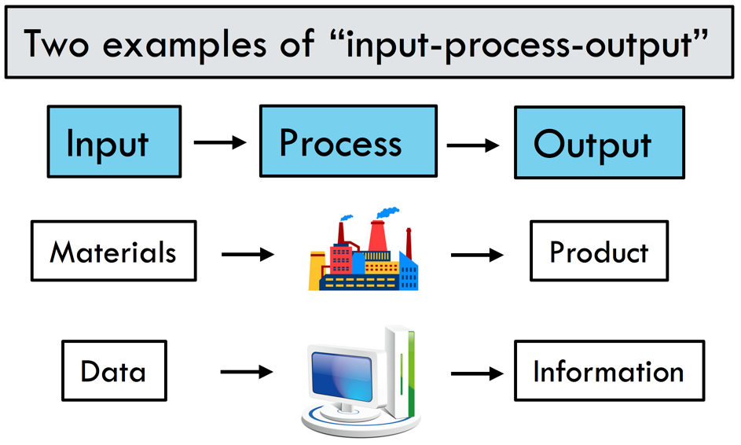

<b>1.</b> The following graph shows information about the input-process-output model, including two examples of input, process, and output.  <b>2.</b> According to the graph, we can see that the first step is input, where materials or data are provided.  <b>3.</b> Following that, the second step is process, where a factory processes materials or a computer processes data.  <b>4.</b> Based on the information we can get from the graph, the third step is output, where the factory produces a product and the computer produces information.  <b>5.</b> It's clear that the last steps are the final products and information being generated from the process.  <b>6.</b> We can see that there is two parallel examples in the picture, which is illustrative and easy to understand.  <b>7.</b> In general, this graph is very informative about the input-process-output model.

### 73. Trading Goods in Ancient Egypt

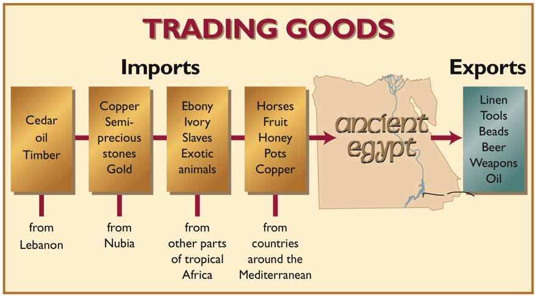

<b>1.</b> The following graph shows information about trading goods in ancient Egypt, including imports and exports.  <b>2.</b> According to the graph we can see that on the left side of the picture, there is imports from Lebanon, which is cedar, oil, and timber.  <b>3.</b> Following that, in the middle of the picture, there is imports from Nubia and tropical Africa, which is copper, semi-precious stones, gold, ebony, ivory, slaves, and exotic animals.  <b>4.</b> Based on the information we can get from the graph on the right side of the picture, there is exports from ancient Egypt, which is linen, tools, beads, beer, weapons, and oil. It's clear that at the bottom of the picture, there is imports from Mediterranean countries, which is horses, fruit, honey, pots, and copper.  <b>5.</b> In general, this picture is very informative about trading goods in ancient Egypt.

### 74. Dell Recycling

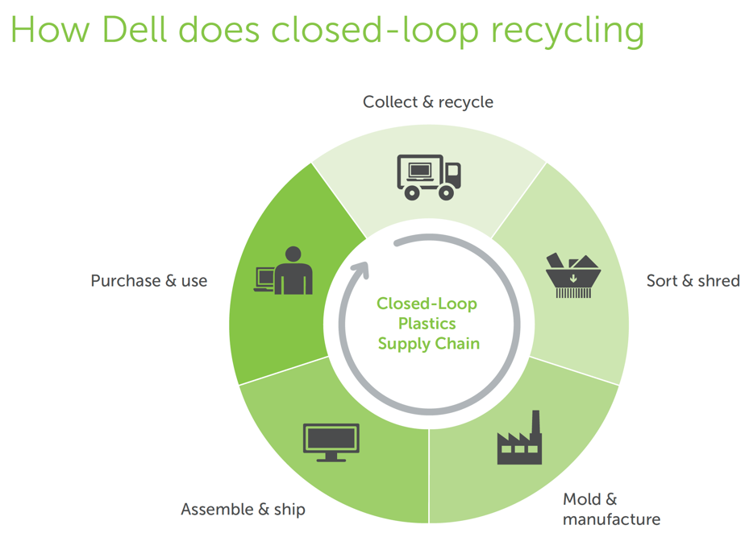

<b>1.</b> The following graph shows information about how Dell does closed-loop recycling, including collect and recycle, sort and shred, mold and manufacture, assemble and ship, and purchase and use.  <b>2.</b> According to the graph, we can see that the first step is collect and recycle, where used plastics are collected.  <b>3.</b> Following that, the second step is sort and shred, where the collected plastics are sorted and shredded.  <b>4.</b> Based on the information we can get from the graph, the third step is mold and manufacture, where the shredded plastics are molded into new parts.  <b>5.</b> It's clear that the last steps are assemble and ship the new products, then purchase and use by customers.  <b>6.</b> We can see that there is a closed-loop plastics supply chain in the picture, which is circular and sustainable.  <b>7.</b> In general, this graph is very informative about how Dell does closed-loop recycling.

### 75. Sweden Government Budget 2018

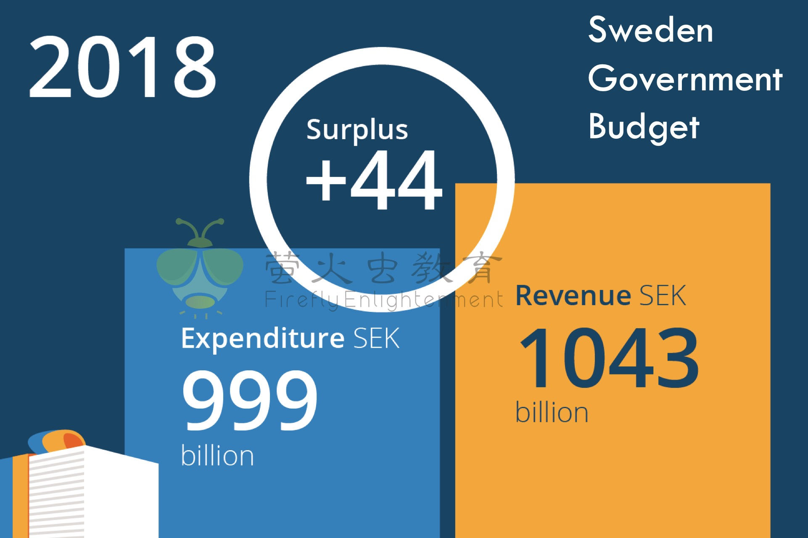

<b>1.</b> The following graph shows information about the Sweden government budget in 2018, from expenditure, revenue, and surplus.  <b>2.</b> According to the graph, we can see that revenue has the largest number, which is around SEK 1,043 billion.  <b>3.</b> Following that, expenditure has the second largest number, which is around SEK 999 billion.  <b>4.</b> Based on the information we can get from the graph surplus has the smallest number, which is around SEK 44 billion.  <b>5.</b> It's clear that revenue has always been higher than expenditure.  <b>6.</b> In general, this graph is very informative about the Sweden government budget in 2018.

### 76. Annual Mean Temperature

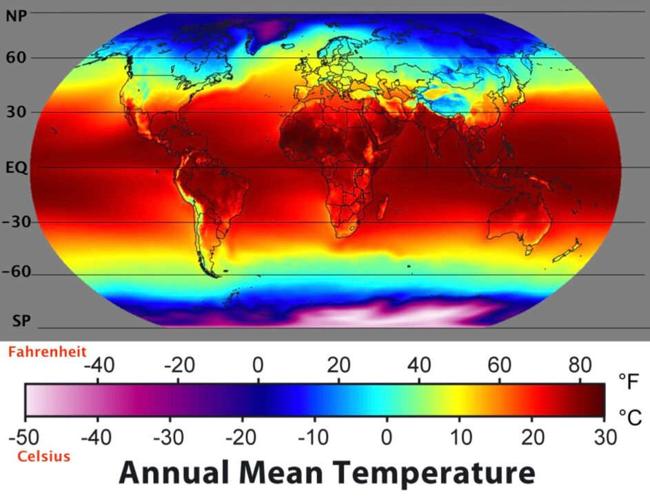

<b>1.</b> The following graph shows information about annual mean temperature around the world, including temperature ranges in both Fahrenheit and Celsius.  <b>2.</b> According to the graph, we can see that on the left side of the picture, there is a red area, which is South America near the equator with temperatures around 20 to 30 degrees Celsius.  <b>3.</b> Following that, in the middle of the picture, there is a red area, which is Africa and the Middle East with temperatures around 20 to 30 degrees Celsius.  <b>4.</b> Based on the information we can get from the graph on the right side of the picture, there is a red and dark red area, which is Southeast Asia and Australia with temperatures around 20 to 30 degrees Celsius. It's clear that at the bottom of the picture, there is a purple and white area, which is Antarctica with temperatures around minus 40 to minus 50 degrees Celsius.  <b>5.</b> In general, the graph is very informative about annual mean temperature.

### 77. Journeys in UK by Purpose

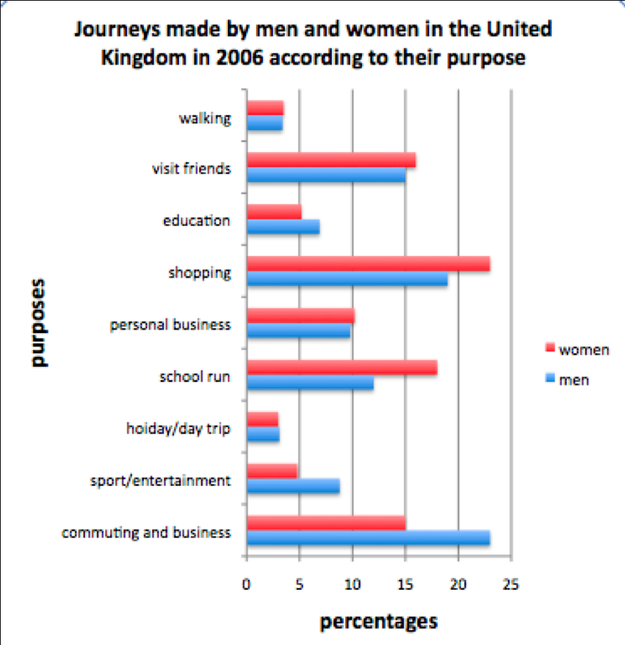

<b>1.</b> The following graph shows information about journeys made by men and women in the United Kingdom in 2006 according to their purpose, from various categories such as shopping, commuting, school run, and others.  <b>2.</b> According to the graph, we can see that shopping for women has the largest number, which is around 23 percent.  <b>3.</b> Following that, commuting and business for men has the second largest number, which is around 23 percent.  <b>4.</b> Based on the information we can get from the graph holiday and day trip has the smallest number, which is around 3 percent.  <b>5.</b> It's clear that women in shopping and school run has always been higher than men in the same categories.  <b>6.</b> In general, this graph is very informative about journeys in the UK by purpose.

### 78. Adults vs Teens Number of Texts on a Typical Day

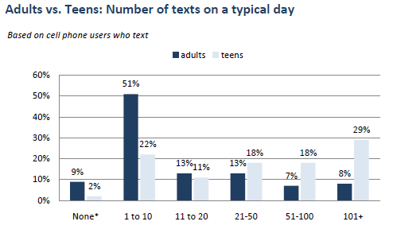

<b>1.</b> The following graph shows information about adults versus teens number of texts on a typical day, from different texting frequency categories.  <b>2.</b> According to the graph, we can see that adults sending 1 to 10 texts has the largest number, which is around 51 percent.  <b>3.</b> Following that, teens sending 101 or more texts has the second largest number, which is around 29 percent.  <b>4.</b> Based on the information we can get from the graph teens sending none has the smallest number, which is around 2 percent.  <b>5.</b> It's clear that adults in the 1 to 10 category has always been higher than teens in the same category.  <b>6.</b> In general, this graph is very informative about adults versus teens number of texts on a typical day.

### 79. Rainforest in South America

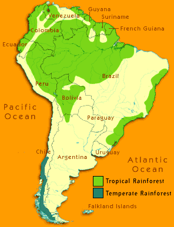

<b>1.</b> The following graph shows information about rainforest distribution in South America, including tropical rainforest and temperate rainforest.  <b>2.</b> According to the graph, we can see that on the left side of the picture, there is a green area, which is tropical rainforest covering Colombia, Ecuador, and Peru.  <b>3.</b> Following that, in the middle of the picture, there is a large green area, which is Brazil containing the largest tropical rainforest.  <b>4.</b> Based on the information we can get from the graph on the right side of the picture, there is a green area, which is French Guiana, Suriname, and Guyana with tropical rainforest. It's clear that at the bottom of the picture, there is a dark green area, which is temperate rainforest in southern Chile.  <b>5.</b> In general, the graph is very informative about rainforest in South America.

### 80. Fruits

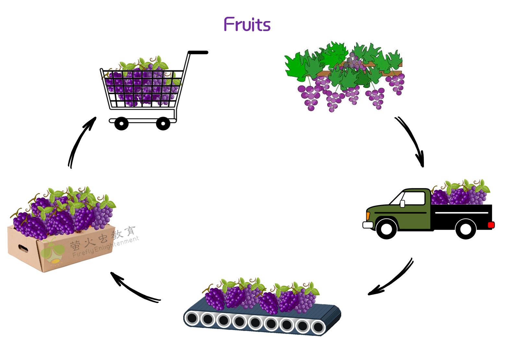

<b>1.</b> The following graph shows information about the process of fruit production and distribution, including growing, transporting, processing, packaging, and selling.  <b>2.</b> According to the graph, we can see that the first step is growing grapes on the vine.  <b>3.</b> Following that, the second step is transporting the harvested grapes by truck.  <b>4.</b> Based on the information we can get from the graph, the third step is processing the grapes on a conveyor belt.  <b>5.</b> It's clear that the last steps are packaging the grapes into boxes and selling them in shopping carts at stores.  <b>6.</b> We can see that there is a circular flow of arrows in the picture, which is clearly illustrating the complete supply chain.  <b>7.</b> In general, this graph is very informative about the fruit production and distribution process.

### 81. A Food Chain

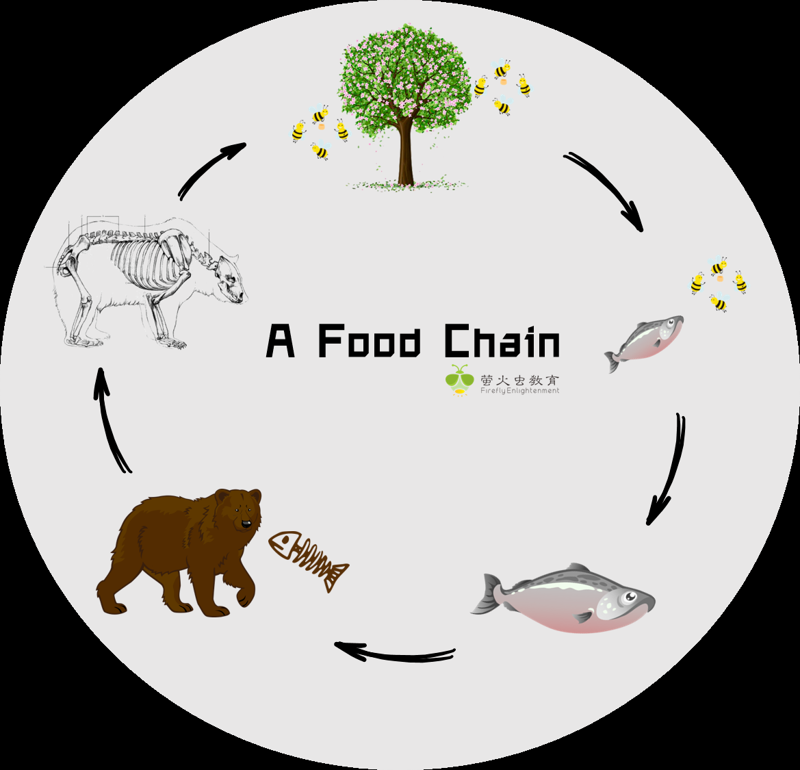

<b>1.</b> The following graph shows information about a food chain, including trees, bees, fish, bears, and decomposition.  <b>2.</b> According to the graph, we can see that the first step is a tree producing flowers that attract bees.  <b>3.</b> Following that, the second step is a small fish feeding on insects like bees.  <b>4.</b> Based on the information we can get from the graph, the third step is a larger fish eating the smaller fish.  <b>5.</b> It's clear that the last steps are a bear eating the fish and then decomposing back into nutrients shown by the skeleton.  <b>6.</b> We can see that there is a circular arrangement of arrows in the picture, which is clearly showing the cyclical nature of the food chain.  <b>7.</b> In general, this graph is very informative about a food chain.

### 82. World Population Density

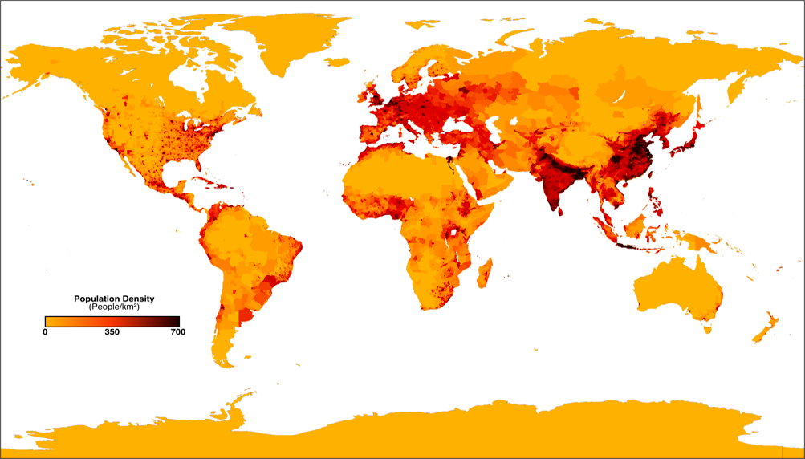

<b>1.</b> The following graph shows information about world population density measured in people per square kilometer, including density ranges from 0 to 700 people per square kilometer.  <b>2.</b> According to the graph, we can see that on the left side of the picture, there is a light orange area, which is North and South America with relatively low population density.  <b>3.</b> Following that, in the middle of the picture, there is a orange area, which is Europe and Africa with moderate population density.  <b>4.</b> Based on the information we can get from the graph on the right side of the picture, there is a dark red and brown area, which is South Asia and East Asia with the highest population density of up to 700 people per square kilometer. It's clear that at the bottom of the picture, there is a light yellow area, which is Australia with very low population density.  <b>5.</b> In general, the graph is very informative about world population density.

### 83. Iron Age Hut

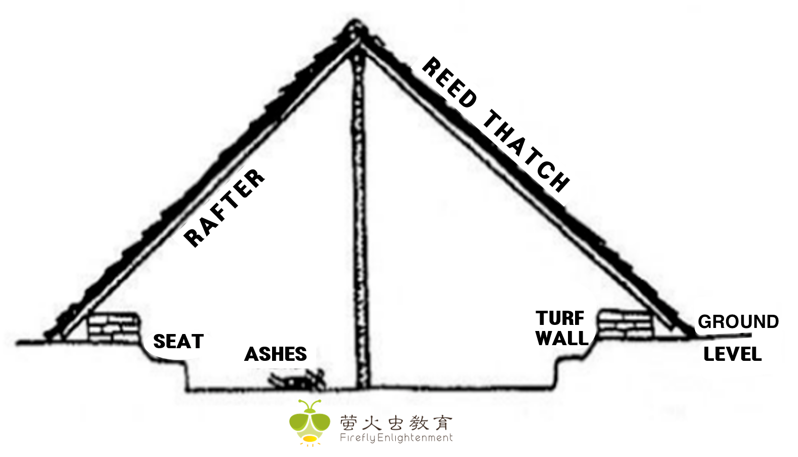

<b>1.</b> The following graph shows information about the structure of an Iron Age hut, including rafter, reed thatch, seat, ashes, turf wall, and ground level.  <b>2.</b> According to the graph we can see that on the left side of the picture, there is a rafter and a seat, which is structural and functional.  <b>3.</b> Following that, in the middle of the picture, there is ashes at the base, which is indicating the location of a fireplace.  <b>4.</b> Based on the information we can get from the graph on the right side of the picture, there is reed thatch covering the roof and a turf wall, which is providing insulation and protection. It's clear that at the bottom of the picture, there is the ground level, which is showing the hut is partially dug into the earth.  <b>5.</b> In general, this picture is very informative about the Iron Age hut.

### 84. Mosquito Life Cycle

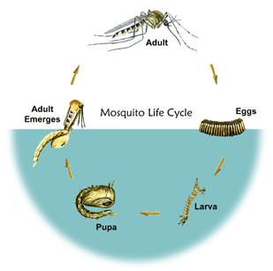

<b>1.</b> The following graph shows information about the mosquito life cycle, including eggs, larva, pupa, adult emerges, and adult.  <b>2.</b> According to the graph, we can see that the first step is the adult mosquito laying eggs.  <b>3.</b> Following that, the second step is the eggs hatching into larva.  <b>4.</b> Based on the information we can get from the graph, the third step is the larva developing into pupa.  <b>5.</b> It's clear that the last steps are the adult emerging from the pupa and becoming a fully grown adult mosquito.  <b>6.</b> We can see that there is a circular diagram with arrows in the picture, which is clearly showing the continuous cycle of mosquito development.  <b>7.</b> In general, this graph is very informative about the mosquito life cycle.

### 85. How to Form Acid Rain

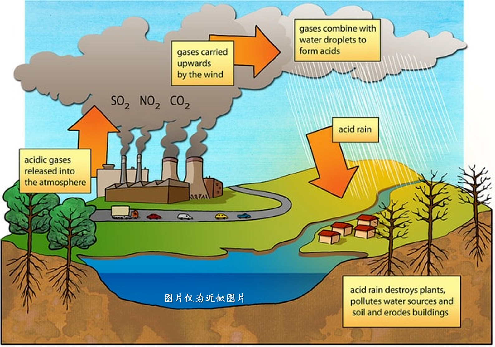

<b>1.</b> The following graph shows information about how acid rain is formed, including emission of gases, atmospheric transport, and acid rain effects.  <b>2.</b> According to the graph, we can see that the first step is acidic gases such as SO2, NO2, and CO2 are released into the atmosphere from factories.  <b>3.</b> Following that, the second step is the gases are carried upwards by the wind.  <b>4.</b> Based on the information we can get from the graph, the third step is the gases combine with water droplets in the clouds to form acids.  <b>5.</b> It's clear that the last steps are acid rain falls down and destroys plants, pollutes water sources and soil, and erodes buildings.  <b>6.</b> We can see that there is a landscape with factories, clouds, and forests in the picture, which is vividly illustrating the entire process.  <b>7.</b> In general, this graph is very informative about how acid rain is formed.

### 86. What Is E-Waste

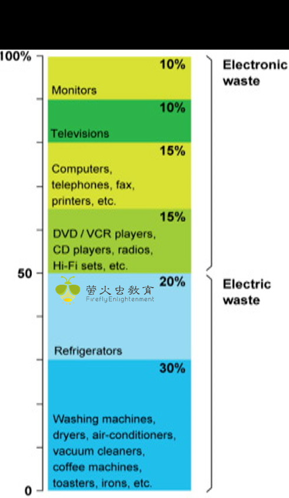

<b>1.</b> The following graph shows information about what is e-waste and its composition, from different categories of electronic and electric waste.  <b>2.</b> According to the graph, we can see that washing machines, dryers, air-conditioners, vacuum cleaners, coffee machines, toasters, and irons has the largest number, which is around 30 percent.  <b>3.</b> Following that, DVD/VCR players, CD players, radios, and Hi-Fi sets has the second largest number, which is around 20 percent.  <b>4.</b> Based on the information we can get from the graph monitors has the smallest number, which is around 10 percent.  <b>5.</b> It's clear that electric waste at 50 percent has always been higher than electronic waste at 50 percent.  <b>6.</b> In general, this graph is very informative about what is e-waste.

### 87. Internet Users Who Accessed via a Mobile Phone

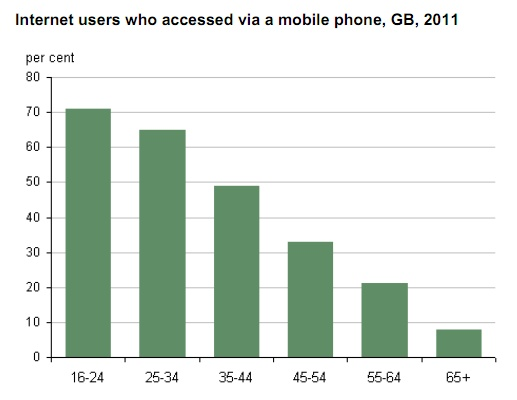

<b>1.</b> The following graph shows information about internet users who accessed via a mobile phone in Great Britain in 2011, from different age groups.  <b>2.</b> According to the graph, we can see that the 16 to 24 age group has the largest number, which is around 71 percent.  <b>3.</b> Following that, the 25 to 34 age group has the second largest number, which is around 65 percent.  <b>4.</b> Based on the information we can get from the graph the 65 plus age group has the smallest number, which is around 8 percent.  <b>5.</b> It's clear that younger age groups has always been higher than older age groups.  <b>6.</b> In general, this graph is very informative about internet users who accessed via a mobile phone.

### 88. Popularity of Cultural Websites in Scotland 2013

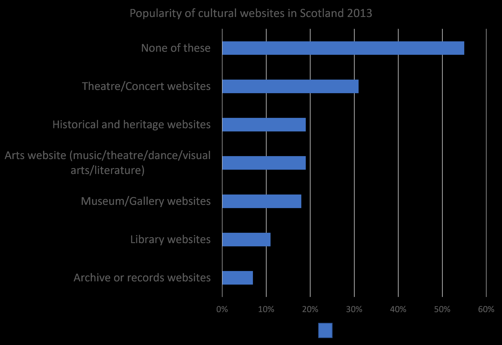

<b>1.</b> The following graph shows information about the popularity of cultural websites in Scotland in 2013, from seven different website categories.  <b>2.</b> According to the graph, we can see that none of these has the largest number, which is around 55 percent.  <b>3.</b> Following that, theatre and concert websites has the second largest number, which is around 30 percent.  <b>4.</b> Based on the information we can get from the graph archive or records websites has the smallest number, which is around 7 percent.  <b>5.</b> It's clear that theatre and concert websites has always been higher than other cultural website categories.  <b>6.</b> In general, this graph is very informative about the popularity of cultural websites in Scotland in 2013.

### 89. Honey Percentage of National Production

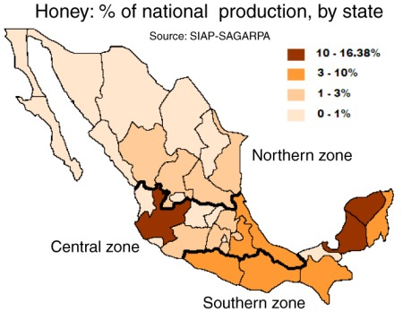

<b>1.</b> The following graph shows information about honey percentage of national production by state in Mexico, including northern zone, central zone, and southern zone.  <b>2.</b> According to the graph, we can see that on the left side of the picture, there is a light beige area, which is the central zone with production of 0 to 3 percent.  <b>3.</b> Following that, in the middle of the picture, there is a light to medium orange area, which is the northern zone with production of 1 to 10 percent.  <b>4.</b> Based on the information we can get from the graph on the right side of the picture, there is a dark brown area, which is the Yucatan Peninsula in the southern zone with the highest production of 10 to 16.38 percent. It's clear that at the bottom of the picture, there is a orange area, which is the southern zone with production of 3 to 10 percent.  <b>5.</b> In general, the graph is very informative about honey percentage of national production.

### 90. Main Hall

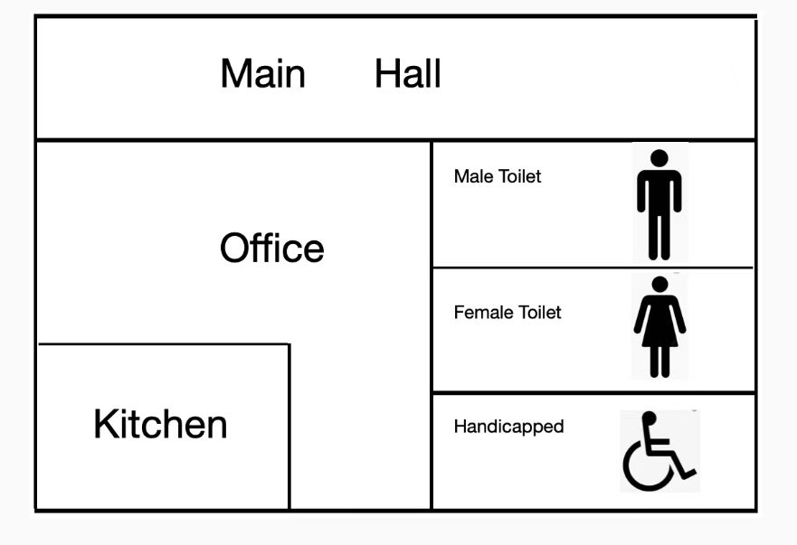

<b>1.</b> The following graph shows information about the floor plan of a main hall building, including main hall, office, kitchen, male toilet, female toilet, and handicapped toilet.  <b>2.</b> According to the graph we can see that on the left side of the picture, there is an office and a kitchen, which is located in the lower left area of the building.  <b>3.</b> Following that, in the middle of the picture, there is the main hall, which is the largest room at the top of the floor plan.  <b>4.</b> Based on the information we can get from the graph on the right side of the picture, there is a male toilet, a female toilet, and a handicapped toilet, which is arranged vertically from top to bottom. It's clear that at the bottom of the picture, there is the kitchen, which is located at the bottom left corner.  <b>5.</b> In general, this picture is very informative about the main hall floor plan.

### 91. Best Food for Brain Health

<b>1.</b> The following graph shows information about best food for brain health, including bad habits and healthy habits.  <b>2.</b> According to the graph we can see that on the left side of the picture, there is a human head filled with unhealthy food such as burgers, fries, and alcohol, which is representing bad habits with a low battery icon.  <b>3.</b> Following that, in the middle of the picture, there is a color gradient bar from red to green, which is showing the transition from bad habits to healthy habits.  <b>4.</b> Based on the information we can get from the graph on the right side of the picture, there is a human head filled with healthy food such as vegetables, fruits, and nuts, which is representing boosted brainpower with a full battery icon. It's clear that at the bottom of the picture, there is three icons for diet, exercise, and sleep, which is essential for improving brain health.  <b>5.</b> In general, this picture is very informative about best food for brain health.

### 92. Pet Ownership

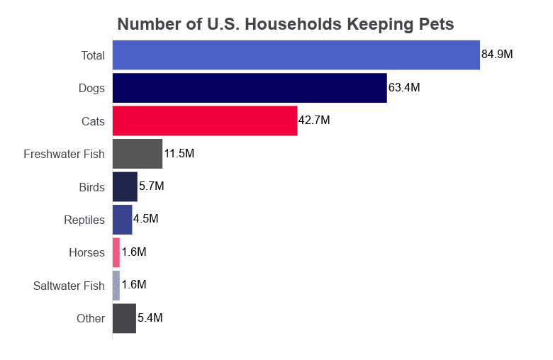

<b>1.</b> The following graph shows information about number of U.S. households keeping pets, from dogs, cats, freshwater fish, birds, reptiles, horses, saltwater fish, and other.  <b>2.</b> According to the graph, we can see that dogs has the largest number, which is around 63.4 million.  <b>3.</b> Following that, cats has the second largest number, which is around 42.7 million.  <b>4.</b> Based on the information we can get from the graph horses and saltwater fish has the smallest number, which is around 1.6 million each.  <b>5.</b> It's clear that dogs has always been higher than cats.  <b>6.</b> In general, this graph is very informative about number of U.S. households keeping pets.

### 93. Australia Inbound Visitors 2005 2006

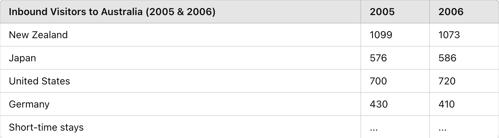

<b>1.</b> The following graph shows information about inbound visitors to Australia, from 2005 and 2006.  <b>2.</b> According to the graph, we can see that New Zealand has the largest number, which is around 1099 in 2005 and 1073 in 2006.  <b>3.</b> Following that, United States has the second largest number, which is around 700 in 2005 and 720 in 2006.  <b>4.</b> Based on the information we can get from the graph Germany has the smallest number, which is around 430 in 2005 and 410 in 2006.  <b>5.</b> It's clear that New Zealand has always been higher than all other countries.  <b>6.</b> In general, this graph is very informative about inbound visitors to Australia in 2005 and 2006.

### 94. Food Pyramid 1970s vs 2010s

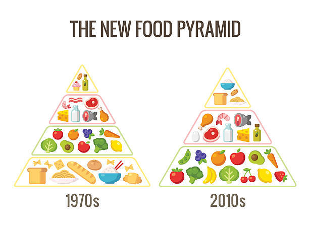

<b>1.</b> The following graph shows information about the new food pyramid, including the 1970s food pyramid and the 2010s food pyramid.  <b>2.</b> According to the graph we can see that on the left side of the picture, there is the 1970s food pyramid with grains and bread at the base, which is showing the old dietary recommendations.  <b>3.</b> Following that, in the middle of the picture, there is sweets and fats at the top of the 1970s pyramid, which is recommended to eat the least.  <b>4.</b> Based on the information we can get from the graph on the right side of the picture, there is the 2010s food pyramid with vegetables and fruits at the base, which is showing the new dietary recommendations with more emphasis on healthy food. It's clear that at the bottom of the picture, there is the year labels 1970s and 2010s, which is indicating the comparison between two eras.  <b>5.</b> In general, this picture is very informative about the new food pyramid comparing 1970s and 2010s.

### 95. Percentage of Volunteer Job

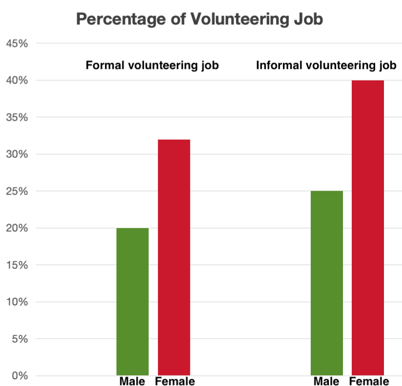

<b>1.</b> The following graph shows information about percentage of volunteering job, from formal and informal volunteering jobs for male and female.  <b>2.</b> According to the graph, we can see that female in informal volunteering job has the largest number, which is around 40%.  <b>3.</b> Following that, female in formal volunteering job has the second largest number, which is around 32%.  <b>4.</b> Based on the information we can get from the graph male in formal volunteering job has the smallest number, which is around 20%.  <b>5.</b> It's clear that female has always been higher than male.  <b>6.</b> In general, this graph is very informative about percentage of volunteering job.

### 96. Collapse of Atlantic Cod Stocks

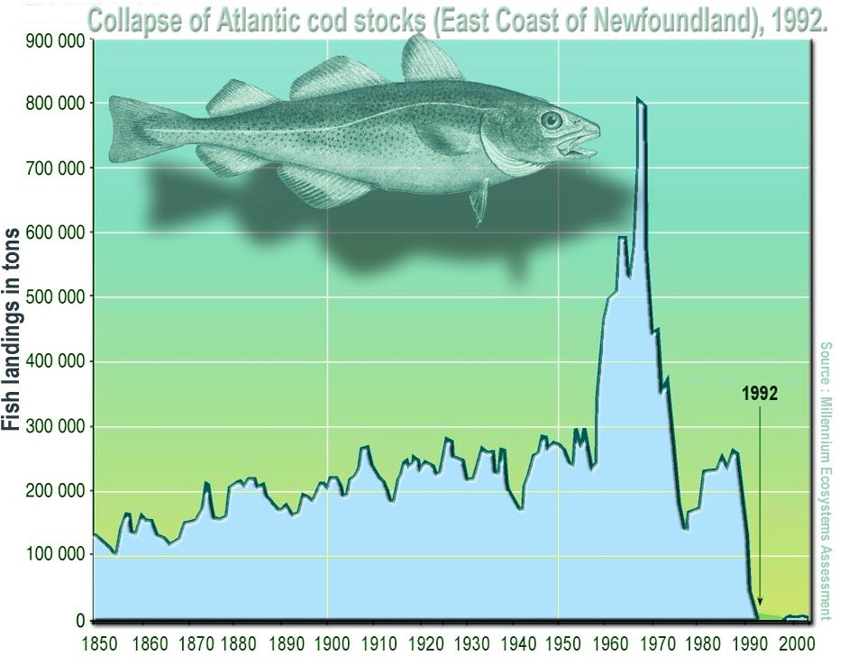

<b>1.</b> The following graph shows information about collapse of Atlantic cod stocks on the East Coast of Newfoundland, from 1850 to 2000.  <b>2.</b> According to the graph, we can see that fish landings around 1968 has the largest number, which is around 800,000 tons.  <b>3.</b> Following that, fish landings from 1850 to 1950 has the second largest number, which is around 100,000 to 300,000 tons.  <b>4.</b> Based on the information we can get from the graph fish landings after 1992 has the smallest number, which is around nearly 0 tons.  <b>5.</b> It's clear that fish landings before 1992 has always been higher than fish landings after the 1992 collapse.  <b>6.</b> In general, this graph is very informative about collapse of Atlantic cod stocks.

### 97. Wage Growth, Consumption, Household Debt

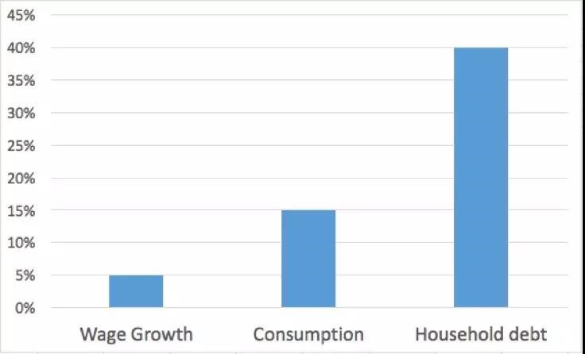

<b>1.</b> The following graph shows information about wage growth, consumption, and household debt, from three economic indicators.  <b>2.</b> According to the graph, we can see that household debt has the largest number, which is around 40%.  <b>3.</b> Following that, consumption has the second largest number, which is around 15%.  <b>4.</b> Based on the information we can get from the graph wage growth has the smallest number, which is around 5%.  <b>5.</b> It's clear that household debt has always been higher than wage growth and consumption.  <b>6.</b> In general, this graph is very informative about wage growth, consumption, and household debt.

### 98. Pre-tax Profits of the 1000 Largest Banks

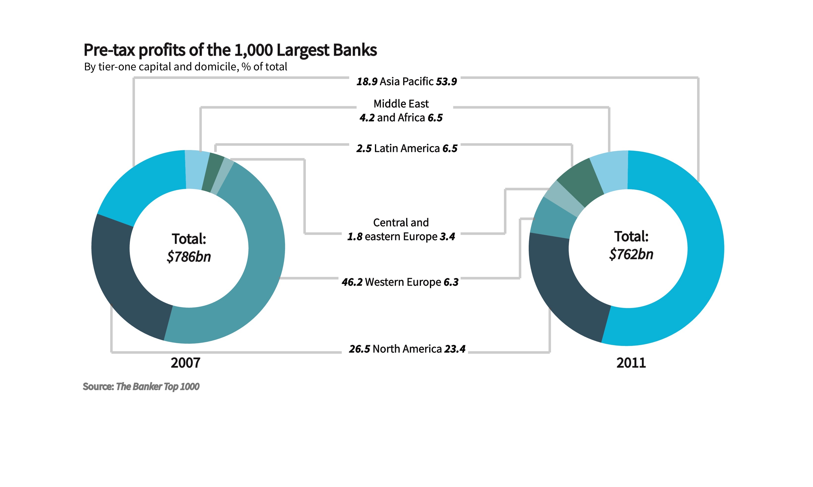

<b>1.</b> The following graph shows information about pre-tax profits of the 1,000 largest banks by tier-one capital and domicile, from 2007 and 2011.  <b>2.</b> According to the graph, we can see that Asia Pacific in 2011 has the largest number, which is around 53.9%.  <b>3.</b> Following that, Western Europe in 2007 has the second largest number, which is around 46.2%.  <b>4.</b> Based on the information we can get from the graph Central and Eastern Europe in 2007 has the smallest number, which is around 1.8%.  <b>5.</b> It's clear that Asia Pacific's share in 2011 at 53.9% has always been higher than its share in 2007 at 18.9%.  <b>6.</b> In general, this graph is very informative about pre-tax profits of the 1,000 largest banks.

### 99. Estimated Number of US Households That Own a Pet

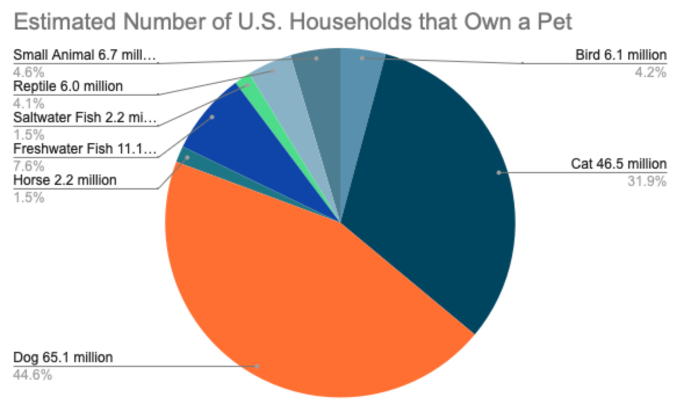

<b>1.</b> The following graph shows information about estimated number of U.S. households that own a pet, from dogs, cats, freshwater fish, birds, reptiles, saltwater fish, horses, and small animals.  <b>2.</b> According to the graph, we can see that dog has the largest number, which is around 65.1 million or 44.6%.  <b>3.</b> Following that, cat has the second largest number, which is around 46.5 million or 31.9%.  <b>4.</b> Based on the information we can get from the graph horse and saltwater fish has the smallest number, which is around 2.2 million or 1.5% each.  <b>5.</b> It's clear that dog has always been higher than cat.  <b>6.</b> In general, this graph is very informative about estimated number of U.S. households that own a pet.

### 100. Households in Millions Who Own Pets

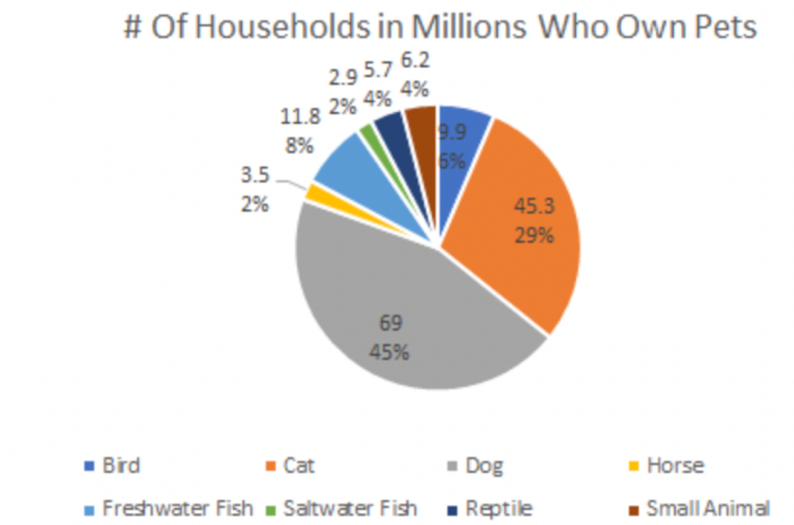

<b>1.</b> The following graph shows information about number of households in millions who own pets, from birds, cats, dogs, horses, freshwater fish, saltwater fish, reptiles, and small animals.  <b>2.</b> According to the graph, we can see that dog has the largest number, which is around 69 million or 45%.  <b>3.</b> Following that, cat has the second largest number, which is around 45.3 million or 29%.  <b>4.</b> Based on the information we can get from the graph saltwater fish has the smallest number, which is around 2.9 million or 2%.  <b>5.</b> It's clear that dog has always been higher than cat.  <b>6.</b> In general, this graph is very informative about number of households in millions who own pets.

### 101. Chemical Experiment

<b>1.</b> The following graph shows information about a chemical experiment, including a scientist, a student, and laboratory equipment.  <b>2.</b> According to the graph we can see that on the left side of the picture, there is an elderly scientist wearing a white lab coat and glasses, which is supervising the experiment.  <b>3.</b> Following that, in the middle of the picture, there is a red liquid being poured from a beaker into another beaker, which is part of the chemical experiment.  <b>4.</b> Based on the information we can get from the graph on the right side of the picture, there is a young student wearing a blue lab coat, which is holding the beaker and conducting the experiment. It's clear that at the bottom of the picture, there is several Erlenmeyer flasks containing white liquid, which is placed on the laboratory table.  <b>5.</b> In general, this picture is very informative about a chemical experiment.

### 102. Population Age Groups in Australia

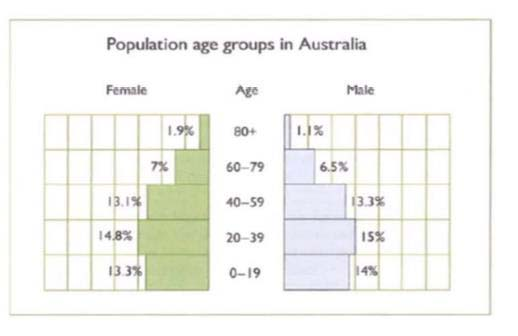

<b>1.</b> The following graph shows information about population age groups in Australia, from age groups 0-19, 20-39, 40-59, 60-79, and 80+ for both female and male.  <b>2.</b> According to the graph, we can see that male aged 20-39 has the largest number, which is around 15%.  <b>3.</b> Following that, female aged 20-39 has the second largest number, which is around 14.8%.  <b>4.</b> Based on the information we can get from the graph male aged 80+ has the smallest number, which is around 1.1%.  <b>5.</b> It's clear that the 20-39 age group has always been higher than the 80+ age group.  <b>6.</b> In general, this graph is very informative about population age groups in Australia.

### 103. Luxury Ensuite

<b>1.</b> The following graph shows information about a luxury ensuite floor plan, including an ensuite bathroom, a desk, a wardrobe, and a bed.  <b>2.</b> According to the graph we can see that on the left side of the picture, there is a door with a curved opening arc, which is the entrance to the room.  <b>3.</b> Following that, in the middle of the picture, there is a desk area and a toilet, which is located in the central part of the layout.  <b>4.</b> Based on the information we can get from the graph on the right side of the picture, there is the ensuite bathroom at the top, which is a private bathroom with shower facilities. It's clear that at the bottom of the picture, there is a wardrobe on the left and a bed on the right, which is providing sleeping and storage areas.  <b>5.</b> In general, this picture is very informative about a luxury ensuite floor plan.

### 104. Share of Companies

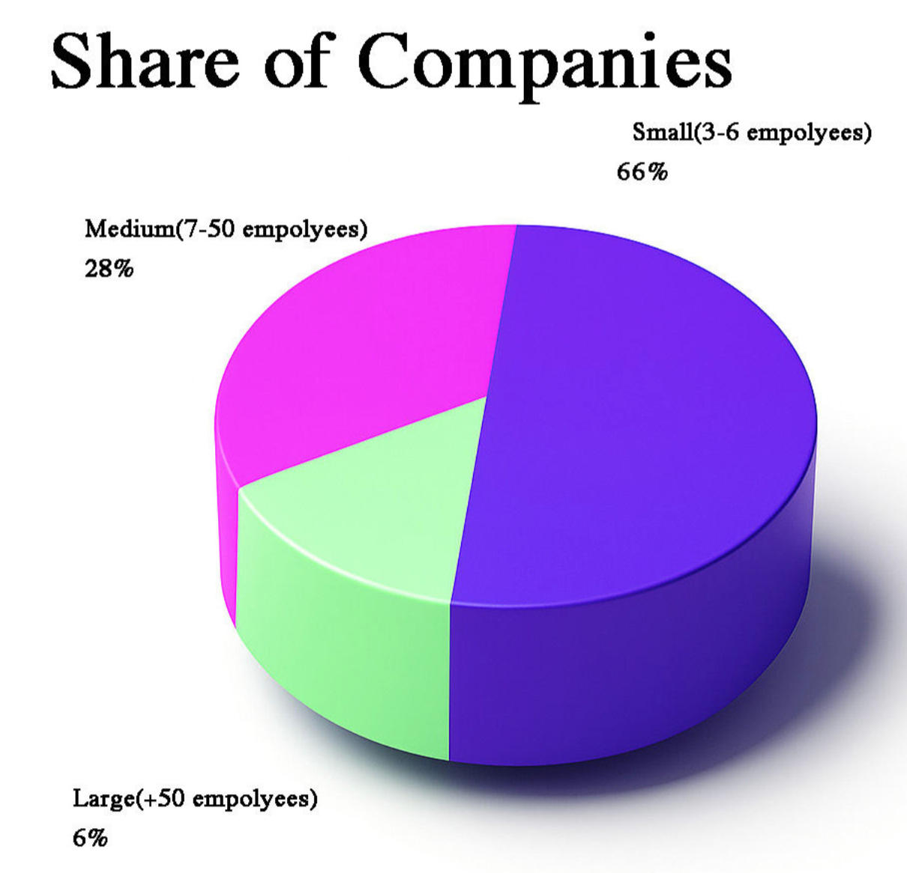

<b>1.</b> The following graph shows information about share of companies by size, from small, medium, and large companies.  <b>2.</b> According to the graph, we can see that small companies with 3-6 employees has the largest number, which is around 66%.  <b>3.</b> Following that, medium companies with 7-50 employees has the second largest number, which is around 28%.  <b>4.</b> Based on the information we can get from the graph large companies with over 50 employees has the smallest number, which is around 6%.  <b>5.</b> It's clear that small companies has always been higher than medium and large companies.  <b>6.</b> In general, this graph is very informative about share of companies by size.

### 105. Inbound Tourists Ecuador

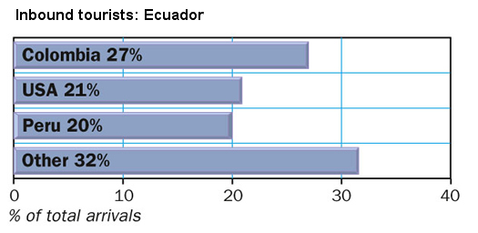

<b>1.</b> The following graph shows information about inbound tourists to Ecuador, from Colombia, USA, Peru, and other countries.  <b>2.</b> According to the graph, we can see that other countries has the largest number, which is around 32% of total arrivals.  <b>3.</b> Following that, Colombia has the second largest number, which is around 27% of total arrivals.  <b>4.</b> Based on the information we can get from the graph Peru has the smallest number, which is around 20% of total arrivals.  <b>5.</b> It's clear that Colombia has always been higher than USA and Peru.  <b>6.</b> In general, this graph is very informative about inbound tourists to Ecuador.

### 106. Annual Height Increase

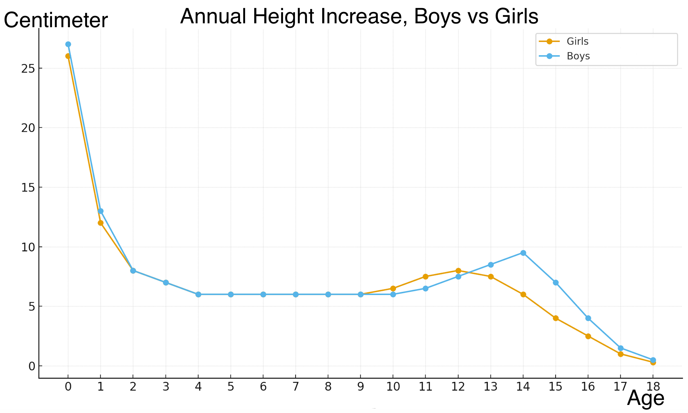

<b>1.</b> The following graph shows information about annual height increase for boys versus girls, from age 0 to 18.  <b>2.</b> According to the graph, we can see that boys at age 0 has the largest number, which is around 27 centimeters.  <b>3.</b> Following that, girls at age 0 has the second largest number, which is around 26 centimeters.  <b>4.</b> Based on the information we can get from the graph both boys and girls at age 18 has the smallest number, which is around 0.5 centimeters.  <b>5.</b> It's clear that boys has always been higher than girls during the teenage years, peaking at around 9.5 centimeters at age 14.  <b>6.</b> In general, this graph is very informative about annual height increase for boys versus girls.

### 107. Comparison of Birth Rates Between Male and Female on Sunday

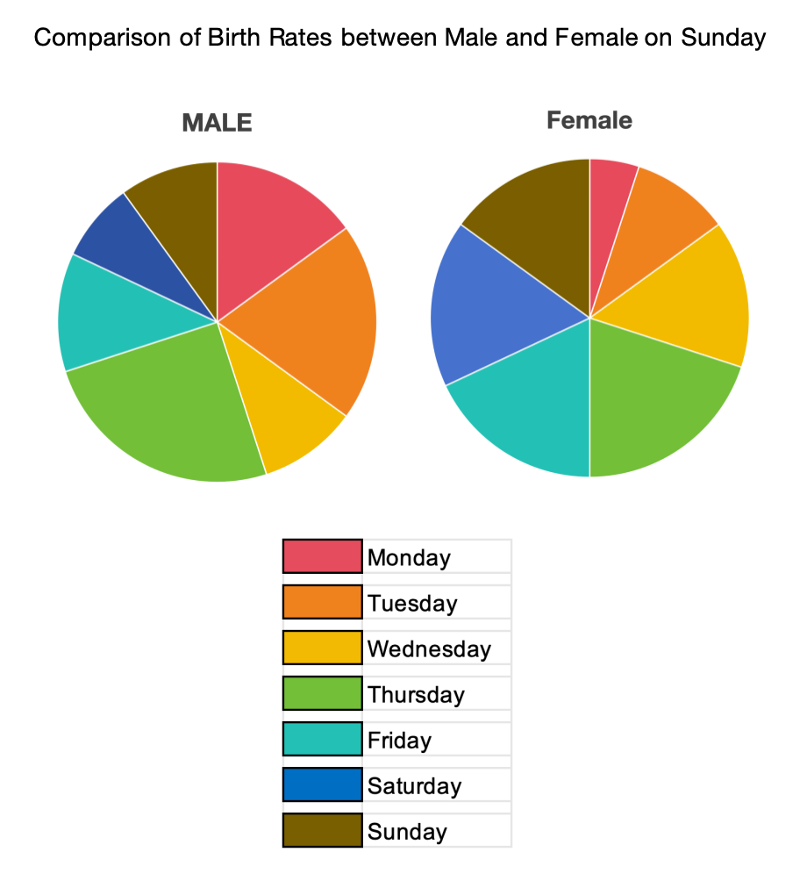

<b>1.</b> The following graph shows information about the comparison of birth rates between male and female on Sunday, including Monday through Sunday.  <b>2.</b> According to the graph, we can see that Monday for males has the largest number, which is around the biggest slice in the male pie chart.  <b>3.</b> Following that, Thursday for females has the second largest number, which is around the biggest slice in the female pie chart.  <b>4.</b> Based on the information we can get from the graph Saturday has the smallest number, which is around the smallest slice in both pie charts.  <b>5.</b> It's clear that the distribution of birth rates differs between males and females across the days of the week.  <b>6.</b> In general, this graph is very informative about the comparison of birth rates between male and female on Sunday.

### 108. Why Students Choose to Study Foreign Languages

<b>1.</b> The following graph shows information about why students choose to study foreign languages, including various reasons.  <b>2.</b> According to the graph, we can see that personal interest and enjoyment has the largest number, which is around 43%.  <b>3.</b> Following that, degree requirement has the second largest number, which is around 24%.  <b>4.</b> Based on the information we can get from the graph other and societal responsibility has the smallest number, which is around 1% each.  <b>5.</b> It's clear that personal interest and enjoyment has always been higher than all other reasons combined.  <b>6.</b> In general, this graph is very informative about why students choose to study foreign languages.

### 109. Types of Clubs That People Belong To

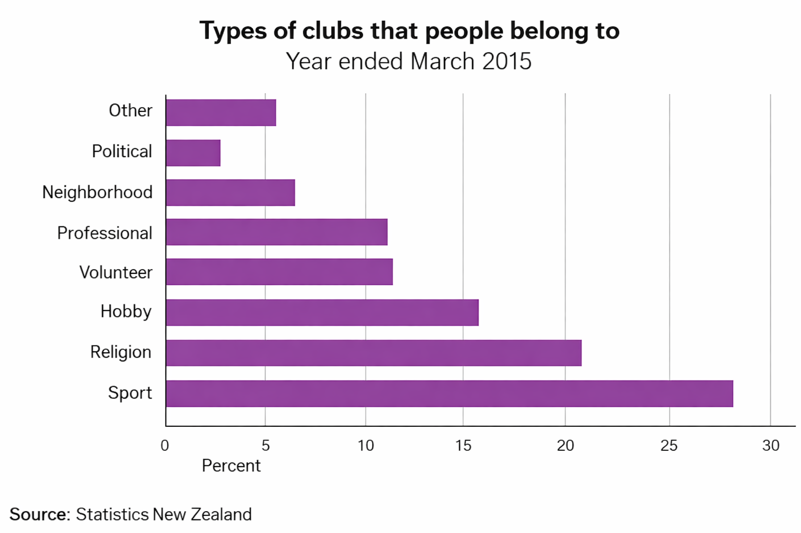

<b>1.</b> The following graph shows information about types of clubs that people belong to, from the year ended March 2015.  <b>2.</b> According to the graph, we can see that Sport has the largest number, which is around 28%.  <b>3.</b> Following that, Religion has the second largest number, which is around 21%.  <b>4.</b> Based on the information we can get from the graph Political has the smallest number, which is around 3%.  <b>5.</b> It's clear that Sport has always been higher than all other types of clubs.  <b>6.</b> In general, this graph is very informative about types of clubs that people belong to.

### 110. Household Car Ownership in New Zealand or Canada

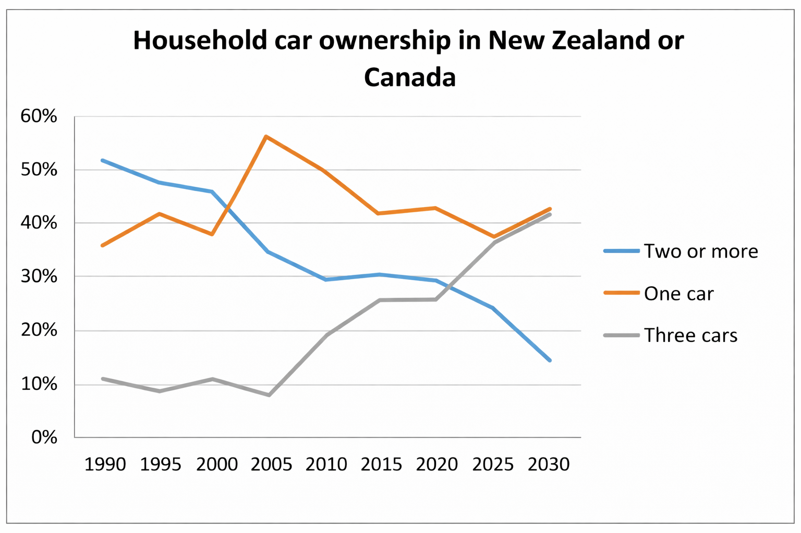

<b>1.</b> The following graph shows information about household car ownership in New Zealand or Canada, from 1990 to 2030.  <b>2.</b> According to the graph, we can see that two or more cars in 1990 has the largest number, which is around 52%.  <b>3.</b> Following that, one car in 2005 has the second largest number, which is around 56%.  <b>4.</b> Based on the information we can get from the graph three cars in 2005 has the smallest number, which is around 8%.  <b>5.</b> It's clear that two or more cars ownership has been decreasing while three cars ownership has been increasing over time.  <b>6.</b> In general, this graph is very informative about household car ownership in New Zealand or Canada.

### 111. Legal Immigrants by Region

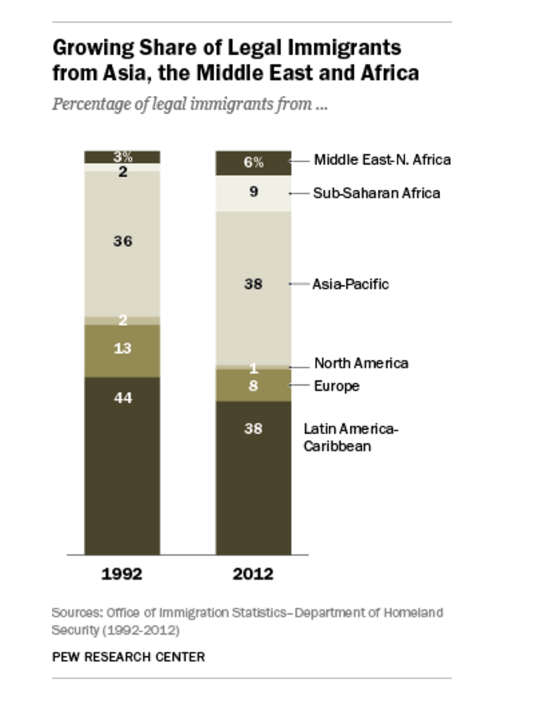

<b>1.</b> The following graph shows information about the growing share of legal immigrants by region, from 1992 to 2012.  <b>2.</b> According to the graph, we can see that Europe in 1992 has the largest number, which is around 44%.  <b>3.</b> Following that, Asia-Pacific in 1992 and Latin America-Caribbean in 2012 has the second largest number, which is around 36% and 38% respectively.  <b>4.</b> Based on the information we can get from the graph North America has the smallest number, which is around 2% in 1992 and 1% in 2012.  <b>5.</b> It's clear that Asia-Pacific and Latin America-Caribbean has always been higher than other regions in 2012, while Europe decreased significantly from 44% to 8%.  <b>6.</b> In general, this graph is very informative about legal immigrants by region.

### 112. Newspaper Circulation USA

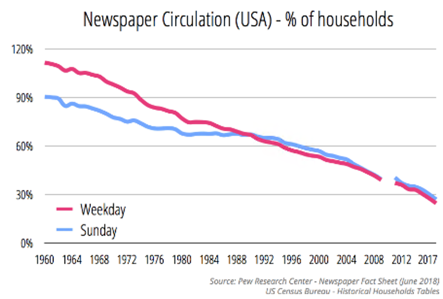

<b>1.</b> The following graph shows information about newspaper circulation in the USA as a percentage of households, from 1960 to 2017.  <b>2.</b> According to the graph, we can see that weekday circulation in 1960 has the largest number, which is around 112%.  <b>3.</b> Following that, Sunday circulation in 1960 has the second largest number, which is around 90%.  <b>4.</b> Based on the information we can get from the graph Sunday circulation in 2017 has the smallest number, which is around 28%.  <b>5.</b> It's clear that weekday circulation has always been higher than Sunday circulation, and both have declined steadily over the decades.  <b>6.</b> In general, this graph is very informative about newspaper circulation in the USA.

### 113. Urban and Rural Population

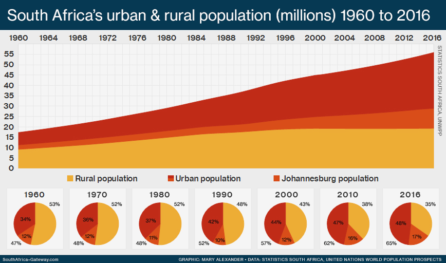

<b>1.</b> The following graph shows information about South Africa's urban and rural population, from 1960 to 2016.  <b>2.</b> According to the graph, we can see that rural population in 2016 has the largest number, which is around 48% with total population reaching 55 million.  <b>3.</b> Following that, urban population in 2016 has the second largest number, which is around 35%.  <b>4.</b> Based on the information we can get from the graph Johannesburg population has the smallest number, which is around 10% to 17% across all years.  <b>5.</b> It's clear that rural population has always been higher than urban and Johannesburg population, though urban population has been steadily increasing.  <b>6.</b> In general, this graph is very informative about South Africa's urban and rural population from 1960 to 2016.

### 114. The Most Cat Owners

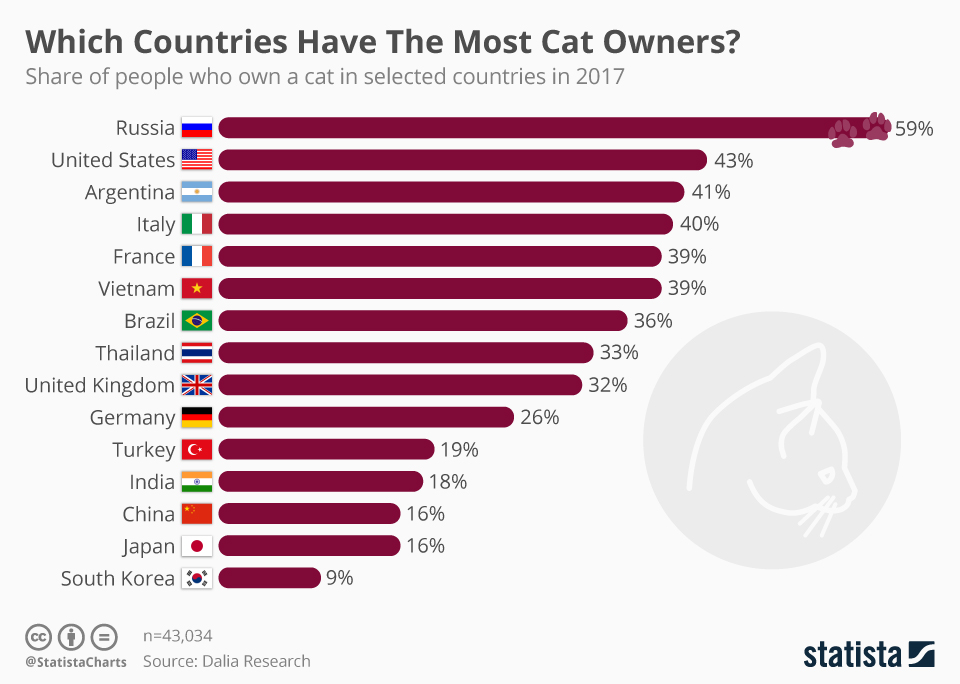

<b>1.</b> The following graph shows information about which countries have the most cat owners, from selected countries in 2017.  <b>2.</b> According to the graph, we can see that Russia has the largest number, which is around 59%.  <b>3.</b> Following that, United States has the second largest number, which is around 43%.  <b>4.</b> Based on the information we can get from the graph South Korea has the smallest number, which is around 9%.  <b>5.</b> It's clear that Russia has always been higher than all other countries by a significant margin.  <b>6.</b> In general, this graph is very informative about which countries have the most cat owners.

### 115. Weekly Household Spending

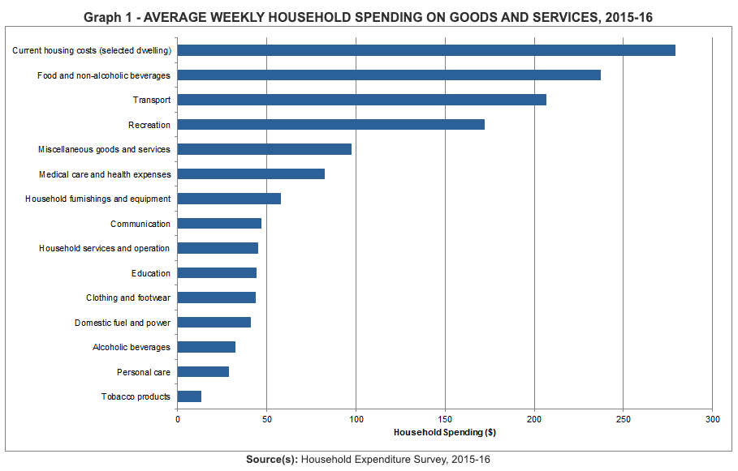

<b>1.</b> The following graph shows information about average weekly household spending on goods and services, from 2015 to 2016.  <b>2.</b> According to the graph, we can see that current housing costs has the largest number, which is around $280.  <b>3.</b> Following that, food and non-alcoholic beverages has the second largest number, which is around $240.  <b>4.</b> Based on the information we can get from the graph tobacco products has the smallest number, which is around $10.  <b>5.</b> It's clear that current housing costs has always been higher than all other categories of household spending.  <b>6.</b> In general, this graph is very informative about average weekly household spending on goods and services.

### 116. Most Popular Social Platforms

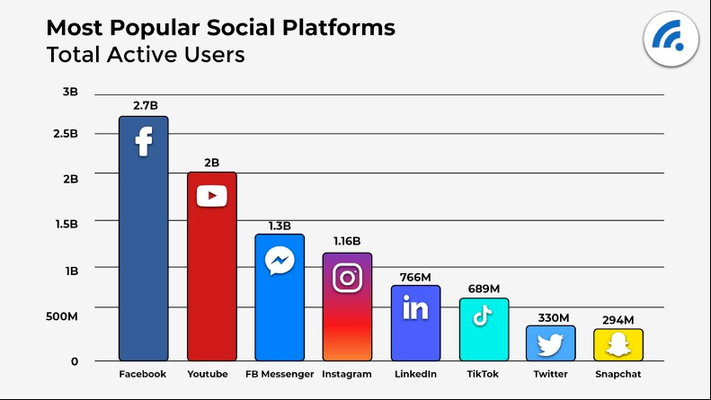

<b>1.</b> The following graph shows information about the most popular social platforms by total active users, including eight platforms.  <b>2.</b> According to the graph, we can see that Facebook has the largest number, which is around 2.7 billion.  <b>3.</b> Following that, YouTube has the second largest number, which is around 2 billion.  <b>4.</b> Based on the information we can get from the graph Snapchat has the smallest number, which is around 294 million.  <b>5.</b> It's clear that Facebook has always been higher than all other social platforms.  <b>6.</b> In general, this graph is very informative about the most popular social platforms.

### 117. Consumer Confidence

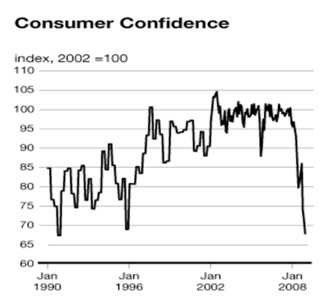

<b>1.</b> The following graph shows information about consumer confidence index, from January 1990 to January 2008.  <b>2.</b> According to the graph, we can see that around January 2002 has the largest number, which is around 105.  <b>3.</b> Following that, around January 1998 has the second largest number, which is around 100.  <b>4.</b> Based on the information we can get from the graph late 2008 has the smallest number, which is around 65.  <b>5.</b> It's clear that consumer confidence rose steadily from 1990 to 2002 and then dropped sharply after 2007.  <b>6.</b> In general, this graph is very informative about consumer confidence index from 1990 to 2008.

### 118. US Energy Consumption by Fuel 1980-2030

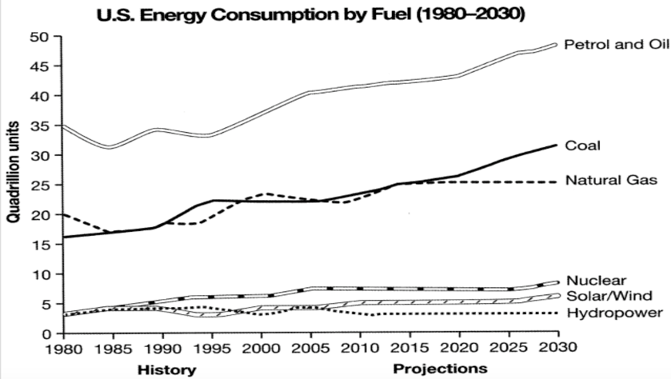

<b>1.</b> The following graph shows information about US energy consumption by fuel, from 1980 to 2030.  <b>2.</b> According to the graph, we can see that petrol and oil has the largest number, which is around 48 quadrillion units by 2030.  <b>3.</b> Following that, coal has the second largest number, which is around 31 quadrillion units by 2030.  <b>4.</b> Based on the information we can get from the graph hydropower has the smallest number, which is around 3 quadrillion units.  <b>5.</b> It's clear that petrol and oil has always been higher than all other fuel types throughout the entire period.  <b>6.</b> In general, this graph is very informative about US energy consumption by fuel from 1980 to 2030.

### 119. World Population Density

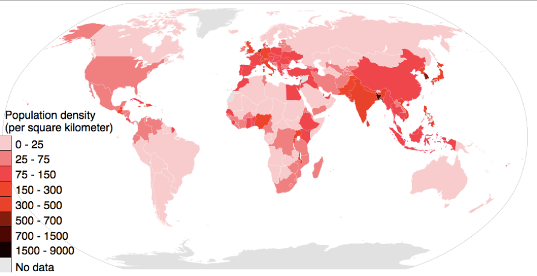

<b>1.</b> The following graph shows information about world population density, including population density per square kilometer across different countries.  <b>2.</b> According to the graph, we can see that on the left side of the picture, there is a light pink area, which is North and South America with 0 to 75 people per square kilometer.  <b>3.</b> Following that, in the middle of the picture, there is a medium pink area, which is Europe and Africa with varying densities from 25 to 300 per square kilometer.  <b>4.</b> Based on the information we can get from the graph on the right side of the picture, there is a dark red area, which is South and East Asia including India, China, and Bangladesh with 300 to 9000 per square kilometer. It's clear that at the bottom of the picture, there is a grey area, which is Antarctica with no data.  <b>5.</b> In general, the graph is very informative about world population density.

### 120. Climate Zones

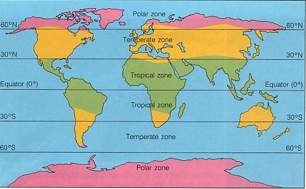

<b>1.</b> The following graph shows information about climate zones of the world, including polar zones, temperate zones, and tropical zones.  <b>2.</b> According to the graph, we can see that on the left side of the picture, there is a pink area, which is the polar zone above 60 degrees North.  <b>3.</b> Following that, in the middle of the picture, there is a orange area, which is the temperate zone between 30 and 60 degrees.  <b>4.</b> Based on the information we can get from the graph on the right side of the picture, there is a green area, which is the tropical zone between 30 degrees North and 30 degrees South around the equator. It's clear that at the bottom of the picture, there is a pink area, which is the polar zone below 60 degrees South.  <b>5.</b> In general, the graph is very informative about climate zones of the world.

### 121. Housing Owned and Rented in the UK

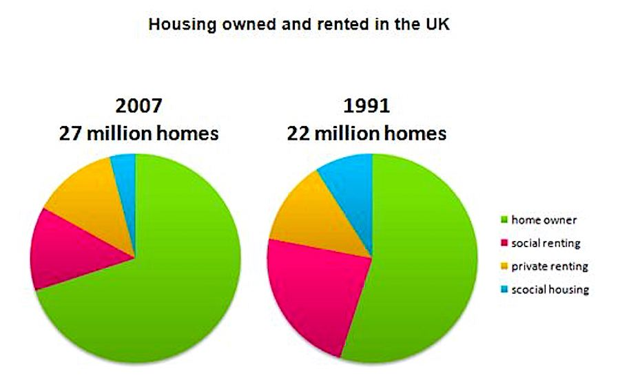

<b>1.</b> The following graph shows information about housing owned and rented in the UK, from 1991 and 2007.  <b>2.</b> According to the graph, we can see that home owner has the largest number, which is around over 60% in both years, with 27 million homes in 2007 and 22 million homes in 1991.  <b>3.</b> Following that, private renting has the second largest number, which is around 15% in 2007.  <b>4.</b> Based on the information we can get from the graph social housing has the smallest number, which is around less than 5%.  <b>5.</b> It's clear that home ownership has always been higher than renting in both years.  <b>6.</b> In general, this graph is very informative about housing owned and rented in the UK.

### 122. The Study Space

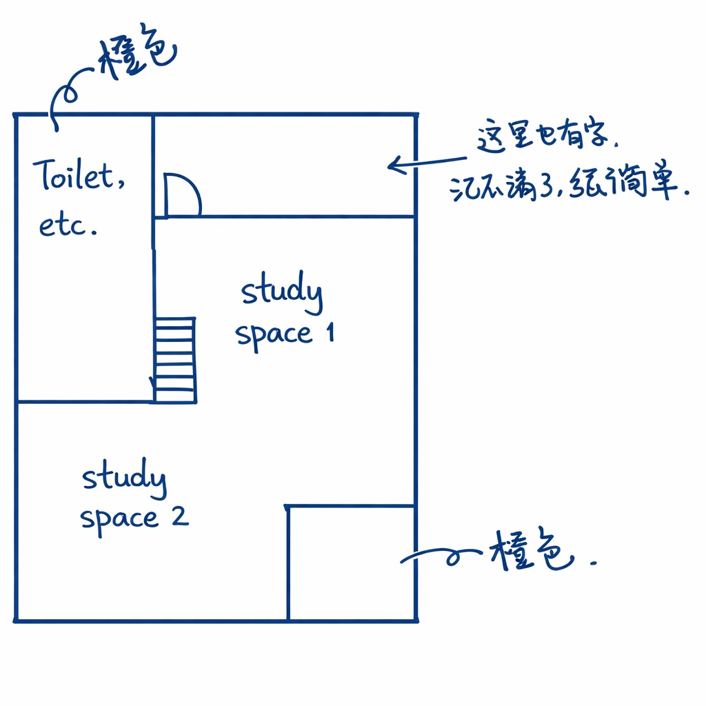

<b>1.</b> The following graph shows information about the study space, including a toilet, study space 1, study space 2, and stairs.  <b>2.</b> According to the graph we can see that on the left side of the picture, there is a toilet area, which is located in the upper left corner.  <b>3.</b> Following that, in the middle of the picture, there is study space 1, which is connected to the stairs.  <b>4.</b> Based on the information we can get from the graph on the right side of the picture, there is an entrance area, which is marked in orange. It's clear that at the bottom of the picture, there is study space 2, which is a large room with another entrance.  <b>5.</b> In general, this picture is very informative about the study space.

### 123. Market Share of Sneaker Brand

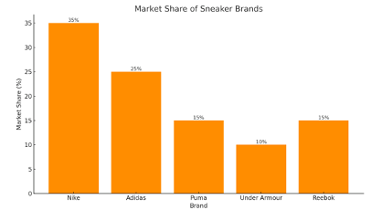

<b>1.</b> The following graph shows information about market share of sneaker brands, from Nike, Adidas, Puma Brand, Under Armour, and Reebok.  <b>2.</b> According to the graph, we can see that Nike has the largest number, which is around 35%.  <b>3.</b> Following that, Adidas has the second largest number, which is around 25%.  <b>4.</b> Based on the information we can get from the graph Under Armour has the smallest number, which is around 10%.  <b>5.</b> It's clear that Nike has always been higher than all other brands.  <b>6.</b> In general, this graph is very informative about market share of sneaker brands.

### 124. Ontario Manufacturing Employment and the Canadian Dollar Exchange

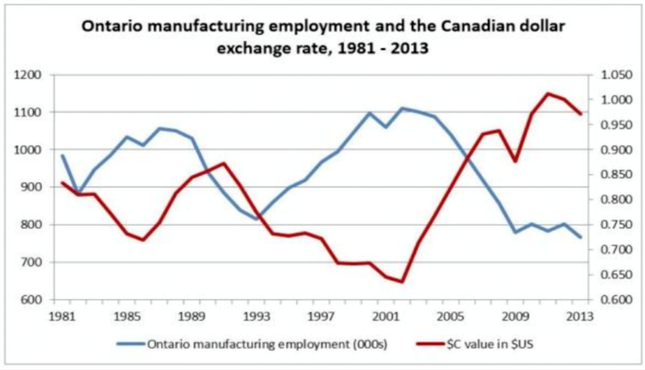

<b>1.</b> The following graph shows information about Ontario manufacturing employment and the Canadian dollar exchange rate, from 1981 to 2013.  <b>2.</b> According to the graph, we can see that Ontario manufacturing employment has the largest number, which is around 1100 thousand in 2001.  <b>3.</b> Following that, the Canadian dollar value in US dollars has the second largest number, which is around 1.050 in 2013.  <b>4.</b> Based on the information we can get from the graph manufacturing employment has the smallest number, which is around 780 thousand in 2009.  <b>5.</b> It's clear that when the Canadian dollar rose after 2002, manufacturing employment has always been higher than it declined significantly, showing an inverse relationship.  <b>6.</b> In general, this graph is very informative about Ontario manufacturing employment and the Canadian dollar exchange rate.

### 125. Drinking Habits by Age in US

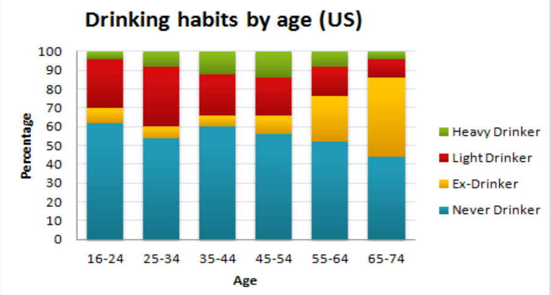

<b>1.</b> The following graph shows information about drinking habits by age in the US, from age groups 16-24, 25-34, 35-44, 45-54, 55-64, and 65-74.  <b>2.</b> According to the graph, we can see that never drinker has the largest number, which is around 62% for the 16-24 age group.  <b>3.</b> Following that, ex-drinker has the second largest number, which is around 30% for the 65-74 age group.  <b>4.</b> Based on the information we can get from the graph heavy drinker has the smallest number, which is around 5% across most age groups.  <b>5.</b> It's clear that never drinker has always been higher than other categories across all age groups.  <b>6.</b> In general, this graph is very informative about drinking habits by age in the US.

### 126. Media in UK

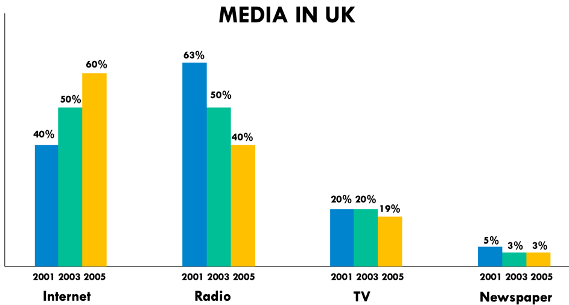

<b>1.</b> The following graph shows information about media in the UK, from 2001, 2003, and 2005.  <b>2.</b> According to the graph, we can see that radio in 2001 has the largest number, which is around 63%.  <b>3.</b> Following that, internet in 2005 has the second largest number, which is around 60%.  <b>4.</b> Based on the information we can get from the graph newspaper in 2003 and 2005 has the smallest number, which is around 3%.  <b>5.</b> It's clear that internet usage has always been higher than it was, increasing from 40% to 60%, while radio decreased from 63% to 40%.  <b>6.</b> In general, this graph is very informative about media in the UK.

### 127. Body Mass Index of Obese Overweight Normal and Underweight People

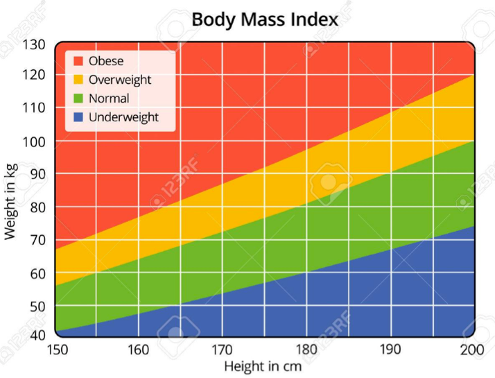

<b>1.</b> The following graph shows information about body mass index, including obese, overweight, normal, and underweight categories.  <b>2.</b> According to the graph we can see that on the left side of the picture, there is a red area representing the obese category, which is dominant for people with lower height and higher weight.  <b>3.</b> Following that, in the middle of the picture, there is a yellow area representing overweight and a green area representing normal weight, which is shown as diagonal bands across the chart.  <b>4.</b> Based on the information we can get from the graph on the right side of the picture, there is a blue area representing underweight, which is found among people with greater height and lower weight. It's clear that at the bottom of the picture, there is a height axis ranging from 150 to 200 cm and a weight axis from 40 to 130 kg, which is clearly labeled.  <b>5.</b> In general, this picture is very informative about body mass index of obese, overweight, normal, and underweight people.

### 128. Buying School Bags at a Stationery Shop

<b>1.</b> The following graph shows information about buying school bags at a stationery shop, including a mother, a young girl, school bags, and colored pencils.  <b>2.</b> According to the graph we can see that on the left side of the picture, there is a mother wearing a pink sweater holding a colorful school bag, which is cheerful and vibrant.  <b>3.</b> Following that, in the middle of the picture, there is a young girl smiling happily, which is excited about the shopping experience.  <b>4.</b> Based on the information we can get from the graph on the right side of the picture, there is the same girl wearing a pink school bag and holding colored pencils, which is delighted and ready for school. It's clear that at the bottom of the picture, there is a variety of school supplies and bags displayed in the shop, which is colorful and well-organized.  <b>5.</b> In general, this picture is very informative about buying school bags at a stationery shop.

### 129. New Zealand House Price

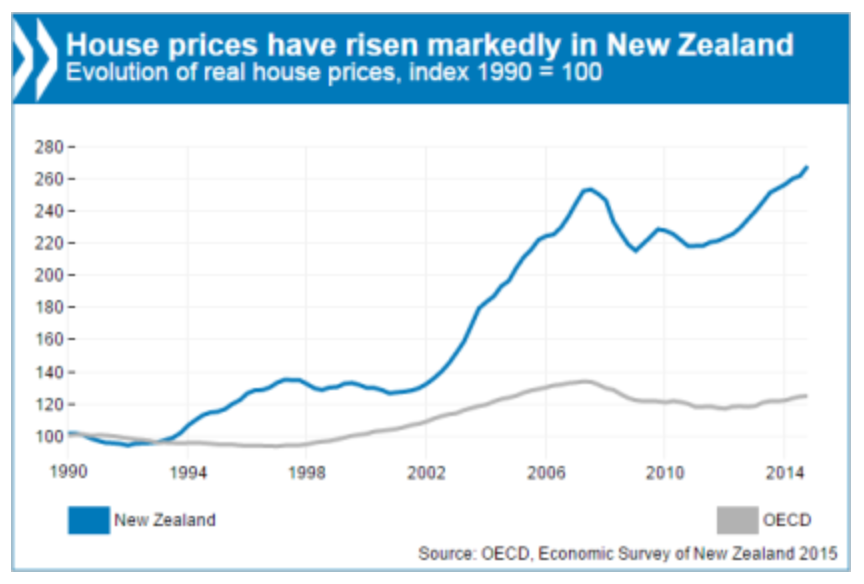

<b>1.</b> The following graph shows information about New Zealand house prices, from 1990 to 2014.  <b>2.</b> According to the graph, we can see that New Zealand house price index has the largest number, which is around 265 in 2014.  <b>3.</b> Following that, OECD average house price index has the second largest number, which is around 130 in 2007.  <b>4.</b> Based on the information we can get from the graph both indices started at has the smallest number, which is around 100 in 1990 as the base year.  <b>5.</b> It's clear that New Zealand house prices has always been higher than the OECD average, especially after 2002.  <b>6.</b> In general, this graph is very informative about New Zealand house prices.

### 130. Students from Disadvantaged Backgrounds

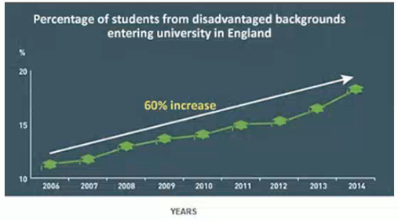

<b>1.</b> The following graph shows information about percentage of students from disadvantaged backgrounds entering university in England, from 2006 to 2014.  <b>2.</b> According to the graph, we can see that the year 2014 has the largest number, which is around 20%.  <b>3.</b> Following that, the year 2013 has the second largest number, which is around 18%.  <b>4.</b> Based on the information we can get from the graph the year 2006 has the smallest number, which is around 12%.  <b>5.</b> It's clear that the percentage has shown a 60% increase has always been higher than the previous years, showing a consistent upward trend.  <b>6.</b> In general, this graph is very informative about students from disadvantaged backgrounds entering university in England.

### 131. Market Share of Pet Services and Products

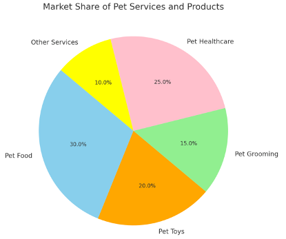

<b>1.</b> The following graph shows information about market share of pet services and products, from pet food, pet healthcare, pet toys, pet grooming, and other services.  <b>2.</b> According to the graph, we can see that pet food has the largest number, which is around 30%.  <b>3.</b> Following that, pet healthcare has the second largest number, which is around 25%.  <b>4.</b> Based on the information we can get from the graph other services has the smallest number, which is around 10%.  <b>5.</b> It's clear that pet food has always been higher than all other categories.  <b>6.</b> In general, this graph is very informative about market share of pet services and products.

### 132. Mean Salary of First Degree Graduates by Gender

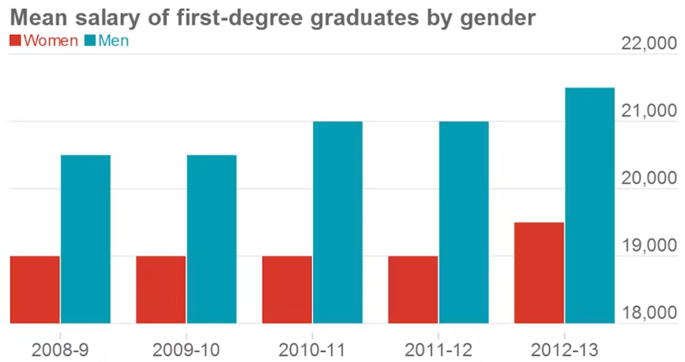

<b>1.</b> The following graph shows information about mean salary of first-degree graduates by gender, from 2008-9 to 2012-13.  <b>2.</b> According to the graph, we can see that men in 2012-13 has the largest number, which is around 21,500 pounds.  <b>3.</b> Following that, men in 2010-11 and 2011-12 has the second largest number, which is around 21,000 pounds.  <b>4.</b> Based on the information we can get from the graph women in 2008-9 and 2009-10 has the smallest number, which is around 18,800 pounds.  <b>5.</b> It's clear that men's salary has always been higher than women's salary across all years.  <b>6.</b> In general, this graph is very informative about mean salary of first-degree graduates by gender.

### 133. Volunteer Rate by Age

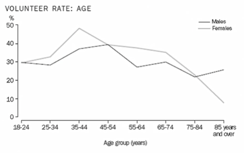

<b>1.</b> The following graph shows information about volunteer rate by age, from age groups 18-24, 25-34, 35-44, 45-54, 55-64, 65-74, 75-84, and 85 years and over.  <b>2.</b> According to the graph, we can see that females aged 35-44 has the largest number, which is around 48%.  <b>3.</b> Following that, males aged 45-54 has the second largest number, which is around 40%.  <b>4.</b> Based on the information we can get from the graph females aged 85 and over has the smallest number, which is around 5%.  <b>5.</b> It's clear that females has always been higher than males in most age groups, especially in the 35-44 range.  <b>6.</b> In general, this graph is very informative about volunteer rate by age.

### 134. Nuclear Power Generation in Europe

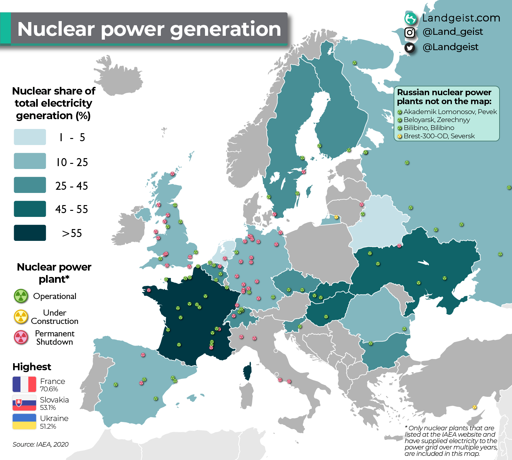

<b>1.</b> The following graph shows information about nuclear power generation in Europe, including nuclear share of total electricity generation by country, and locations of nuclear power plants.  <b>2.</b> According to the graph, we can see that on the left side of the picture, there is a dark teal area, which is France with the highest nuclear share at 70.6%.  <b>3.</b> Following that, in the middle of the picture, there is a medium teal area, which is Slovakia at 53.1% and Ukraine at 51.2%.  <b>4.</b> Based on the information we can get from the graph on the right side of the picture, there is a light blue area, which is Russia with 10-25% nuclear power generation. It's clear that at the bottom of the picture, there is a grey area, which is countries with no nuclear power generation such as Italy and Poland.  <b>5.</b> In general, the graph is very informative about nuclear power generation in Europe.

