

### 1. Years to Double Population #031001 极高频 普通

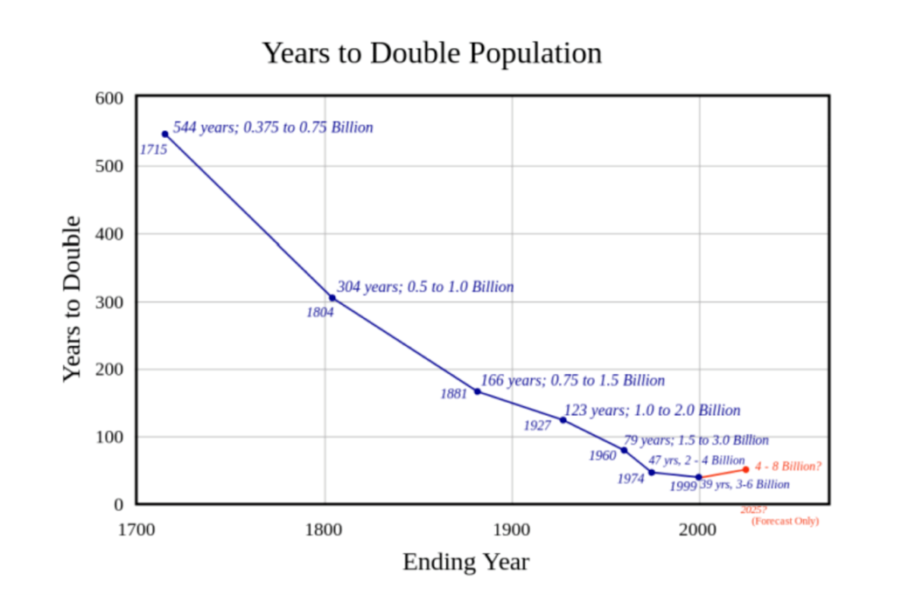

<b>1.</b> The following graph shows information about years to double population, from 1715 to 1999.  <b>2.</b> According to the graph, we can see that 1715 has the largest number, which is around 544 years.  <b>3.</b> Following that, 1804 has the second largest number, which is around 304 years.  <b>4.</b> Based on the information we can get from the graph 1999 has the smallest number, which is around 39 years.  <b>5.</b> It's clear that 1715 has always been higher than 1999.  <b>6.</b> In general, this graph is very informative about years to double population.

### 2. Dubai Gold Sales in 2002 #031002 极高频 简单

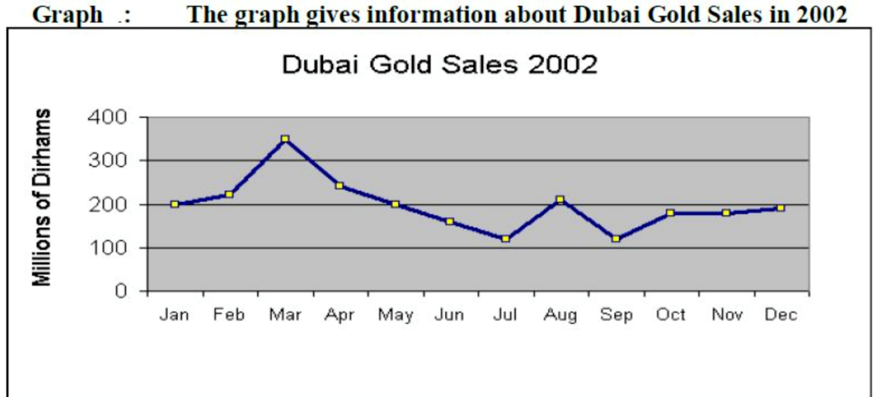

<b>1.</b> The following graph shows information about Dubai gold sales in 2002, from January to December.  <b>2.</b> According to the graph, we can see that March has the largest number, which is around 350 million Dirhams.  <b>3.</b> Following that, August has the second largest number, which is around 210 million Dirhams.  <b>4.</b> Based on the information we can get from the graph July and September has the smallest number, which is around 130 million Dirhams.  <b>5.</b> It's clear that March has always been higher than July.  <b>6.</b> In general, this graph is very informative about Dubai gold sales in 2002.

### 9. Daily temperature in Beijing China #031024 极高频 简单

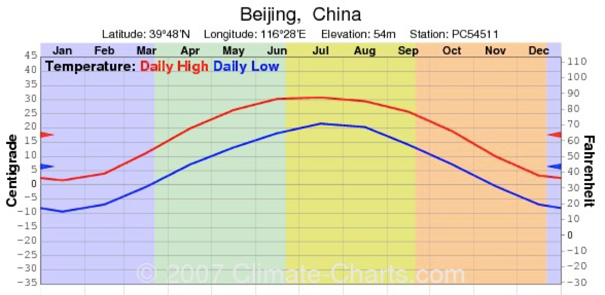

<b>1.</b> The following graph shows information about daily temperature in Beijing China, including daily high and daily low from January to December.  <b>2.</b> According to the graph, we can see that daily high in July has the largest number, which is around 30 degrees Centigrade.  <b>3.</b> Following that, daily low in July has the second largest number, which is around 21 degrees Centigrade.  <b>4.</b> Based on the information we can get from the graph daily low in January has the smallest number, which is around minus 10 degrees Centigrade.  <b>5.</b> It's clear that daily high has always been higher than daily low.  <b>6.</b> In general, this graph is very informative about daily temperature in Beijing China.

### 17. Australian Age Group #031053 极高频 简单

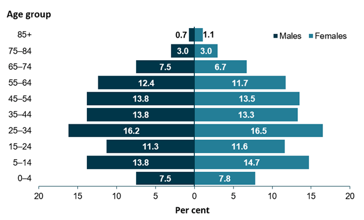

<b>1.</b> The following graph shows information about Australian age group, including males and females.  <b>2.</b> According to the graph, we can see that females in 25-34 has the largest number, which is around 16.5%.  <b>3.</b> Following that, males in 25-34 has the second largest number, which is around 16.2%.  <b>4.</b> Based on the information we can get from the graph males in 85+ has the smallest number, which is around 0.7%.  <b>5.</b> It's clear that females in 5-14 has always been higher than males in 5-14.  <b>6.</b> In general, this graph is very informative about Australian age group.

### 18. Internet Population in Millions of Users #031058 极高频 简单

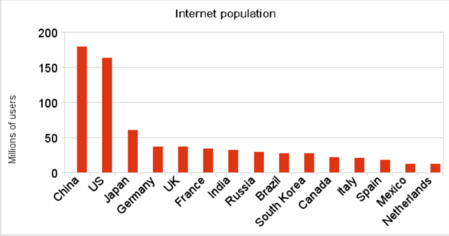

<b>1.</b> The following graph shows information about internet population in millions of users, including China, US, Japan, Germany, UK and other countries.  <b>2.</b> According to the graph, we can see that China has the largest number, which is around 180 million users.  <b>3.</b> Following that, US has the second largest number, which is around 165 million users.  <b>4.</b> Based on the information we can get from the graph Netherlands has the smallest number, which is around 15 million users.  <b>5.</b> It's clear that China has always been higher than US.  <b>6.</b> In general, this graph is very informative about internet population in millions of users.

### 21. Earnings and Unemployment Rates by Educational Attainment #031071 极高频 普通

<b>1.</b> The following graph shows information about earnings and unemployment rates by educational attainment, including unemployment rate and median weekly earnings in 2012.  <b>2.</b> According to the graph, we can see that less than a high school diploma has the largest unemployment rate, which is around 12.4%.  <b>3.</b> Following that, high school diploma has the second largest number, which is around 8.3%.  <b>4.</b> Based on the information we can get from the graph professional degree has the smallest unemployment rate, which is around 2.1%.  <b>5.</b> It's clear that median weekly earnings for professional degree at $1,735 has always been higher than less than a high school diploma at $471.  <b>6.</b> In general, this graph is very informative about earnings and unemployment rates by educational attainment.

### 23. Transport Modes in a European City 1960-2000 #031078 极高频 简单

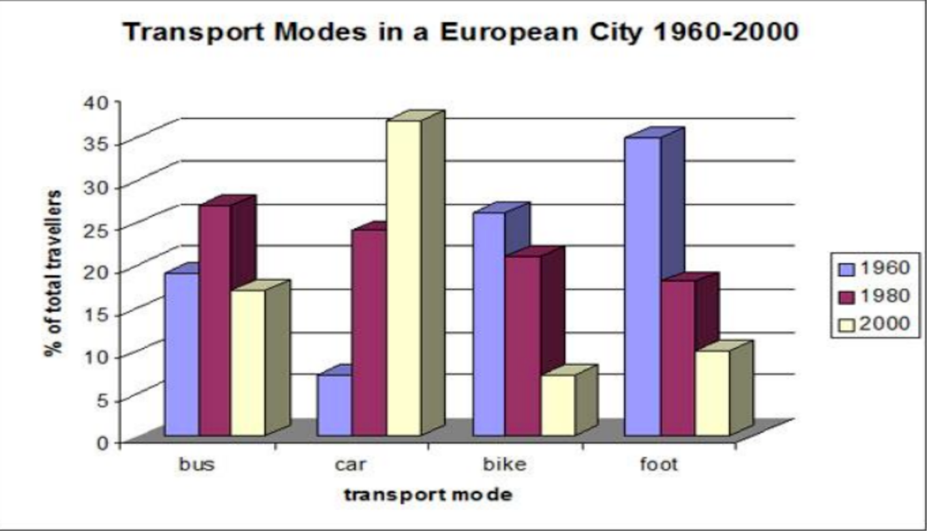

<b>1.</b> The following graph shows information about transport modes in a European city, from 1960 to 2000.  <b>2.</b> According to the graph, we can see that car in 2000 has the largest number, which is around 38% of total travellers.  <b>3.</b> Following that, foot in 1960 has the second largest number, which is around 35% of total travellers.  <b>4.</b> Based on the information we can get from the graph bike in 2000 has the smallest number, which is around 7% of total travellers.  <b>5.</b> It's clear that car in 2000 has always been higher than car in 1960.  <b>6.</b> In general, this graph is very informative about transport modes in a European city 1960-2000.

### 24. Age Percentage in UK #031082 极高频 普通

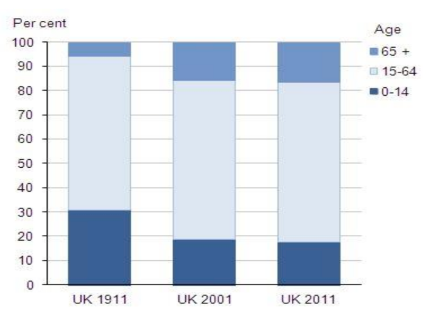

<b>1.</b> The following graph shows information about age percentage in UK, from UK 1911, UK 2001 and UK 2011.  <b>2.</b> According to the graph, we can see that 15-64 age group has the largest number, which is around 65%.  <b>3.</b> Following that, 0-14 in UK 1911 has the second largest number, which is around 30%.  <b>4.</b> Based on the information we can get from the graph 65+ in UK 1911 has the smallest number, which is around 5%.  <b>5.</b> It's clear that 15-64 has always been higher than 0-14 and 65+.  <b>6.</b> In general, this graph is very informative about age percentage in UK.

### 25. Beginning of flow chart for quiz #031086 极高频 简单

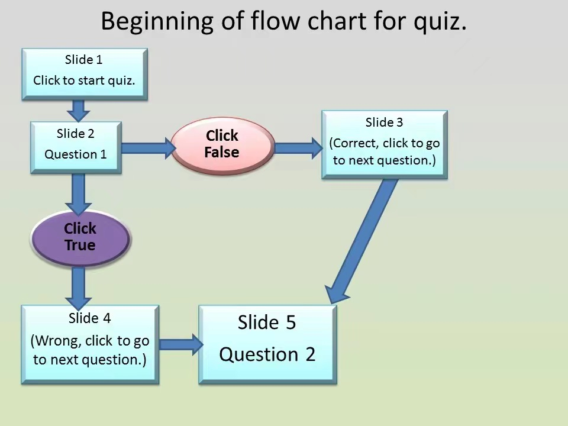

<b>1.</b> The following graph shows information about beginning of flow chart for quiz, including Slide 1 to Slide 5.  <b>2.</b> According to the graph, we can see that the first step is Slide 1, click to start quiz.  <b>3.</b> Following that, the second step is Slide 2, Question 1.  <b>4.</b> Based on the information we can get from the graph, the third step is click true or click false.  <b>5.</b> It's clear that the last steps are Slide 3 correct or Slide 4 wrong, then click to go to Slide 5, Question 2.  <b>6.</b> We can see that there is a decision process in the picture, which is interactive and structured.  <b>7.</b> In general, this graph is very informative about beginning of flow chart for quiz.

### 29. Pet Expenditure in US #031133 极高频 简单

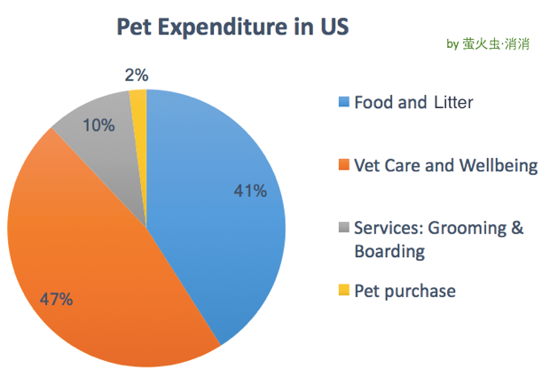

<b>1.</b> The following graph shows information about pet expenditure in US, including food and litter, vet care and wellbeing, services grooming and boarding, and pet purchase.  <b>2.</b> According to the graph, we can see that vet care and wellbeing has the largest number, which is around 47%.  <b>3.</b> Following that, food and litter has the second largest number, which is around 41%.  <b>4.</b> Based on the information we can get from the graph pet purchase has the smallest number, which is around 2%.  <b>5.</b> It's clear that vet care and wellbeing has always been higher than food and litter.  <b>6.</b> In general, this graph is very informative about pet expenditure in US.

### 32. Size of Nine Planets #031141 极高频 极限预测 困难

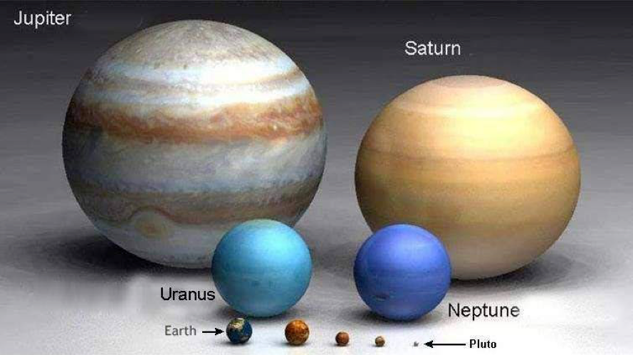

<b>1.</b> The following graph shows information about size of nine planets, including Jupiter, Saturn, Uranus, Neptune, Earth and Pluto.  <b>2.</b> According to the graph, we can see that Jupiter has the largest size, which is the biggest planet.  <b>3.</b> Following that, Saturn has the second largest size, which is slightly smaller than Jupiter.  <b>4.</b> Based on the information we can get from the graph Pluto has the smallest size, which is the tiniest object in the picture.  <b>5.</b> It's clear that Jupiter has always been bigger than all other planets.  <b>6.</b> In general, this graph is very informative about size of nine planets.

### 33. Typing Postures #031142 极高频 困难

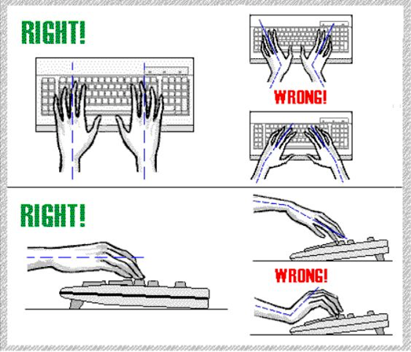

<b>1.</b> The following graph shows information about typing postures, including right and wrong postures.  
<b>2.</b> According to the graph we can see that on the left side of the picture, the top left picture shows the correct typing posture in the top view., which is straight and aligned with the keyboard.  
<b>3.</b> Following that, in the middle of the picture, the bottom left picture shows the correct typing posture in the side view., which is clearly illustrated.  
<b>4.</b> Based on the information we can get from the graph on the right side of the picture, The top right picture shows the wrong typing posture in the top view., which is bent and angled incorrectly.  
<b>5.</b> It's clear that at the bottom of the picture, the bottom right picture shows the wrong typing posture in the side view., which is also showing right and wrong positions.  
<b>6.</b> In general, this graph is very informative about typing postures.

### 34. Adults Healthy BMI Chart #031143 极高频 普通

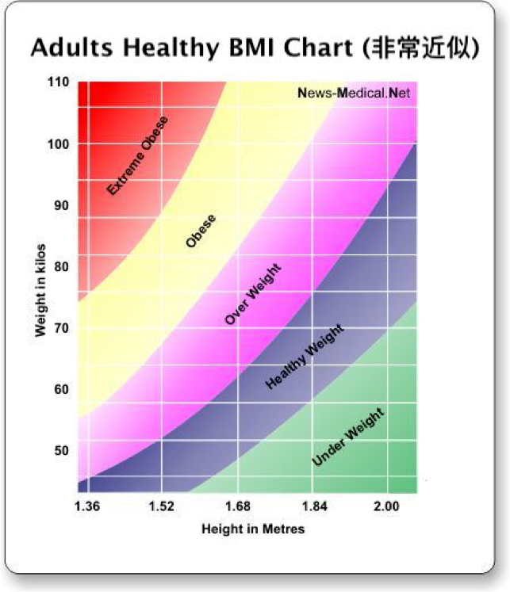

<b>1.</b> The following graph shows information about adults healthy BMI chart, including height from 1.36 to 2.00 metres and weight from 45 to 110 kilos.  <b>2.</b> According to the graph, we can see that extreme obese has the largest area, which is around the top left corner in red.  <b>3.</b> Following that, obese has the second largest area, which is around the upper middle section in pink.  <b>4.</b> Based on the information we can get from the graph under weight has the smallest area, which is around the bottom right corner in green.  <b>5.</b> It's clear that healthy weight has always been between under weight and over weight.  <b>6.</b> In general, this graph is very informative about adults healthy BMI chart.

### 35. How Solar Yard Lights Work #031145 极高频 困难

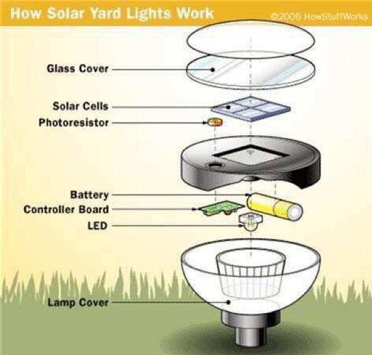

<b>1.</b> The following graph shows information about how solar yard lights work, including several components.  <b>2.</b> According to the graph we can see that on the left side of the picture, there is labels for each component, which is clearly marked.  <b>3.</b> Following that, in the middle of the picture, there is glass cover, solar cells and photoresistor, which is located at the top part of the light.  <b>4.</b> Based on the information we can get from the graph on the right side of the picture, there is battery, controller board and LED, which is the internal components in the middle part.  <b>5.</b> It's clear that at the bottom of the picture, there is lamp cover, which is the base of the solar yard light.  <b>6.</b> In general, this graph is very informative about how solar yard lights work.

### 36. Student Accommodation of Southampton University #031146 极高频 极限预测 困难

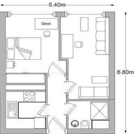

<b>1.</b> The following graph shows information about student accommodation of Southampton University, including a floor plan of 5.40m by 6.80m.  <b>2.</b> According to the graph we can see that on the left side of the picture, there is a kitchen area and a single bed, which is located next to each other.  <b>3.</b> Following that, in the middle of the picture, there is a desk and a bathroom, which is in the central area of the room.  <b>4.</b> Based on the information we can get from the graph on the right side of the picture, there is a sofa and a wardrobe, which is placed along the right wall.  <b>5.</b> It's clear that at the bottom of the picture, there is another bed and a washing machine, which is in the lower section of the accommodation.  <b>6.</b> In general, this graph is very informative about student accommodation of Southampton University.

### 37. Food Pyramid #031148 极高频 极限预测 困难

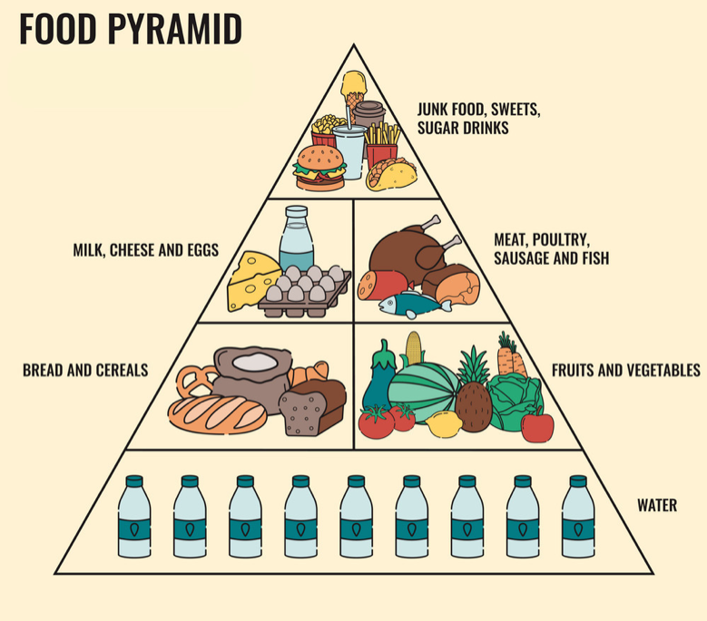

<b>1.</b> The following graph shows information about food pyramid, including different food groups from top to bottom.  <b>2.</b> According to the graph we can see that on the left side of the picture, there is milk, cheese and eggs, and bread and cereals, which is in the middle and lower layers of the pyramid.  <b>3.</b> Following that, in the middle of the picture, there is junk food, sweets and sugar drinks at the top, which is the smallest portion we should eat the least.  <b>4.</b> Based on the information we can get from the graph on the right side of the picture, there is meat, poultry, sausage and fish, and fruits and vegetables, which is in the middle and lower layers.  <b>5.</b> It's clear that at the bottom of the picture, there is water, which is the most essential and largest portion at the base.  <b>6.</b> In general, this graph is very informative about food pyramid.

### 39. Library Plan #031151 极高频 困难

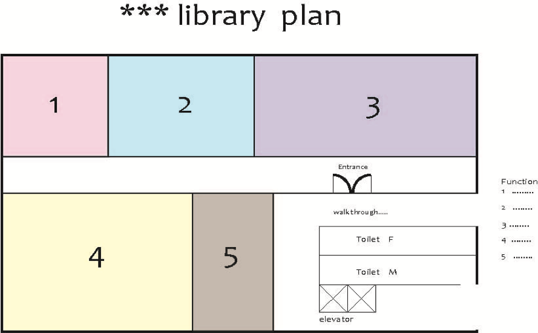

<b>1.</b> The following graph shows information about library plan, including 5 functional areas.  <b>2.</b> According to the graph we can see that on the left side of the picture, there is area 1 in pink and area 4 in yellow, which is on the upper and lower left.  <b>3.</b> Following that, in the middle of the picture, there is area 2 in blue and area 5 in brown with an entrance between them, which is in the central part of the library.  <b>4.</b> Based on the information we can get from the graph on the right side of the picture, there is area 3 in purple, which is the largest area on the upper right.  <b>5.</b> It's clear that at the bottom of the picture, there is toilet F, toilet M and an elevator, which is located near the walkthrough area.  <b>6.</b> In general, this graph is very informative about library plan.

### 40. Oxbow Lake Formation #031152 极高频 极限预测 困难

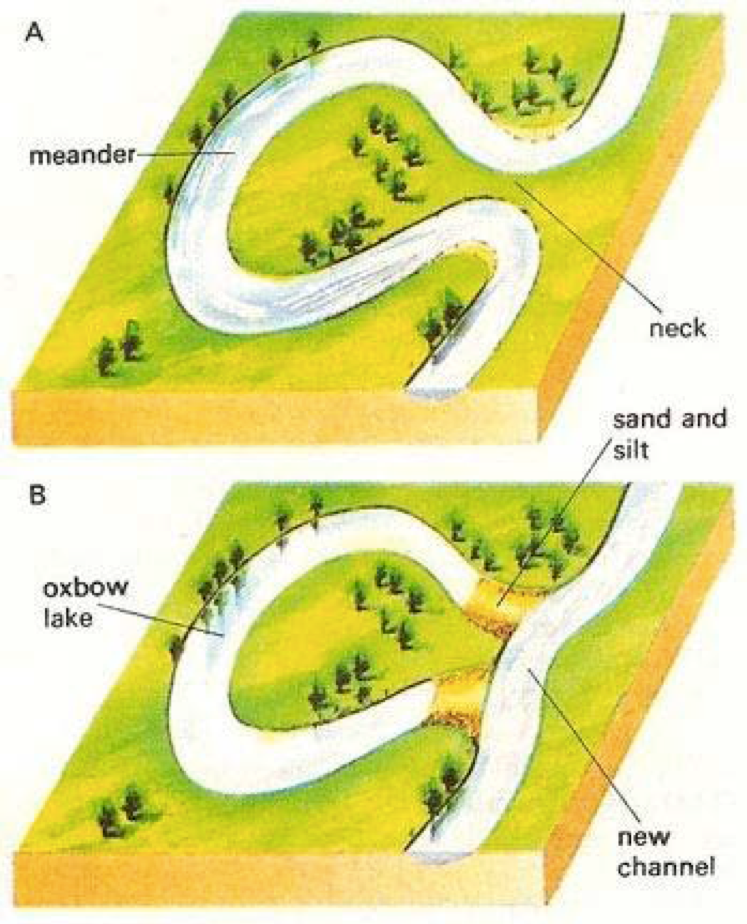

<b>1.</b> The following graph shows information about oxbow lake formation, including two stages A and B.  <b>2.</b> According to the graph we can see that on the left side of the picture, there is a meander in stage A, which is a curved river bend.  <b>3.</b> Following that, in the middle of the picture, there is a narrow neck between the meander, which is where the river is about to cut through.  <b>4.</b> Based on the information we can get from the graph on the right side of the picture, there is sand and silt deposited, which is along the river bank.  <b>5.</b> It's clear that at the bottom of the picture, there is stage B showing an oxbow lake and a new channel, which is formed after the river cuts through the neck.  <b>6.</b> In general, this graph is very informative about oxbow lake formation.

### 41. The Eatwell Plate #031156 极高频 普通

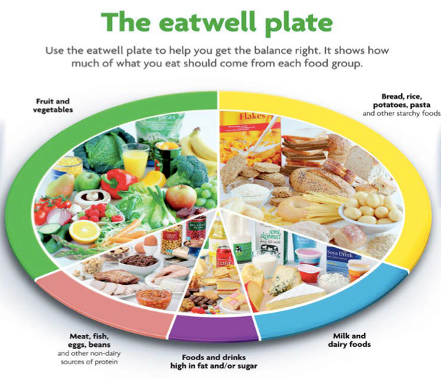

<b>1.</b> The following graph shows information about the eatwell plate, including fruit and vegetables, bread rice potatoes pasta, meat fish eggs beans, milk and dairy foods, and foods high in fat and sugar.  <b>2.</b> According to the graph, we can see that fruit and vegetables has the largest portion, which is around the biggest green section of the plate.  <b>3.</b> Following that, bread, rice, potatoes, pasta and other starchy foods has the second largest portion, which is around the orange section.  <b>4.</b> Based on the information we can get from the graph foods and drinks high in fat and/or sugar has the smallest portion, which is around the tiniest yellow section.  <b>5.</b> It's clear that fruit and vegetables has always been larger than milk and dairy foods.  <b>6.</b> In general, this graph is very informative about the eatwell plate.

### 45. Lunar Cycle affects Fish Catch Rates #031167 极高频 极限预测 困难

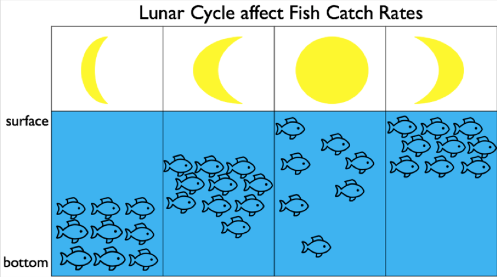

<b>1.</b> The following graph shows information about lunar cycle affects fish catch rates, including four moon phases.  <b>2.</b> According to the graph we can see that on the left side of the picture, there is a crescent moon with fish staying at the bottom, which is indicating low catch rates.  <b>3.</b> Following that, in the middle of the picture, there is a half moon and a full moon with fish moving to the surface, which is indicating increasing catch rates.  <b>4.</b> Based on the information we can get from the graph on the right side of the picture, there is a waning moon with fish near the surface, which is indicating high catch rates.  <b>5.</b> It's clear that at the bottom of the picture, there is fewer fish during the crescent moon, which is compared to more fish near the surface during the full moon.  <b>6.</b> In general, this graph is very informative about lunar cycle affects fish catch rates.

### 48. Human Arms and Wings #031170 极高频 困难

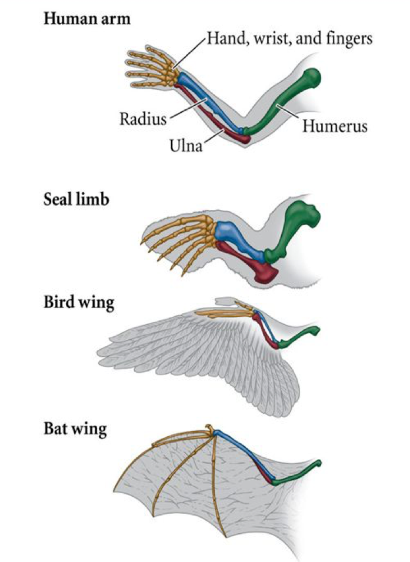

<b>1.</b> The following graph shows information about human arms and wings, including human arm, seal limb, bird wing and bat wing.  <b>2.</b> According to the graph we can see that on the left side of the picture, there is the labels for each limb type, which is clearly written.  <b>3.</b> Following that, in the middle of the picture, there is colored bone structures including humerus, radius, ulna and hand, which is highlighted in green, blue and red.  <b>4.</b> Based on the information we can get from the graph on the right side of the picture, there is the hand, wrist and fingers of each limb, which is shown in different shapes for each species.  <b>5.</b> It's clear that at the bottom of the picture, there is bat wing, which is the largest and most spread out limb.  <b>6.</b> In general, this graph is very informative about human arms and wings.

### 55. Distribution of Tropical Rain Forests #031181 极高频 困难

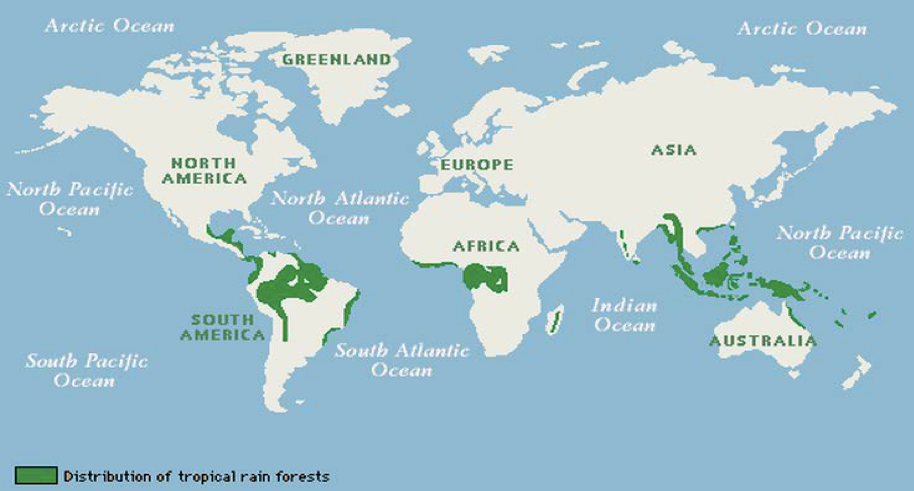

<b>1.</b> The following graph shows information about distribution of tropical rain forests, including all continents.  <b>2.</b> According to the graph, we can see that on the left side of the picture, there is a green area, which is South America with the largest tropical rain forest.  <b>3.</b> Following that, in the middle of the picture, there is a green area, which is Africa with a significant portion of rain forest.  <b>4.</b> Based on the information we can get from the graph on the right side of the picture, there is a green area, which is Southeast Asia and Australia with scattered rain forests.  <b>5.</b> It's clear that at the bottom of the picture, there is a blue area, which is oceans surrounding all the continents.  <b>6.</b> In general, the graph is very informative about distribution of tropical rain forests.

### 56. Climate Zones for Temperature and Humidity #031182 极高频 困难

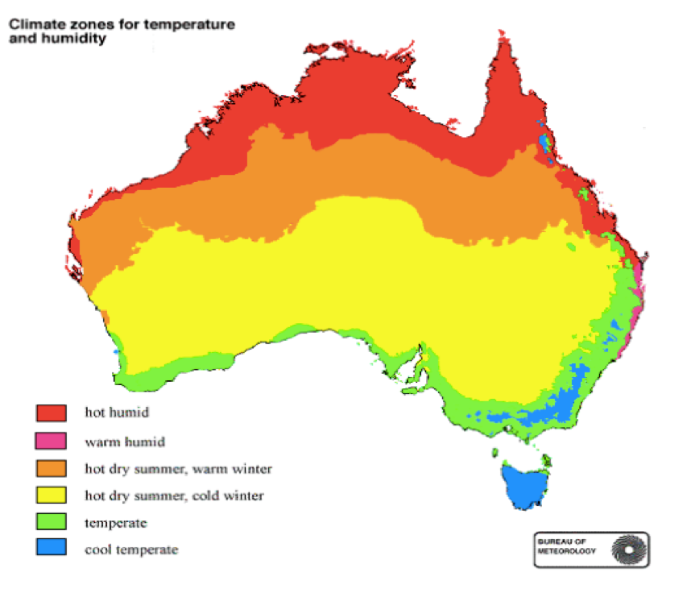

<b>1.</b> The following graph shows information about climate zones for temperature and humidity in Australia, including hot humid, warm humid, hot dry summer warm winter, hot dry summer cold winter, temperate and cool temperate.  <b>2.</b> According to the graph, we can see that on the left side of the picture, there is a yellow area, which is hot dry summer cold winter in western Australia.  <b>3.</b> Following that, in the middle of the picture, there is a orange area, which is hot dry summer warm winter in central Australia.  <b>4.</b> Based on the information we can get from the graph on the right side of the picture, there is a red area, which is hot humid in the northeast of Australia.  <b>5.</b> It's clear that at the bottom of the picture, there is a green and blue area, which is temperate and cool temperate in the south and Tasmania.  <b>6.</b> In general, the graph is very informative about climate zones for temperature and humidity in Australia.

### 57. Population Density in Australia 2011 #031192 极高频 困难

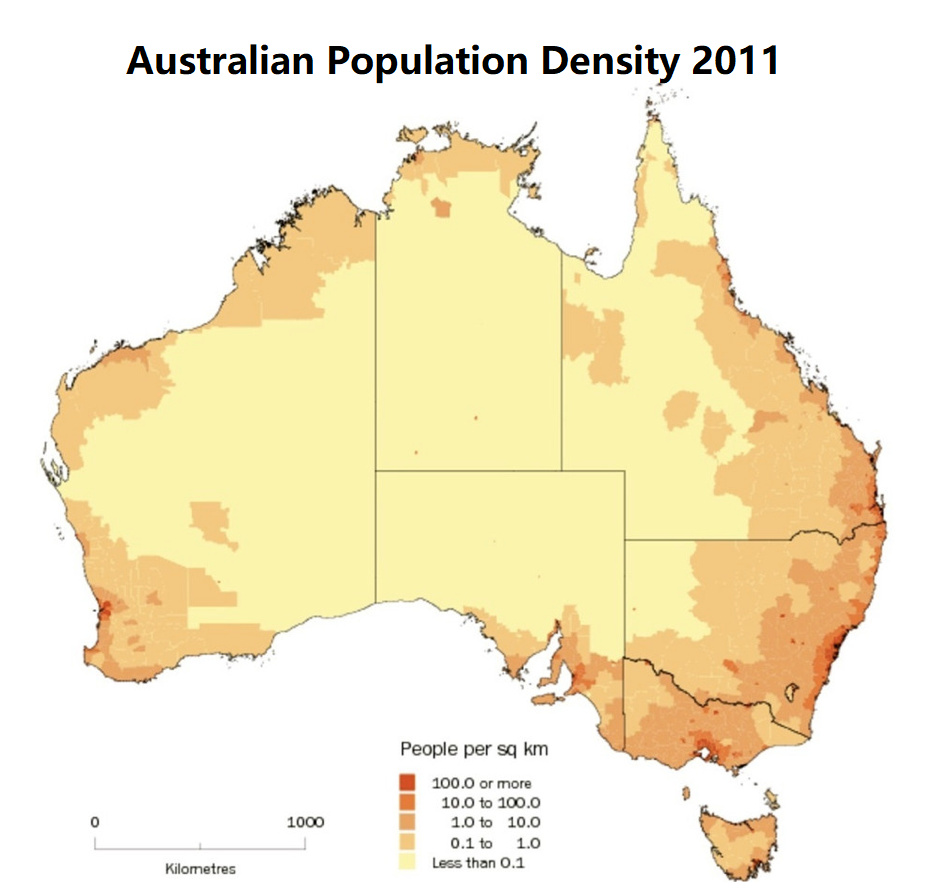

<b>1.</b> The following graph shows information about Australian population density 2011, including people per square kilometer.  <b>2.</b> According to the graph, we can see that on the left side of the picture, there is a light yellow area, which is less than 0.1 people per square kilometer in western Australia.  <b>3.</b> Following that, in the middle of the picture, there is a light beige area, which is 0.1 to 1.0 people per square kilometer in central Australia.  <b>4.</b> Based on the information we can get from the graph on the right side of the picture, there is a dark brown area, which is 100.0 or more people per square kilometer along the east coast.  <b>5.</b> It's clear that at the bottom of the picture, there is a orange area, which is 10.0 to 100.0 people per square kilometer in the southeast.  <b>6.</b> In general, the graph is very informative about Australian population density 2011.

### 58. Annual Sunshine Hours for France #031196 极高频 极限预测 普通

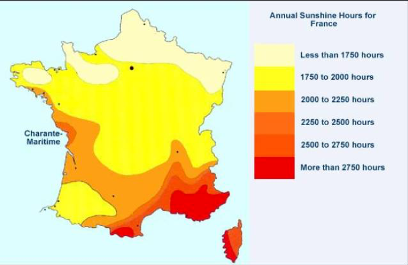

<b>1.</b> The following graph shows information about annual sunshine hours for France, including less than 1750 to more than 2750 hours.  <b>2.</b> According to the graph, we can see that on the left side of the picture, there is a yellow area, which is 1750 to 2000 hours in western France near Charante-Maritime.  <b>3.</b> Following that, in the middle of the picture, there is a light yellow area, which is less than 1750 hours in northern France.  <b>4.</b> Based on the information we can get from the graph on the right side of the picture, there is a orange area, which is 2000 to 2500 hours in eastern and central France.  <b>5.</b> It's clear that at the bottom of the picture, there is a red area, which is more than 2750 hours in southern France and Corsica.  <b>6.</b> In general, the graph is very informative about annual sunshine hours for France.

### 59. Global Warming Predictions by Temperature Increase #031197 极高频 极限预测 普通

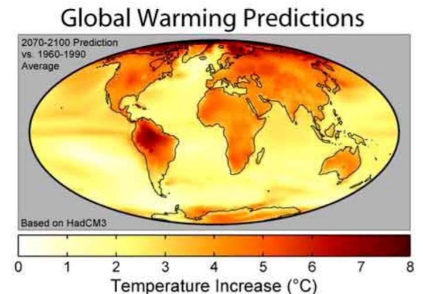

<b>1.</b> The following graph shows information about global warming predictions by temperature increase, including 2070-2100 prediction versus 1960-1990 average.  <b>2.</b> According to the graph, we can see that on the left side of the picture, there is a orange area, which is 3 to 4 degrees Celsius increase in South America.  <b>3.</b> Following that, in the middle of the picture, there is a dark red area, which is 5 to 7 degrees Celsius increase in Africa and Central Asia.  <b>4.</b> Based on the information we can get from the graph on the right side of the picture, there is a orange area, which is 3 to 5 degrees Celsius increase in Australia and East Asia.  <b>5.</b> It's clear that at the bottom of the picture, there is a light yellow area, which is 0 to 2 degrees Celsius increase in the oceans.  <b>6.</b> In general, the graph is very informative about global warming predictions by temperature increase.

### 61. Water Cycle (color) #031202 极高频 普通

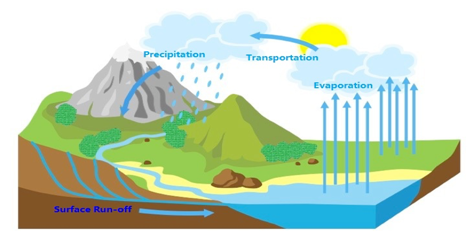

<b>1.</b> The following graph shows information about water cycle, including evaporation, transportation, precipitation and surface run-off.  <b>2.</b> According to the graph, we can see that the first step is evaporation, where water from the ocean rises into the atmosphere.  <b>3.</b> Following that, the second step is transportation, where water vapor moves through the air towards the mountains.  <b>4.</b> Based on the information we can get from the graph, the third step is precipitation, where water falls as rain onto the mountains and land.  <b>5.</b> It's clear that the last steps are surface run-off, where water flows back to the ocean through rivers.  <b>6.</b> We can see that there is mountains, rivers and ocean in the picture, which is colorful and vivid.  <b>7.</b> In general, this graph is very informative about water cycle.

### 62. Life Cycle of an Apple Tree #031209 极高频 普通

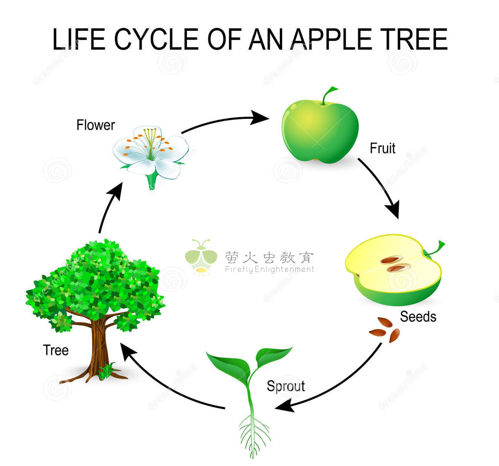

<b>1.</b> The following graph shows information about life cycle of an apple tree, including seeds, sprout, tree, flower and fruit.  <b>2.</b> According to the graph, we can see that the first step is seeds, which come from inside the apple fruit.  <b>3.</b> Following that, the second step is sprout, where the seeds grow into a small plant with roots.  <b>4.</b> Based on the information we can get from the graph, the third step is tree, where the sprout grows into a full-sized apple tree.  <b>5.</b> It's clear that the last steps are flower and fruit, where the tree blossoms and then produces apples.  <b>6.</b> We can see that there is a circular arrow pattern in the picture, which is continuous and cyclical.  <b>7.</b> In general, this graph is very informative about life cycle of an apple tree.

### 63. Tesco Extra Music Download #031214 极高频 普通

<b>1.</b> The following graph shows information about Tesco Extra music download, including search, purchase, download and play.  <b>2.</b> According to the graph, we can see that the first step is search, where users look for the music they want.  <b>3.</b> Following that, the second step is purchase, where users buy the music through a shopping cart.  <b>4.</b> Based on the information we can get from the graph, the third step is download, where users save the purchased music to their device.  <b>5.</b> It's clear that the last steps are play, where users listen to the music with headphones.  <b>6.</b> We can see that there is a circular flow with arrows in the picture, which is simple and clear.  <b>7.</b> In general, this graph is very informative about Tesco Extra music download.

### 64. Fungus Gnat Lifecycle in 28 Days #031224 极高频 极限预测 困难

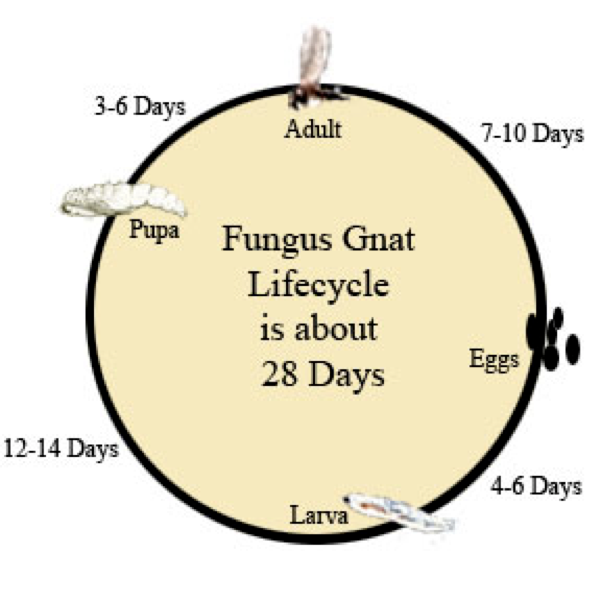

<b>1.</b> The following graph shows information about fungus gnat lifecycle in 28 days, including eggs, larva, pupa and adult.  <b>2.</b> According to the graph, we can see that the first step is eggs, which takes about 4 to 6 days.  <b>3.</b> Following that, the second step is larva, which takes about 12 to 14 days.  <b>4.</b> Based on the information we can get from the graph, the third step is pupa, which takes about 3 to 6 days.  <b>5.</b> It's clear that the last steps are adult, which lives for about 7 to 10 days before laying eggs again.  <b>6.</b> We can see that there is a circular diagram in the picture, which is about 28 days in total.  <b>7.</b> In general, this graph is very informative about fungus gnat lifecycle in 28 days.

### 65. Adding an Article to Wikipedia #031225 极高频 普通

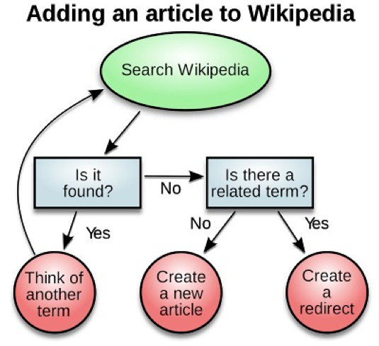

<b>1.</b> The following graph shows information about adding an article to Wikipedia, including search, decision and creation.  <b>2.</b> According to the graph, we can see that the first step is search Wikipedia for the topic.  <b>3.</b> Following that, the second step is check if it is found, if yes, think of another term.  <b>4.</b> Based on the information we can get from the graph, the third step is if not found, check if there is a related term.  <b>5.</b> It's clear that the last steps are if there is a related term, create a redirect; if not, create a new article.  <b>6.</b> We can see that there is a decision flow with yes and no branches in the picture, which is logical and structured.  <b>7.</b> In general, this graph is very informative about adding an article to Wikipedia.

